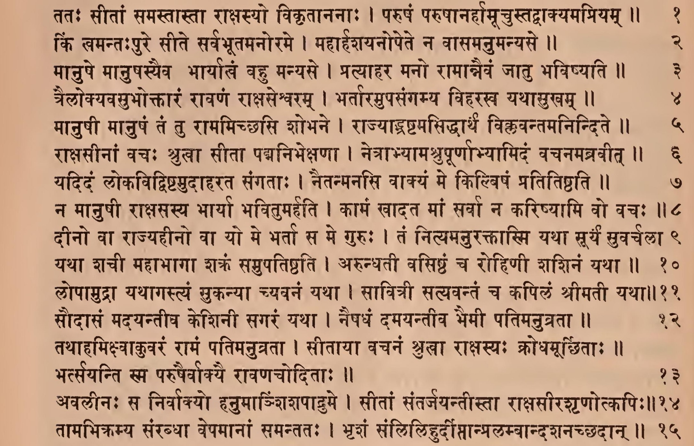
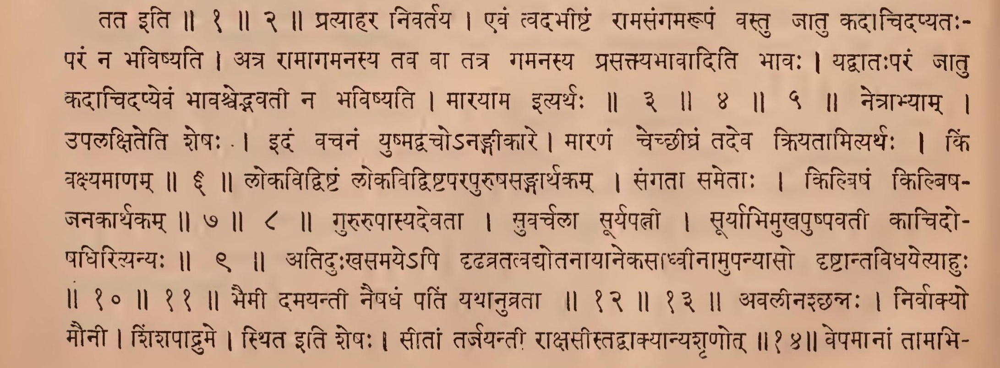
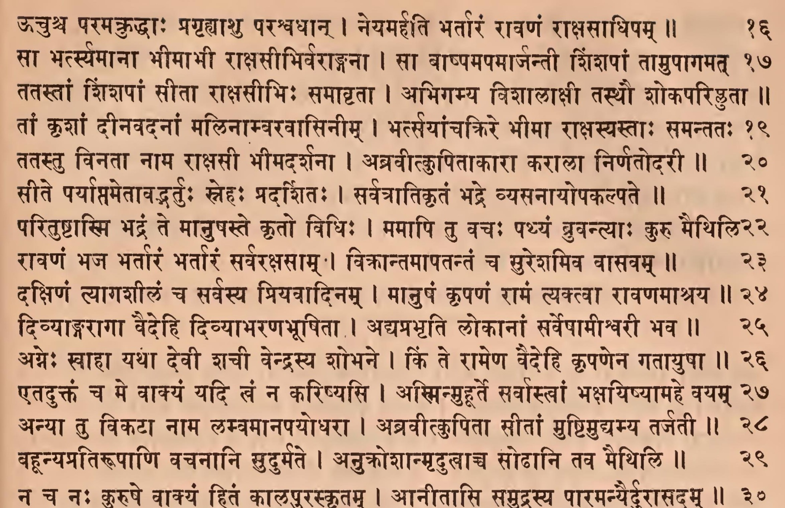
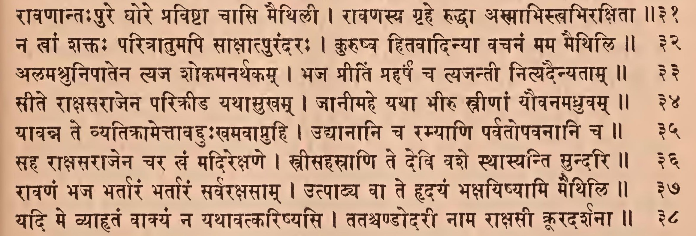
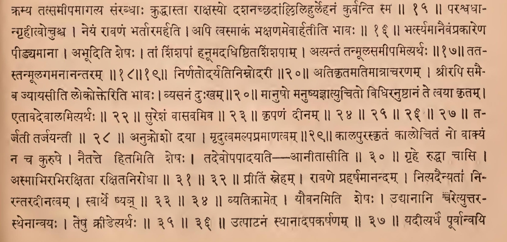
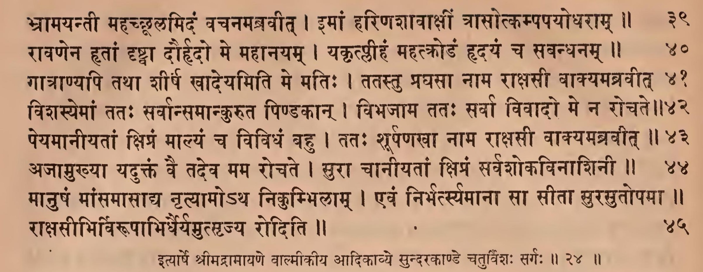
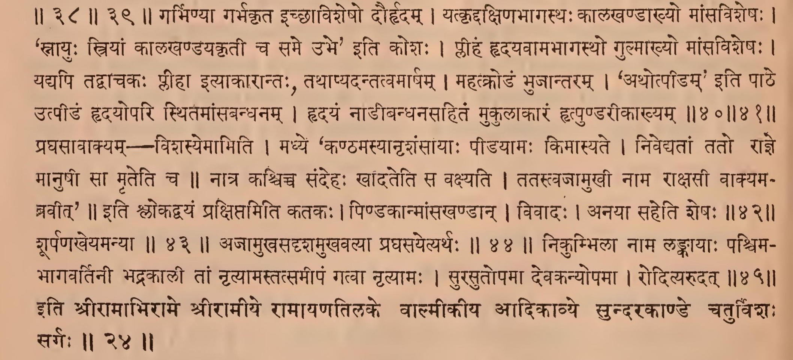

॥ श्रीः॥ ॥śrīḥ॥

ādikaviśrīvālmīkimahāmunipraṇītaṃ

rāmāyaṇam

tilakākhyayā vyākhyayā sametam।\
sundarakāṇḍam।

# caturviṃśaḥ sargaḥ \|\| 24

*PDF: pages 104 (1-15), 105 (16-38), 106 (39-45)*

## devanāgarī. page 104 (1-15) 

### Comment (1-14, 15…)

## devanāgarī. page 105 (16-38)

### Comment (…15, 16-39)

## devanāgarī. page 106 (39-45)

### Comment (40-45)

## IAST - International Alphabet of Sanskrit Transliteration

tataḥ sītāṃ samastāstā rākṣasyo vikṛtānanāḥ \|

paruṣaṃ parupānarhāmṛcustadvākyamapriyam \|\| 1

kiṃ vamantaḥpure sīte sarvabhūtamanorame \|

mahārhaśayanopete na vāsamanumanyase \|\| 2

> tata iti \|\| 1 \|\| 2 \|\|

mānuṣe mānuṣasyaiva bhāryātvaṃ bahu manyase \|

pratyāhara mano rāmānnaivaṃ jātu bhaviṣyati \|\| 3

trailokyavamubhoktāraṃ rāvaṇaṃ rākṣaseśvaram \|

bhartāramupasaṅgamya viharakha yathāsukham \|\| 4

mānuṣī mānuṣaṃ taṃ tu rāmamicchasi śobhane \|

rājyāṣṭamasiddhārtha viklavantamanindite \|\| 5

> pratyāhara nivartaya \| evaṃ tvadabhīṣṭaṃ rāmasaṅgamarūpaṃ vastu jātu kadā cidapyataḥ - paraṃ na bhaviṣyati \| atra rāmāgamanasya tava vā tatra gamanasya prasaktyabhāvāditi bhāvaḥ \| yadvātaḥ paraṃ jātu kadācidapyevaṃ bhāvaścedbhavatī na bhaviṣyati \| mārayāma ityarthaḥ \|\| 3 \|\| 4 \|\| 5 \|\|

rākṣasīnāṃ vacaḥ śrutvā sītā padmanibhekṣaṇā \|

netrābhyāmaśrupūrṇābhyāmidaṃ vacanamabravīt \|\| 6

> netrābhyām \| \| upalakṣiteti śeṣaḥ \| idaṃ vacanaṃ yuṣmadvaco'naṅgīkāre \| māraṇaṃ cecchīghraṃ tadeva kriyatāmityarthaḥ \| kiṃ vakṣyamāṇam \|\| 6 \|\|

yadidaṃ lokavidviṣṭamudāharata saṅgatāḥ \|

naitanmanasi vākyaṃ me kilviṣaṃ pratitiṣṭhati \|\| 7

na mānuṣī rākṣasasya bhāryā bhavitumarhati \|

kāmaṃ khādata māṃ sarvā na kariṣyāmi vo vacaḥ \|\| 8

> lokavidviṣṭaṃ lokavidviṣṭaparapuruṣasaṅgārthakam \| saṅgatā sametāḥ \| kilviṣaṃ kilbiṣa- janakārthakam \|\| 7 \|\| 8 \|\|

dīno vā rājyahīno vā yo me bhartā sa me guruḥ \|

taṃ nityamanuraktāsmi yathā sūryaṃ suvarcalā \|\| 9

> gururūpāsyadevatā \| suvarcalā sūryapattī \| sūryābhimukhapuṣpavatī kācidoṣadhirityanyaḥ \|\| 9 \|\|

yathā śacī mahābhāgā śakraṃ samupatiṣṭhati \|

arundhatī vasiṣṭhaṃ ca rohiṇī śaśinaṃ yathā \|\| 10

lopāmudrā yathāgastyaṃ sukanyā cyavanaṃ yathā \|

sāvitrī satyavantaṃ ca kapilaṃ śrīmatī yathā \|\| 11

> atiduḥkhasamaye'pi dṛḍhavratatvadyotanāyāne kasādhvīnāmupanyāso dṛṣṭāntavidhayetyāhuḥ \|\| 10 \|\| 11 \|\|

saudāsaṃ madayantīva keśinī sagaraṃ yathā \|

naiṣadhaṃ damayantīva bhaimī patimanuvratā \|\| 12

tathāhamikṣvākuvaraṃ rāmaṃ patimanuvratā \|

sītāyā vacanaṃ śrukhā rākṣasyaḥ krodhamūrcchitāḥ \|\|

bhartsayanti sma paruṣairvākyai rāvaṇacoditāḥ \|\| 13

> bhaimī damayantī naiṣadhaṃ patiṃ yathānuvratā \|\| 12 \|\| 13 \|\|

avalīnaḥ sa nirvākyo hanumāśiśapāḍume \|

sītāṃ santarjayantīstā rākṣasīraśṛṇotkapiḥ \|\|14

> avalīnaśchannaḥ \| nirvākyo \| maunī \| śiṃśapādrume \| sthita iti śeṣaḥ \| sītāṃ tarjayantī rākṣasīstadvākyānyaśṛṇot \|\| 14\|\|

tāmabhikramya saṃrabdhā vepamānāṃ samantataḥ \|

bhṛśaṃ saṃlilihurdīptānpralambāndaśanacchadān \|\| 15

> vepamānāṃ tāmabhikramya tatsamīpamāgatya saṃrabdhāḥ kruddhāstā rākṣasyo daśanacchadāṃllilihurlehanaṃ kurvanti sma \|\| 15 \|\|

ūcuśca paramakruddhāḥ pragṛhyāśu paraśvadhān \|

neyamarhati bhartāraṃ rāvaṇaṃ rākṣasādhipam \|\| 16

> paraśvadhāgṛhītvośca \| neyaṃ rāvaṇaṃ bhartāramarhati \| api tvasmākaṃ bhakṣaṇamevārhatīti bhāvaḥ \|\| 16 \|\|

sā bhartsyamānā bhīmābhī rākṣasībhirvarāṅganā \|

sā vāṣpamapamārjantī śiṃśapāṃ tāmupāgamat \|\| 17

> bhartsyamānaivaṃprakāreṇa pīḍyamānā \| abhūditi śeṣaḥ \| tāṃ śiṃśapāṃ hanūmadadhiṣṭhitaśiṃśapām \| atyantaṃ tanmūlasamīpamityarthaḥ \|\| 17\|\|

tatastāṃ śiṃśapāṃ sītā rākṣasībhiḥ samāvṛtā \|

abhigamya viśālākṣī tasthau śokaparitā \|\| 18

tāṃ kṛśāṃ dīnavadanāṃ malināmvaravāsinīm \|

bhartsayāñcakrire bhīmā rākṣasyastāḥ samantataḥ \|\| 19

> tatastanmūlagamanānantaram \|\| 18 \|\| 19 \|\|

tatastu vinatā nāma rākṣasī bhīmadarśanā \|

abravītkupitākārā karālā nirṇatodarī \|\| 20

> nirṇatodaryatinimnodarī \|\|20\|\|

sīte paryāptametāvadbhartuḥ snehaḥ pradarśitaḥ \|

sarvatrātikṛtaṃ bhadre vyasanāyopakalpate \|\| 21

> atikṛtamatimātrācaraṇam \| śrīrapi samaiba jyāyasīti lokokteriti bhāvaḥ \| vyasanaṃ duḥkham \|\| 21 \|\|

parituṣṭāsmi bhadraṃ te mānuṣaste kṛto vidhiḥ \|

mamāpi tu vacaḥ pathyaṃ bruvantyāḥ kuru maithili \|\| 22

> mānuṣo manuṣyajñātyucito vidhiranuṣṭhānaṃ te tvayā kṛtam \| etāvadevālamityarthaḥ \|\| 22 \|\|

rāvaṇaṃ bhaja bhartāraṃ bhartāraṃ sarvarakṣasām \|

vikrāntamāpatantaṃ ca sureśamiva vāsavam \|\| 23

> sureśaṃ vāsavamiva \|\| 23 \|\|

dakṣiṇaṃ tyāgaśīlaṃ ca sarvasya priyavādinam \|

mānuṣaṃ kṛpaṇaṃ rāmaṃ tyaktvā rāvaṇamāśraya \|\| 24

divyāṅgarāgā vaidehi divyābharaṇabhūṣitā \|

adyaprabhṛti lokānāṃ sarveṣāmīśvarī bhava \|\| 25

agneḥ svāhā yathā devī śacī vendrasya śobhane \|

kiṃ te rāmeṇa vaidehi kṛpaṇena gatāyuṣā \|\| 26

etaduktaṃ ca me vākyaṃ yadi tvaṃ na kariṣyasi \|

asminmuhūrte sarvāstvāṃ bhakṣayiṣyāmahe vayam \|\| 27

> kṛpaṇaṃ dīnam \|\| 24 \|\| 25 \|\| 26 \|\| 27 \|\|

anyā tu vikaṭā nāma lambamānapayodharā \|

abravītkupitā sītāṃ muṣṭimudyamya tarjatī \|\| 28

> tarjatī tarjayantī \|\| 28 \|\|

vahūnyapratirūpāṇi vacanāni sudurmate \|

anukrośānmṛdutvācca soḍhāni tava maithili \|\| 29

> anukrośo dayā \| mṛdutvamalpapramāṇatvam \|\|29\|\|

na ca naḥ kuruṣe vākyaṃ hitaṃ kālapuraskṛtam \|

ānītāsi samudrasya pāramanyairdurāsadam \|\| 30

> kālapuraskṛtaṃ kālocitaṃ no vākyaṃ na ca kuru \| naitatte hitamiti śeṣaḥ \| tadevopapādayati — ānītāsīti \|\| 30 \|\|

rāvaṇāntaḥpure ghore praviṣṭā cāsi maithilī \|

rāvaṇasya gṛhe ruddhā asmābhistvabhirakṣitā \|\| 31

na khāṃ śaktaḥ paritrātumapi sākṣātpurandaraḥ \|

kuruṣva hitavādinyā vacanaṃ mama maithili \|\| 32

> gṛhe ruddhā cāsi \| asmābhirabhirakṣitā rakṣitanirodhā \|\| 31 \|\| 32 \|\|

alamaśrunipātena tyaja śokamanarthakam \|

bhaja prītiṃ praharṣaṃ ca tyajantī nityadainyatām \|\| 33

sīte rākṣasarājena parikrīḍa yathāsukham \|

jānīmahe yathā bhīru strīṇāṃ yauvanamadhruvam \|\| 34

> prītiṃ sneham \| rāvaṇe praharṣamānandam \| nityadainyatāṃ nirantaradīnatvam \| svārthe ṣyañ \|\| 33 \|\| 34 \|\|

yāvanna te vyatikrāmettāvadduḥkhamavāpnuhi \|

udyānāni ca ramyāṇi parvatopavanāni ca \|\| 35

saha rākṣasarājena cara khaṃ madirekṣaṇe \|

strīsahasrāṇi te devi vaśe sthāsyanti sundari \|\| 36

> vyatikrāmet \| yauvanamiti śeṣaḥ \| udyānāni caretyuttara \|\| 35 \|\| 36 \|\|

rāvaṇaṃ bhaja bhartāraṃ bhartāraṃ sarvarakṣasām \|

utpāvya vā te hṛdayaṃ bhakṣayiṣyāmi maithili \|\| 37

> utpāṭanaṃ sthānādapakarṣaṇam \|\| 37 \|\|

yadi me vyāhṛtaṃ vākyaṃ na yathāvatkariṣyasi \|

tataścaṇḍodarī nāma rākṣasī krūradarśanā \|\| 38

bhrāmayantī mahacchūlamidaṃ vacanamabravīt \|

imāṃ hariṇaśāvākṣīṃ trāsotkampapayodharām \|\| 39

> yadītyarthaṃ pūrvānvayi sthenānvayaḥ \| teṣu krīḍetyarthaḥ \|\| 38 \|\| 39 \|\|

rāvaṇena hṛtāṃ dṛṣṭvā daurhṛdo me mahānayam \|

yakṛtplīhaṃ mahatkoḍaṃ hṛdayaṃ ca savandhanam \|\| 40

gātrāṇyapi tathā śīrṣa khādeyamiti me matiḥ \|

tatastu praghasā nāma rākṣasī vākyamabravīt \|\| 41

> garbhiṇyā garbhakṛta icchāviśeṣo daurhṛdam \| yatkṛddakṣiṇabhāgasthaḥ kālakhaṇḍākhyo māṃsaviśeṣaḥ \| 'snāyuḥ striyāṃ kālakhaṇḍayakṛtī ca same ubhe' iti kośa: \| plīhaṃ hṛdayavāmabhāgastho gulmākhyo māṃsaviśeṣaḥ \| yadyapi tadvācakaḥ plīhā ityākārāntaḥ, tathāpyadantatvamārṣam \| mahatkoḍaṃ bhujāntaram \| 'athotpīḍam' iti pāṭhe utpīḍaṃ hṛdayopari sthitamāṃsabandhanam \| hṛdayaṃ nāḍībandhanasahitaṃ mukulākāraṃ hṛtpuṇḍarīkākhyam \|\| 40 \|\| 41 \|\|

viśasyemāṃ tataḥ sarvānsamānkuruta piṇḍakān \|

vibhajāya tataḥ sarvā vivādo me na rocate \|\| 42

> praghasāvākyam -- viśasyemāmiti \| madhye 'kaṇṭhamasyānṛśaṃsāyāḥ pīḍayāmaḥ kimāsyate \| nivedyatāṃ tato rājñe mānuṣī sā mṛteti ca \|\| nātra kaścicca sandehaḥ khāndateti sa vakṣyati \| tatastvajāmukhī nāma rākṣasī vākyamanavīt' \|\| iti ślokadvayaṃ prakṣiptamiti katakaḥ \| piṇḍakānmāṃsakhaṇḍān \| vivāda: \| anayā saheti śeṣaḥ \|\|42\|\|

peyamānīyatāṃ kṣipraṃ mālyaṃ ca vividhaṃ vahu \|

tataḥ śūrpaṇakhā nāma rākṣasī vākyamabravīt \|\| 43

> śūrpaṇakheyamanyā \|\| 43 \|\|

ajāmukhyā yaduktaṃ vai tadeva mama rocate \|

surā cānīyatāṃ kṣipraṃ sarvaśokavināśinī \|\| 44

> ajāmukhasadṛśamukhavalyā praghasayetyarthaḥ \|\| 44 \|\|

mānuṣaṃ māṃsamāsādya nṛtyāmo'tha nikumbhilām \|

evaṃ nirbhartsyamānā sā sītā surasutopamā \|\| rākṣasībhirvirūpābhidhairyamutsṛjya roditi \|\| 45

> nikumbhilā nāma laṅkāyāḥ paścimabhāgavartinī bhadrakālī tāṃ nṛtyāmastatsamīpaṃ gatvā nṛtyāmaḥ \| surasutopamā devakanyopamā \| rodityarudat \|\| 45 \|\|

ityārṣe śrīmadrāmāyaṇe vālmīkīya ādikāvye sundarakāṇḍe caturviṃśaḥ sargaḥ \|\| 24 \|\|

> iti śrīrāmābhirāme śrīrāmīye rāmāyaṇatilake vālmīkīya ādikāvye sundarakāṇḍe caturviṃśaḥ sargaḥ \|\| 24 \|\|
