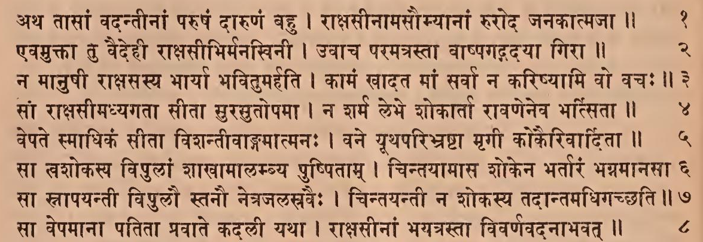
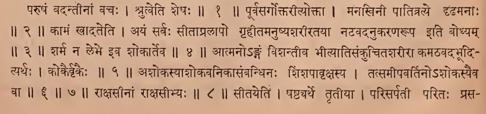
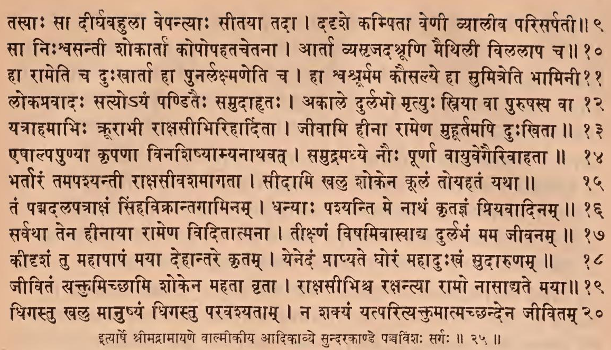
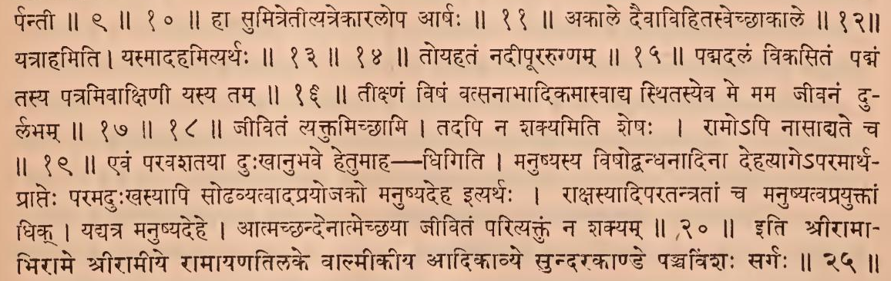

॥ श्रीः॥ ॥śrīḥ॥

ādikaviśrīvālmīkimahāmunipraṇītaṃ

rāmāyaṇam

tilakākhyayā vyākhyayā sametam।\
sundarakāṇḍam।

# pañcaviṃśaḥ sargaḥ \|\| 25

*PDF: pages 106 (1-8), 107 (9-20)*

## devanāgarī. page 106 (1-8) 

### Comment (1-8, 9-10…)

## devanāgarī. page 107 (…9-20)

### Comment (…9-20)

## IAST - International Alphabet of Sanskrit Transliteration

atha tāsāṃ vadantīnāṃ paruṣaṃ dāruṇaṃ bahu \|

rākṣasīnāmasaumyānāṃ ruroda janakātmajā \|\| 1

> paruṣaṃ vadantīnāṃ vacaḥ \| śrutveti śeṣaḥ \|\| 1 \|\|

evamuktā tu vaidehī rākṣasībhirmanakhinī \|

uvāca paramatrastā vāṣpagadayā girā \|\| 2

> pūrvasargoktarītyoktā \| manakhinī pātitraye dṛḍhamanāḥ \|\| 2 \|\|

na mānuṣī rākṣasasya bhāryā bhavitumarhati \|

kāmaṃ khādata māṃ sarvā na kariṣyāmi vo vacaḥ \|\| 3

> kāmaṃ khādateti \| ayaṃ sarvaḥ sītāpralāpo gṛhītamanuṣyaśarīratayā naṭavadanukaraṇarūpa iti bodhyam \|\| 3 \|\|

sāṃ rākṣasīmadhyagatā sītā surasutopamā \|

na śarma lebhe śokārtā rāvaṇeneva bhasitā \|\| 4

> śarma na lebhe iva śokārteva \|\| 4 \|\|

vepate smādhikaṃ sītā viśantīvāṅgamātmanaḥ \|

vane yūthaparibhraṣṭā mṛgī kokairivāditā \|\| 5

> ātmano'ṅgaṃ viśantīva bhītyātisaṅkucitaśarīrā kamaṭhavadabhūdityarthaḥ \| kokairvṛkaiḥ \|\| 5 \|\|

sā tvaśokasya vipulāṃ śākhāmālambya puṣpitām \|

cintayāmāsa śokena bhartāraṃ bhagnamānasā \|\| 6

sā strāpayantī vipulau stanau netrajalasravaiḥ \|

cintayantī na śokasya tadāntamadhigacchati \|\| 7

> aśokasyāśokavanikāsaṃbandhinaḥ śiṃśapāvṛkṣasya \| tatsamīpavartino'śokasyaiva cā \|\| 6 \|\| 7 \|\|

sā vepamānā patitā pravāte kadalī yathā \|

rākṣasīnāṃ bhayatrastā vivarṇavadanābhavat \|\| 8

> rākṣasīnāṃ rākṣasībhyaḥ \|\| 8 \|\|

tasyāḥ sā dīrghabahulā vepantyāḥ sītayā tadā \|

dadṛśe kampitā veṇī vyālīva parisarpatī \|\| 9

sā niḥśvasantī śokārtā kopopahatacetanā \|

ārtā vyasṛjadaśrūṇi maithilī vilalāpa ca \|\| 10

> sītayetiṃ \| ṣaṣṭhyarthe tṛtīyā \| parisarpatī paritaḥ prasarpantī \|\| 9 \|\| 10 \|\|

hā rāmeti ca duḥkhārtā hā punarlakṣmaṇeti ca \|

hā śvaśrūrmama kausalye hā sumitreti bhāminī \|\| 11

> hā sumitretītyatrekāralopa ārṣaḥ \|\| 11 \|\|

lokapravādaḥ satyo'yaṃ paṇḍitaiḥ samudāhṛtaḥ \|

akāle durlabho mṛtyuḥ striyā vā puruṣasya vā \|\| 12

> akāle daivāvihitasvecchākāle \|\| 12 \|\|

yatrāhamābhiḥ krūrābhī rākṣasībhirihārditā \|

jīvāmi hīnā rāmeṇa muhūrtamapi duḥkhitā \|\| 13

eṣālpapuṇyā kṛpaṇā vinaśiṣyāmyanāthavat \|

samudramadhye nauḥ pūrṇā vāyuvegairivāhatā \|\| 14

> yatrāhamiti \| yasmādahamityarthaḥ \|\| 13 \|\| 14 \|\|

bhartāraṃ tamapaśyantī rākṣasīvaśamāgatā \|

sīdāmi khalu śokena kūlaṃ toyahataṃ yathā \|\| 15

> toyahataṃ nadīpūrarugṇam \|\| 15 \|\|

taṃ padmadalapatrākṣaṃ siṃhavikrāntagāminam \|

dhanyāḥ paśyanti me nāthaṃ kṛtajñaṃ priyavādinam \|\| 16

> padmadalaṃ vikasitaṃ padmaṃ tasya patramivākṣiṇī yasya tam \|\| 16 \|\|

sarvathā tena hīnāyā rāmeṇa viditātmanā \|

tīkṣṇaṃ viṣamivāsvādya durlabhaṃ mama jīvanam \|\| 17

kīdṛśaṃ tu mahāpāpaṃ mayā dehāntare kṛtam \|

yenedaṃ prāpyate ghoraṃ mahāduḥkhaṃ sudāruṇam \|\| 18

> tīkṣṇaṃ viṣaṃ vatsanābhādikamāsvādya sthitasyeva me mama jīvanaṃ durlabham \|\| 17 \|\| 18 \|\|

jīvitaṃ saktumicchāmi śokena mahatā vṛtā \|

rākṣasībhiśca rakṣantyā rāmo nāsādyate mayā \|\| 19

> jīvitaṃ vyaktumicchāmi \| tadapi na śakyamiti śeṣaḥ \| rāmo'pi nāsādyate ca \|\| 19 \|\|

dhigastu khalu mānuṣyaṃ dhigastu paravaśyatām \|

na śakyaṃ yatparityaktumātmacchandena jīvitam \|\| 20

> evaṃ paravaśatayā duḥkhānubhave hetumāha - dhigiti \| manuṣyasya viṣodbandhanādinā dehatyāge'paramārtha- prāpteḥ paramaduḥkhasyāpi soḍhavyatvādaprayojako manuṣyadeha ityarthaḥ \| rākṣasyādiparatantratāṃ ca manuṣyatvaprayuktāṃ dhik \| yadyatra manuṣyadehe \| ātmacchandenātmecchayā jīvitaṃ parityaktuṃ na śakyam \|\| 20 \|\|

ityārṣe śrīmadrāmāyaṇe vālmīkīya ādikāvye sundarakāṇḍe pañcaviṃśaḥ sargaḥ \|\| 25 \|\|

> iti śrīrāmābhirāme śrīrāma rāmāyaṇatilake vālmīkīya ādikāvye sundarakāṇḍe pañcaviṃśaḥ sargaḥ \|\| 25 \|\|
