॥ श्रीः॥ ॥śrīḥ॥

ādikaviśrīvālmīkimahāmunipraṇītaṃ

rāmāyaṇam

tilakākhyayā vyākhyayā sametam।\
sundarakāṇḍam।

# ṣaḍviṃśaḥ sargaḥ \|\| 26

*PDF: pages 107 (1-7), 108 (8-22), 109 (23-38), 110 (39-47)*

## devanāgarī. page 107 (1-7) 

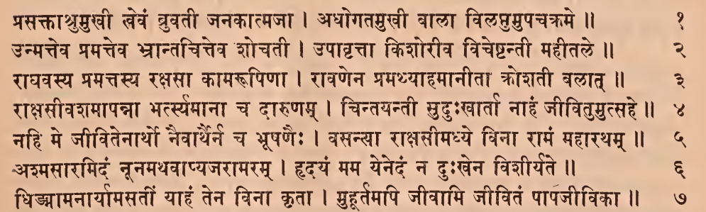

### Comment (1-7)

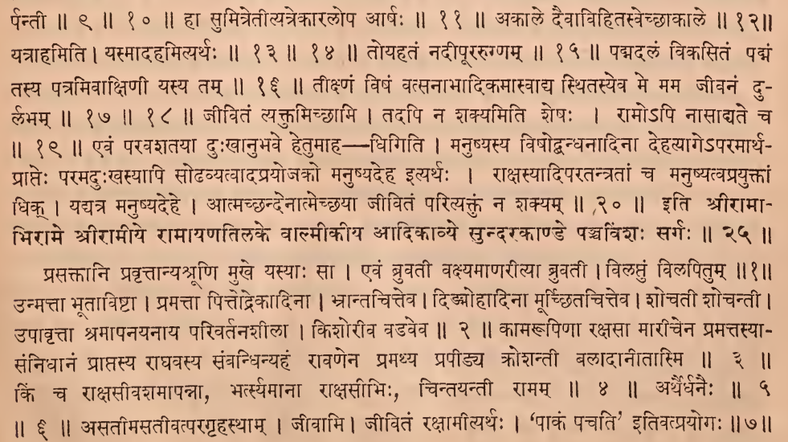

## devanāgarī. page 108 (8-22)

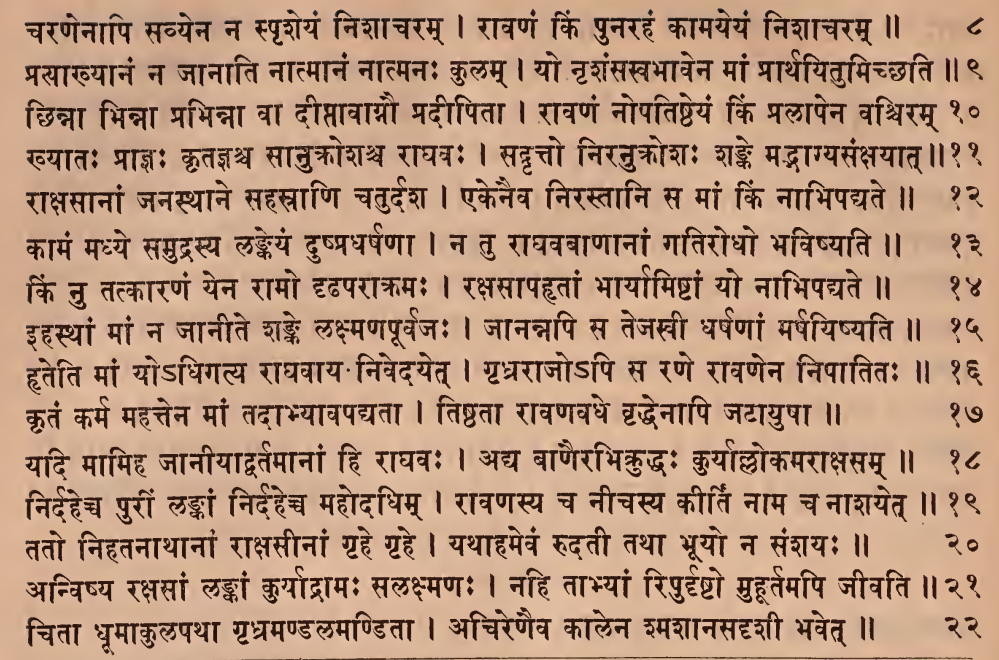

### Comment (8-22)

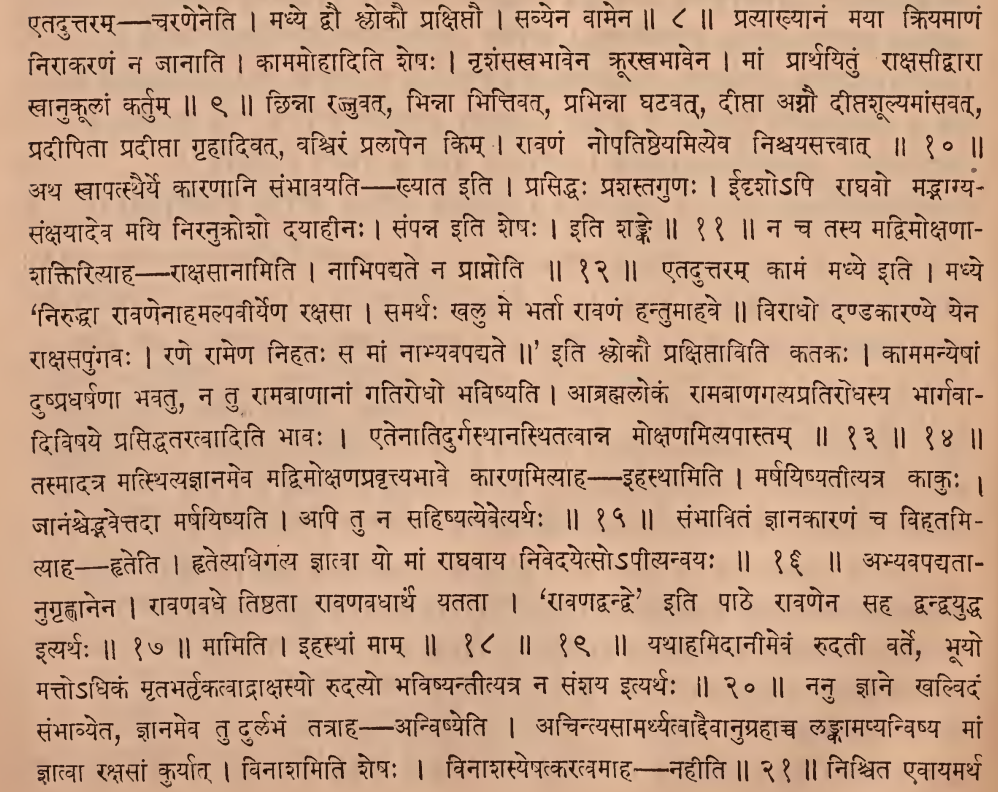

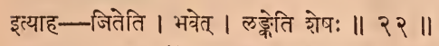

## devanāgarī. page 109 (23-38)

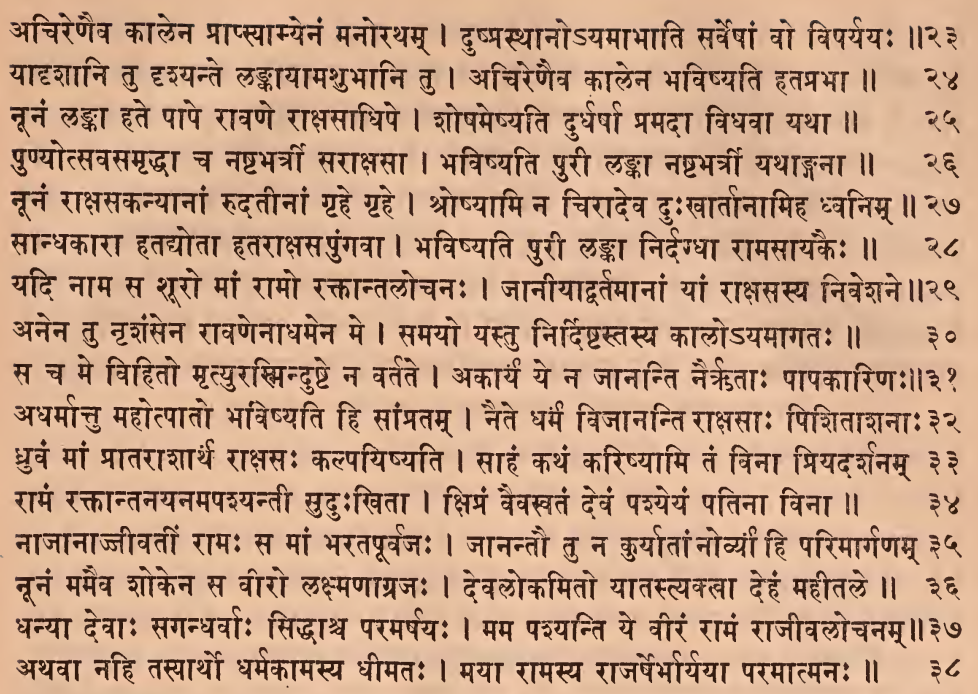

### Comment (23-38)

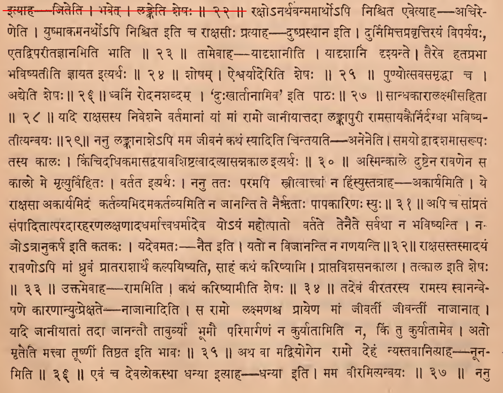

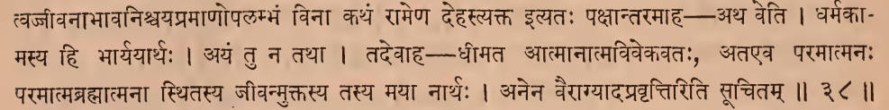

## devanāgarī. page 110 (39-47)

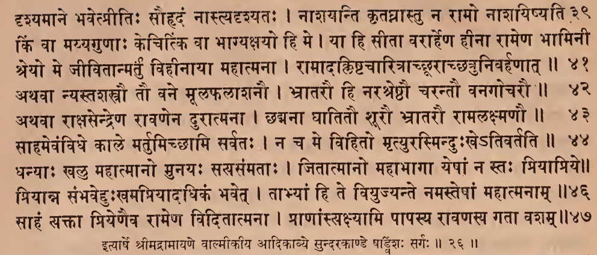

### Comment (39-47)

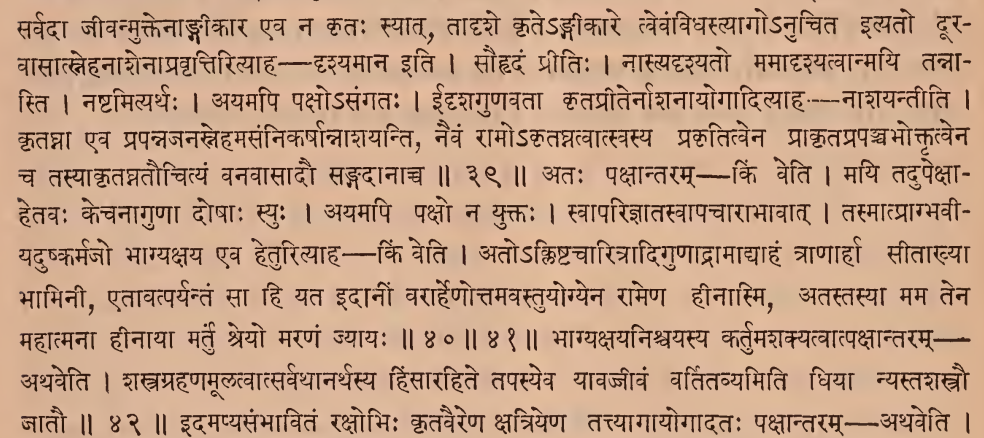

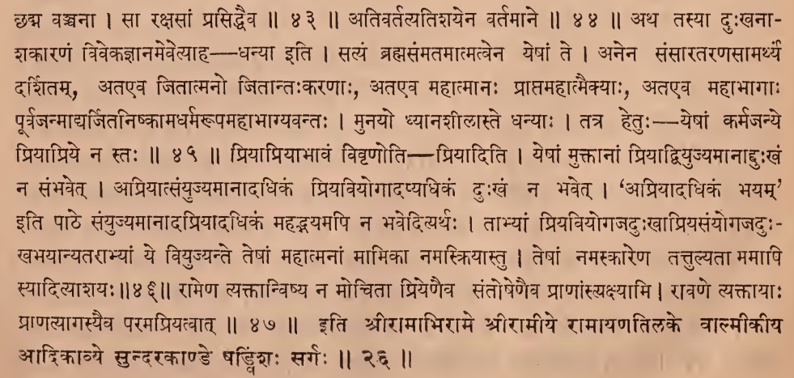

## IAST - International Alphabet of Sanskrit Transliteration

prasaktāśumukhī levaṃ bruvatī janakātmajā \|

adhogatamukhī bālā vilaptumupacakrame \|\| 1

> prasaktāni pravṛttānyabhrūṇi mukhe yasyāḥ sā \|
>
> evaṃ bruvatī vakṣyamāṇarītyā bruvatī \|
>
> vilaptuṃ vilapitum \|\| 1 \|\|

unmatteva pramatteva bhrāntacitteva śocatī \|

upāvṛttā kiśorīva viceṣṭantī mahītale \|\| 2

> unmattā bhūtāviṣṭā \|
>
> pramattā pittodrekādinā \|
>
> bhrāntacitteva \|
>
> diṅmohādinā mūcchitacitteva \|
>
> śocatī śocantī \|
>
> upāvṛttā śramāpanayanāya parivartanaśīlā \|
>
> kiśorīva vaḍaveva \|\| 2 \|\|

rāghavasya pramattasya rakṣasā kāmarūpiṇā \|

rāvaṇena pramathyāhamānītā krośatī balāt \|\| 3

> kāmarūpiṇā rakṣasā mārīcena pramattasyā- saṃnidhānaṃ prāptasya rāghavasya saṃbandhinyahaṃ rāvaṇena pramathya prapīḍya krośantī balādānītāsmi \|\| 3 \|\|

rākṣasīvaśamāpannā bhartsyamānā ca dāruṇam \|

cintayantī suduḥkhārtā nāhaṃ jīvitumutsahe \|\| 4

> kiṃ ca rākṣasīvaśamāpannā, bhartsyamānā rākṣasībhiḥ, cintayantī rāmam \|\| 4 \|\|

nahi me jīvitenārtho naivāthairna ca bhūṣaṇaiḥ \|

vasanyā rākṣasīmadhye vinā rāmaṃ mahāratham \|\| 5

aśmasāramidaṃ nūnamathavāpyajarāmaram \|

hṛdayaṃ mama yenedaṃ na duḥkhena viśīryate \|\| 6

> arthairdhanaiḥ \|\| 5 \|\| 6 \|\|

dhiṅmāmanāryāmasatīṃ yāhaṃ tena vinā kṛtā \|

muhūrtamapi jīvāmi jīvitaṃ pāpajīvikā \|\| 7

> asatīmasatīvatparagṛhasthām \|
>
> jīvāmi \|
>
> jīvitaṃ rakṣāmītyarthaḥ \|
>
> ' pākaṃ pacati' itivatprayogaḥ \|\| 7 \|\|

caraṇenāpi savyena na spṛśeyaṃ niśācaram \|

rāvaṇaṃ kiṃ punarahaṃ kāmayeyaṃ niśācaram \|\| 8

> etaduttaram — caraṇeneti \|
>
> madhye dvau ślokau prakṣiptau \|
>
> savyena vāmena \|\| 8 \|\|

prasākhyānaṃ na jānāti nātmānaṃ nātmanaḥ kulam \|

yo nṛśaṃsakhabhāvena māṃ prārthayitumicchati \|\| 9

> pratyākhyānaṃ mayā kriyamāṇaṃ nirākaraṇaṃ na jānāti \|
>
> kāmamohāditi śeṣaḥ \|
>
> nṛśaṃsasvabhāvena krūrakhabhāvena \|
>
> māṃ prārthayituṃ rākṣasīdvārā svānukūlāṃ kartum \|\| 9 \|\|

chinnā bhinnā bhinnā vā dīptāvāgnau pradīpitā \|

rāvaṇaṃ nopatiṣṭheyaṃ kiṃ pralāpena vaściram \|\| 10

> chinnā rajjuvat, bhinnā bhittivat, prabhinnā ghaṭavat dīptā agnau dīptaśūlyamāṃsavat, pradīpitā pradīptā gṛhādivat, vaściraṃ pralāpena kim\|
>
> rāvaṇaṃ nopatiṣṭheyamityeva niścayasattvāt \|\| 10 \|\|

khyātaḥ prājñaḥ kṛtajñaśca sānukrośaśca rāghavaḥ \|

sadvṛtto niranukrośaḥ śaṅke madbhāgyasaṅkṣayāt \|\| 11

> atha svāpatsthairye kāraṇāni saṃbhāvayati — khyāta iti \|
>
> prasiddhaḥ praśastaguṇaḥ \|
>
> īdṛśo'pi rāghavo madbhāgya- saṅkṣayādeva mayi niranukrośo dayāhīnaḥ \|
>
> saṃpanna iti śeṣaḥ \|
>
> iti śaṅke \|\| 11 \|\|

rākṣasānāṃ janasthāne sahasrāṇi caturdaśa \|

ekenaiva nirastāni sa māṃ kiṃ nābhipadyate \|\| 12

> na ca tasya madvimokṣaṇā- śaktirityāha — rākṣasānāmiti \|
>
> nābhipadyate na prāpnoti \|\| 12 \|\|

kāmaṃ madhye samudrasya laṅkeyaṃ duṣpradharṣaṇā \|

na tu rāghavavāṇānāṃ gatirodho bhaviṣyati \|\| 13

kiṃ nu tatkāraṇaṃ yena rāmo dṛḍhaparākramaḥ \|

rakṣasāpahṛtāṃ bhāryāmiṣṭāṃ yo nābhipadyate \|\| 14

> etaduttaram kāmaṃ madhye iti \|
>
> madhye 'niruddhā rāvaṇenāhamalpavīryeṇa rakṣasā \|
>
> samarthaḥ khalu me bhartā rāvaṇaṃ hantumāhave \|\|
>
> virādho daṇḍakāraṇye yena rākṣasapuṅgavaḥ \|
>
> raṇe rāmeṇa nihataḥ sa māṃ nābhyavapadyate \|\|
>
> ' iti ślokī prakṣiptāviti katakaḥ \|
>
> kāmamanyeṣāṃ duṣpradharṣaṇā bhavatu, na tu rāmabāṇānāṃ gatirodho bhaviṣyati \|
>
> ābrahmalokaṃ rāmabāṇagatyapratirodhasya bhārgavā- diviṣaye prasiddhataratvāditi bhāvaḥ \|
>
> etenātidurgasthānasthitatvānna mokṣaṇamityapāstam \|\| 13 \|\| 14 \|\|

ihasthāṃ māṃ na jānīte śaṅke lakṣmaṇapūrvajaḥ \|

jānannapi sa tejakhī dharṣaṇāṃ marṣayiṣyati \|\| 15

> tasmādatra matsthityajñānameva madvimokṣaṇapravṛttyabhāve kāraṇamityāha - ihasthāmiti \|
>
> marṣayiṣyatītyatra kākuḥ \|
>
> jānaṃścedbhavettadā marṣayiṣyati \|
>
> api tu na sahiṣyatyevetyarthaḥ \|\| 15 \|\|

hṛteti māṃ yo'dhigatya rāghavāya nivedayet \|

gṛdhrarājo'pi sa raṇe rāvaṇena nipātitaḥ \|\| 16

> saṃbhāvitaṃ jñānakāraṇaṃ ca vihṛtami- tyāha—hṛteti \|
>
> hṛtetyadhigatya jñātvā yo māṃ rāghavāya nivedayetso'pītyanvayaḥ \|\| 16 \|\|

kṛtaṃ karma mahattena māṃ tadābhyāvapadyatā \|

tiṣṭhatā rāvaṇavadhe vṛddhenāpi jaṭāyuṣā \|\| 17

> abhyavapadyatā- nugṛhṇānena \|
>
> rāvaṇavadhe tiṣṭhatā rāvaṇavadhārthaṃ yatatā \|
>
> ' rāvaṇadvandve' iti pāṭhe rāvaṇena saha dvandvayuddha ityarthaḥ \|\| 17 \|\|

yadi māmiha jānīyādvartamānāṃ hi rāghavaḥ \|

adya vāṇairabhikruddhaḥ kuryālloka marākṣasam \|\| 18

nirdaheca purīṃ laṅkāṃ nirdahecca mahodadhim \|

rāvaṇasya ca nīcasya kīrti nāma ca nāśayet \|\| 19

> māmiti \|
>
> ihasthāṃ mām \|\| 18 \|\| 19 \|\|

tato nihatanāthānāṃ rākṣasīnāṃ gṛhe gṛhe \|

yathāhamevaṃ rudatī tathā bhūyo na saṃśayaḥ \|\| 20

> yathāhamidānīmevaṃ rudatī varte, bhūyo matto'dhikaṃ mṛtabhartṛkatvādrākṣasyo rudatyo bhaviṣyantītyatra na saṃśaya ityarthaḥ \|\| 20 \|\|

anviṣya rakṣasāṃ laṅkāṃ kuryādrāmaḥ salakṣmaṇaḥ \|

nahi tābhyāṃ ripurdṛṣṭo muhūrtamapi jīvati \|\| 21

> nanu jñāne khalvidaṃ saṃbhāvyeta, jñānameva tu durlabhaṃ tatrāha — anviṣyeti \|
>
> acintyasāmarthyatvāddaivānugrahācca laṅkāmapyanviṣya māṃ jñātvā rakṣasāṃ kuryāt \|
>
> vināśamiti śeṣaḥ \|
>
> vināśasyepatkaratvamāha--nahīti \|\| 21 \|\|

citā dhūmākulapathā gṛbhramaṇḍalamaṇḍitā \|

acireṇaiva kālena śmaśānasadṛśī bhaveta \|\| 22

> niścita evāyamartha ityāha—jiteti \|
>
> bhavet \|
>
> laṅketi śeṣaḥ \|\| 22 \|\|

acireṇaiva kālena prāpsyāmyenaṃ manoratham \|

duṣprasthāno'yamābhāti sarveṣāṃ vo viparyayaḥ \|\| 23

> rakṣo'narthavanmamārtho'pi niścita evetyāha- acire- ṇeti \|
>
> yuṣmākamanartho'pi niścita iti ca rākṣasīḥ pratyāha - duṣprasthāna iti \|
>
> durnimittapravṛttirayaṃ viparyayaḥ, etadviparītajñānamiti bhāti \|\| 23 \|\|

yādṛśāni tu dṛśyante laṅkāyāmaśubhāni tu \|

acireṇaiva kālena bhaviṣyati hataprabhā \|\| 24

> tāmevāha - yādṛśānīti \|
>
> yādṛśāni dṛśyante \|
>
> taireva hataprabhā bhaviṣyatīti jñāyata ityarthaḥ \|\| 24 \|\|

nūnaṃ laṅkā hate pāpe rāvaṇe rākṣasādhipe \|

śoṣameṣyati durdharṣā pramadā vidhavā yathā \|\| 25

> śoṣam \|
>
> aiśvaryāderiti śeṣaḥ \|\| 25 \|\|

puṇyotsavasamṛddhā ca naṣṭabhatra sarākṣasā \|

bhaviṣyati purī laṅkā naṣṭabhatra yathāṅganā \|\| 26

> puṇyotsavasamṛddhā ca \|
>
> adyeti śeṣaḥ \|\| 26 \|\|

nūnaṃ rākṣasakanyānāṃ rudatīnāṃ gṛhe gṛhe \|

śroṣyāmi na cirādeva duḥkhārtānāmiha dhvanim \|\| 27

> dhvaniṃ rodanaśabdam \|
>
> 'duḥkhātīnāmiva' iti pāṭhaḥ \|\| 27 \|\|

sāndhakārā hatotā hatarākṣasa puṅgavā \|

bhaviṣyati purī laṅkā nirdagdhā rāmasāyakaiḥ \|\| 28

> sāndhakārālakṣmīsahitā \|\| 28 \|\|

yadi nāma sa śūro māṃ rāmo raktāntalocanaḥ \|

jānīyādvartamānāṃ yāṃ rākṣasasya niveśane \|\| 29

> yadi rākṣasasya niveśane vartamānāṃ yāṃ māṃ rāmo jānīyāttadā laṅkāpurī rāmasāyakairnirdagdhā bhaviṣya- tītyanvayaḥ \|\| 29 \|\|

anena tu nṛśaṃsena rāvaṇenādhamena me \|

samayo yastu nirdiṣṭastasya kālo'yamāgataḥ \|\| 30

> nanu laṅkānāśe'pi mama jīvanaṃ kathaṃ syāditi cintayati---aneneti \|
>
> samayo dvādaśamāsarūpaḥ tasya kālaḥ \|
>
> kiñcidadhikamāsadvayāvaśiṣṭatvādatyāsannakāla ityarthaḥ \|\| 30 \|\|

saca me vihito mṛtyurasminduṣṭe na vartate \|

akāryaṃ ye na jānanti nairṛtāḥ pāpakāriṇaḥ \|\| 31

> asminkāle duṣṭena rāvaṇena sa kālo me mṛtyurvihitaḥ \|
>
> vartata ityarthaḥ \|
>
> nanu tataḥ paramapi strītvāttvāṃ na hiṃsyustatrāha - akāryamiti \|
>
> ye rākṣasā akāryamidaṃ kartavyamidamakartavyamiti na jānanti te nairṛtāḥ pāpakāriṇaḥ syuḥ \|\| 31 \|\|

adharmāttu mahotpāto bhaviṣyati hi sāṃpratam \|

naite dharmaṃ vijānanti rākṣasāḥ piśitāśanāḥ \|\| 32

> api ca sāṃprataṃ saṃpāditātparadāraharaṇalakṣaṇādadharmāttvadharmādeva yo'yaṃ mahotpāto vartate tenaite sarvathā na bhaviṣyanti \|
>
> na- ño'trānukarṣa iti katakaḥ \|
>
> yadevamataḥ- naita iti \|
>
> yato na vijānanti na gaṇayanti \|\| 32 \|\|

dhruvaṃ māṃ prātarāśārthaṃ rākṣasaḥ kalpayiṣyati \|

sāhaṃ kathaṃ kariṣyāmi taṃ vinā priyadarśanam \|\| 33

> rākṣasastasmādayaṃ rāvaṇo'pi māṃ dhruvaṃ prātarāśārthaṃ kalpayiṣyati, sāhaṃ kathaṃ kariṣyāmi \|
>
> prāptaviśasanakālā \|
>
> tatkāla iti śeṣaḥ \|\| 33 \|\|

rāmaṃ raktāntanayanamapaśyantī suduḥkhitā \|

kṣipraṃ vaivasvataṃ devaṃ paśyeyaṃ patinā vinā \|\| 34

> uktamevāha — rāmamiti \|
>
> kathaṃ kariṣyāmīti śeṣaḥ \|\| 34 \|\|

nājānājjīvatīṃ rāmaḥ sa māṃ bharatapūrvajaḥ \|

jānantau tu na kuryātāṃ norvyā hi parimārgaṇam \|\| 35

> tadevaṃ vīratarasya rāmasya svānanve- paṇe kāraṇānyutprekṣate - nājānāditi \|
>
> sa rāmo lakṣmaṇaśca prāyeṇa māṃ jīvatīṃ jīvantīṃ nājānāt \|
>
> yadi jānīyātāṃ tadā jānantau tāvurvyā bhūmau parimārgaṇaṃ na kuryātāmiti na kiṃ tu kuryātāmeva \|
>
> ato mṛteti mattvā tūṣṇīṃ tiṣṭhata iti bhāvaḥ \|\| 35 \|\|

nūnaṃ mamaiva śokena sa vīro lakṣmaṇāgrajaḥ \|

devalokamito yātastyaktvā dehaṃ mahītale \|\| 36

> atha vā madviyogena rāmo dehaṃ nyastavānityāha - nūna- miti \|\| 36 \|\|

dhanyā devāḥ sagandharvāḥ siddhāśca paramarṣayaḥ \|

mama paśyanti ye vīraṃ rāmaṃ rājīvalocanam \|\| 37

> evaṃ ca devalokasthā dhanyā ityāha-- dhanyā iti \|
>
> mama vīramityanvayaḥ \|\| 37 \|\|

athavā nahi tasyārtho dharmakāmasya dhīmataḥ \|

mayā rāmasya rājarṣerbhāryayā paramātmanaḥ \|\| 38

> nanu tvajjīvanābhāvaniścayapramāṇopalambhaṃ vinā kathaṃ rāmeṇa dehastyakta ityataḥ pakṣāntaramāha — atha veti \|
>
> dharmakā- masya hi bhāryayārthaḥ \|
>
> ayaṃ tu na tathā \|
>
> tadevāha - dhīmata ātmānātmavivekavataḥ, ataeva paramātmanaḥ paramātmabrahmātmanā sthitasya jīvanmuktasya tasya mayā nārthaḥ \|
>
> anena vairāgyādapravṛttiriti sūcitam \|\| 38 \|\|

dṛśyamāne bhavetprītiḥ sauhṛdaṃ nāstyadṛśyataḥ \|

nāśayanti kṛtaghnāstu na rāmo nāśayiṣyati \|\| 39

> sarvadā jīvanmuktenāṅgīkāra eva na kṛtaḥ syāt, tādṛśe kṛte'ṅgīkāre tvevaṃvidhastyāgo'nucita ityato dūra- vāsātsnehanāśenāpravṛttirityāha — dṛśyamāna iti \|
>
> sauhṛdaṃ prītiḥ \|
>
> nāstyadṛśyato mamādṛśyatvānmayi tannā- sti \|
>
> naṣṭamityarthaḥ \|
>
> ayamapi pakṣo'saṅgataḥ \|
>
> īdṛśaguṇavatā kṛtaprīternāśanāyogādityāha -- nāśayantīti \|
>
> kṛtaghnnā eva prapannajanasnehamasaṃnikarṣānnāśayanti, naivaṃ rāmo'kṛtaghnnatvātsvasya prakṛtitvena prākṛtaprapañcabhoktṛtvena ca tasyākṛtaghnataucityaṃ vanavāsādau saṅgadānācca \|\| 39 \|\|

kiṃ vā mayyaguṇāḥ kecitki vā bhāgyakṣayo hi me \|

yā hi sītā varārheṇa hīnā rāmeṇa bhāminī \|\| 40

śreyo me jīvitāntu vihīnāyā mahātmanā \|

rāmādakliṣṭacāritrācchūrācchatrunibarhaṇāt \|\| 41

> ataḥ pakṣāntaram — kiṃ veti \|
>
> mayi tadupekṣā- hetavaḥ kecanāguṇā doṣāḥ syuḥ \|
>
> ayamapi pakṣo na yuktaḥ \|
>
> svāparijñātasvāpacārābhāvāt \|
>
> tasmātprāgbhavī- yaduṣkarmajo bhāgyakṣaya eva heturityāha — kiṃ veti \|
>
> ato'kliṣṭacāritrādiguṇādrāmādyāhaṃ trāṇārhā sītākhyā bhāminī, etāvatparyantaṃ sā hi yata idānīṃ varārheṇottamavastuyogyena rāmeṇa hīnāsmi, atastasyā mama tena mahātmanā hīnāyā ma śreyo maraṇaṃ jyāyaḥ \|\| 40 \|\| 41 \|\|

athavā nyastaśastrau tau vane mūlaphalāśanau \|

bhrātarau hi naraśreṣṭhau carantau vanagocarau \|\| 42

> bhāgyakṣayaniścayasya kartumaśakyatvātpakṣāntaram - athaveti \|
>
> śastragrahaṇamūlatvātsarvathānarthasya hiṃsārahite tapasyeva yāvajjīvaṃ vartitavyamiti dhiyā nyastaśastrau jātau \|\| 42 \|\|

athavā rākṣasendreṇa rāvaṇena durātmanā \|

chadmanā ghātitau śurau bhrātarau rāmalakṣmaṇau \|\| 43

> idamapyasaṃbhāvitaṃ rakṣobhiḥ kṛtavaireṇa kṣatriyeṇa tattyāgāyogādataḥ pakṣāntaram — athaveti \|
>
> chadma vañcanā \|
>
> sā rakṣasāṃ prasidvaiva \|\| 43 \|\|

sāhamevaṃvidhe kāle martumicchāmi sarvataḥ \|

na ca me vihito mṛtyurasminduḥkhe'tivartati \|\| 44

> ativartatyatiśayena vartamāne \|\| 44 \|\|

dhanyāḥ khalu mahātmāno munayaḥ sayasaṃmatāḥ \|

jitātmāno mahābhāgā yeṣāṃ na staḥ priyāpriye\| 45

> atha tasyā duḥkhanā- śakāraṇaṃ vivekajñānamevetyāha- dhanyā iti \|
>
> satyaṃ brahmasaṃmatamātmatvena yeṣāṃ te \|
>
> anena saṃsārataraṇasāmarthya darśitam, ataeva jitātmano jitāntaḥ karaṇāḥ, ataeva mahātmānaḥ prāptamahātmaikyāḥ, ataeva mahābhāgāḥ pūrvajanmādyarjitaniṣkāmadharmarūpamahābhāgyavantaḥ \|
>
> munayo dhyānaśīlāste dhanyāḥ \|
>
> tatra hetuḥ - yeṣāṃ karmajanye priyāpriye na staḥ \|\| 45 \|\|

priyānna saṃbhavedduḥkhamapriyādadhikaṃ bhavet \|

tābhyāṃ hi te viyujyante namasteṣāṃ mahātmanām \|\| 46

> priyāpriyābhāvaṃ vivṛṇoti - priyāditi \|
>
> yeṣāṃ muktānāṃ priyādviyujyamānādduḥkhaṃ na saṃbhavet \|
>
> apriyātsaṃyujyamānādadhikaṃ priyaviyogādapyadhikaṃ duḥkhaṃ na bhavet \|
>
> 'aprivādadhikaṃ bhayam' iti pāṭhe saṃyujyamānādapriyādadhikaṃ mahadbhayamapi na bhavedityarthaḥ \|
>
> tābhyāṃ priyaviyogajaduḥkhāpriyasaṃyogajaduḥ- khabhayānyatarābhyāṃ ye viyujyante teṣāṃ mahātmanāṃ māmikā namaskriyāstu \|
>
> teṣāṃ namaskāreṇa tattulyatā mamāpi syādityāśayaḥ\|\| 46 \|\|

sāhaṃ saktā priyeṇaiva rāmeṇa viditātmanā \|

prāṇāṃsyakṣyāmi pāpasya rāvaṇasya gatā vaśam \|\| 47

> rāmeṇa vyaktānviṣya na mocitā priyeṇaiva santoṣeṇaiva prāṇāṃstyakṣyāmi \|
>
> rāvaṇe vyaktāyā: prāṇatyāgasyaiva paramapriyatvāt \|\| 47 \|\|

ityārṣe śrīmadrāmāyaṇe vālmīkīya ādikāvye sundarakāṇḍe ṣaḍiśaḥ sargaḥ \|\| 26 \|\|

> iti śrīrāmābhirāme śrīrāmīye rāmāyaṇatilake vālmīkīya ādikāvye sundarakāṇḍe ṣaḍviṃśaḥ sargaḥ \|\| 26 \|\|
