_Created: 07-07-2026 · Last updated: 05-09-2026_

॥ श्रीः॥ ॥śrīḥ॥

ādikaviśrīvālmīkimahāmunipraṇītaṃ

rāmāyaṇam

tilakākhyayā vyākhyayā sametam।\
sundarakāṇḍam।

# saptaviṃśaḥ sargaḥ \|\| 27

*Source in Sanskrit (devanāgarī) (file [Ramayana 2.pdf](https://drive.google.com/open?id=18roDak0GMr30lg8CN1aqfkz__r9X_9ID&usp=drive_fs))*

<table style="width:47%;">
<colgroup>
<col style="width: 7%" />
<col style="width: 12%" />
<col style="width: 27%" />
</colgroup>
<thead>
<tr>
<th style="text-align: center;"><strong>Page</strong></th>
<th style="text-align: center;"><strong>Verse</strong></th>
<th style="text-align: center;"><strong>Comment</strong></th>
</tr>
</thead>
<tbody>
<tr>
<td style="text-align: center;">111</td>
<td style="text-align: center;">1-15</td>
<td><blockquote>

1-15 (beginning)

</blockquote></td>
</tr>
<tr>
<td style="text-align: center;">112</td>
<td style="text-align: center;">16-35</td>
<td><blockquote>

15 (ending)- 35 (beginning)

</blockquote></td>
</tr>
<tr>
<td style="text-align: center;">113</td>
<td style="text-align: center;">36-47</td>
<td><blockquote>

35 (ending) – 47

</blockquote></td>
</tr>
</tbody>
</table>

## devanāgarī. 

### Page 111. Verse (1-15) 

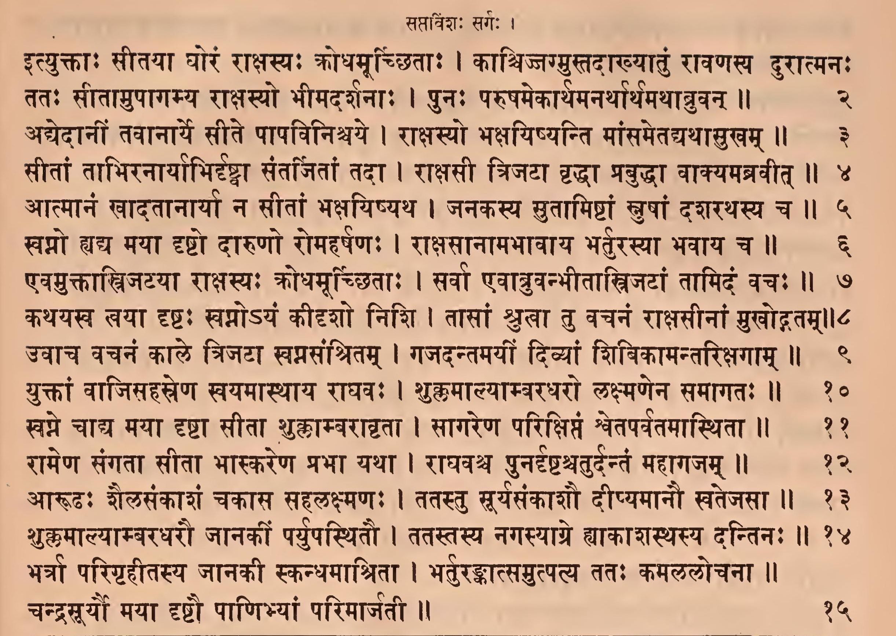

### Page 111. Comment (1-15)

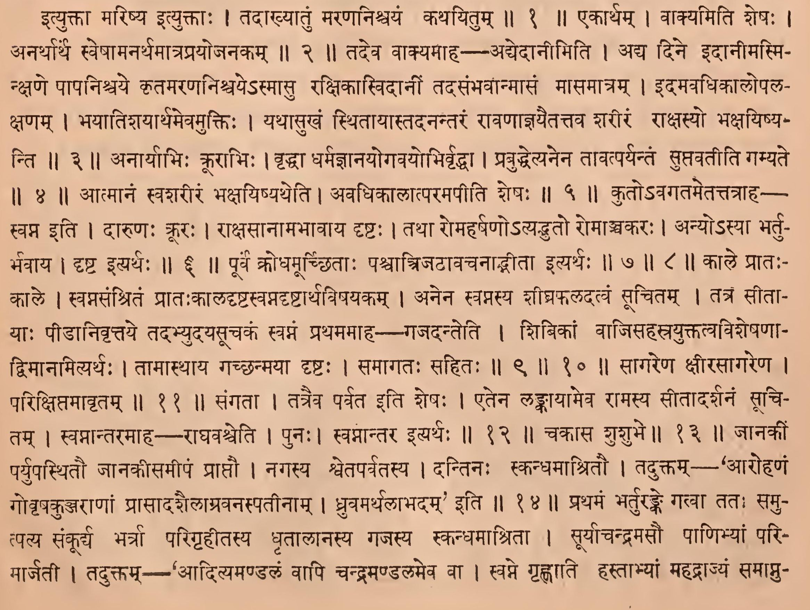

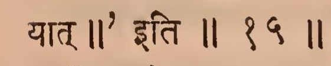

### Page 112. Verse (16-35)

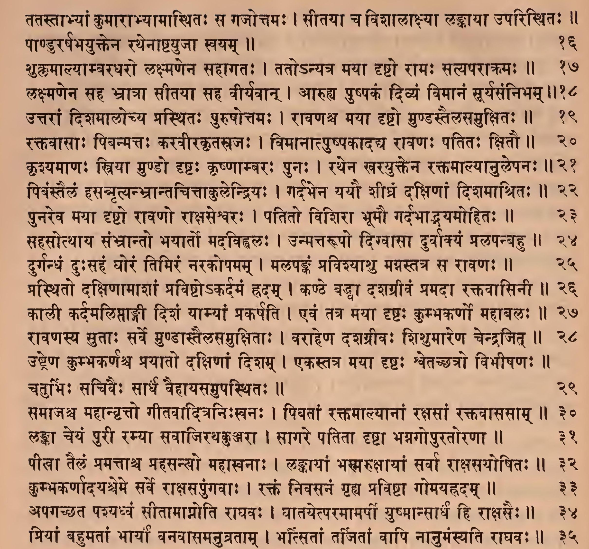

### Page 112. Comment (16-35)

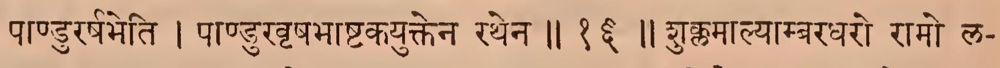

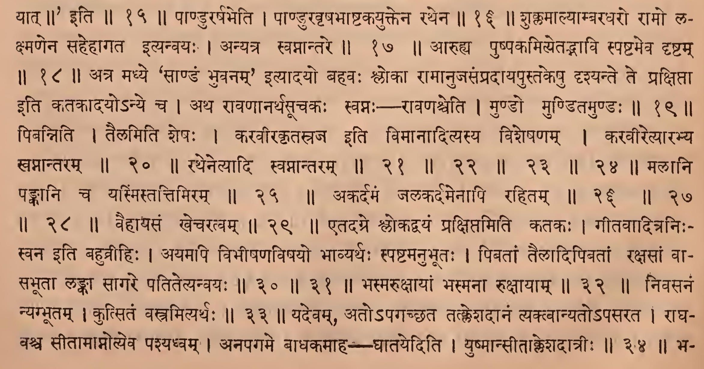

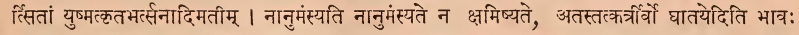

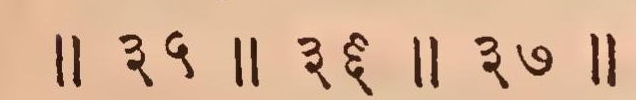

### Page 113. Verse (36-47)

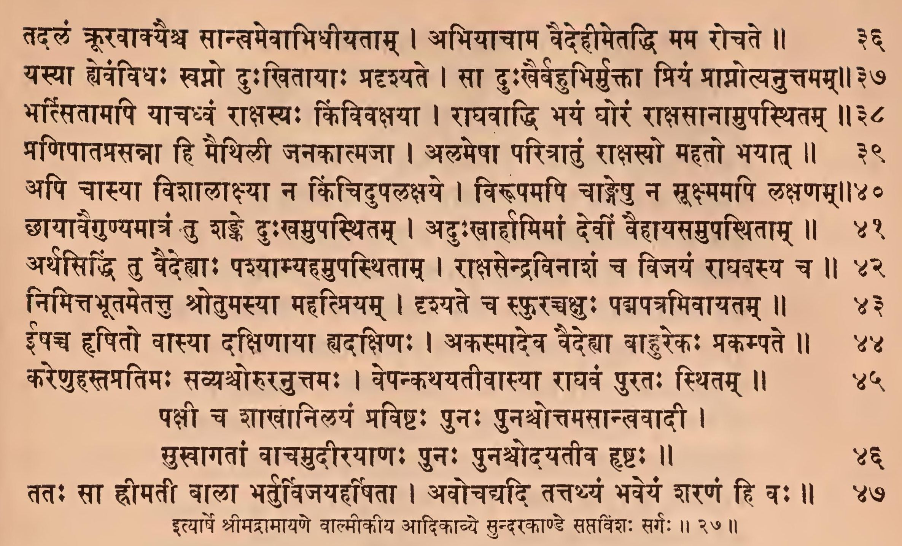

### Page 113. Comment (35-47)

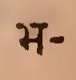

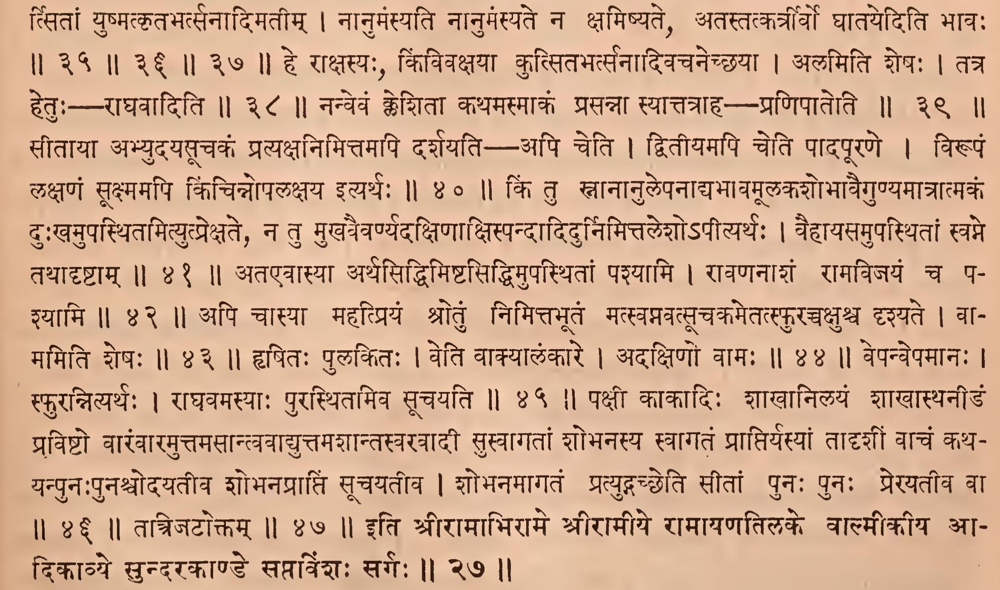

## IAST - International Alphabet of Sanskrit Transliteration

ityuktāḥ sītayā ghoraṃ rākṣasyaḥ krodhamūcchitāḥ \|

kācijjagmustadākhyātuṃ rāvaṇasya durātmanaḥ \|\| 1

> ityuktā mariṣya ityuktāḥ \|
>
> tadākhyātuṃ maraṇaniścayaṃ kathayitum \|\|1\|\|

tataḥ sītāmupāgamya rākṣasyo bhīmadarśanāḥ \|

punaḥ paruṣamekārthamanarthārthamathābruvan \|\| 2

> ekārtham \|
>
> vākyamiti śeṣaḥ \|\|
>
> anarthārtha sveṣāmanarthamātraprayojanakam \|\|2\|\|

adyedānīṃ tavānārye sīte pāpaviniścaye \|

rākṣasyo bhakṣayiṣyanti māṃsametadyathāsukham \|\| 3

> tadeva vākyamāha - adyedānīmiti \|
>
> adya dine idānīmasmi- nkṣaṇe pāpaniścaye kṛtamaraṇaniścaye'smāsu rakṣikāsvidānīṃ tadasaṃbhavānmāsaṃ māsamātram \|
>
> idamavadhikālopala- kṣaṇam \|
>
> bhayātiśayārthamevamuktiḥ \|
>
> yathāsukhaṃ sthitāyāstadanantaraṃ rāvaṇājñayaitattava śarīraṃ rākṣasyo bhakṣayiṣyanti \|\|3\|\|

sītāṃ tābhiranāryābhirdṛṣṭvā santarjitāṃ tadā \|

rākṣasī trijaṭā vṛddhā prabuddhā vākyamabravīt \|\| 4

> anāryābhiḥ krūrābhiḥ \|
>
> vṛddhā dharmajñānayogavayobhirvṛddhā \|
>
> prabuddhetyanena tāvatparyantaṃ suptavatīti gamyate \|\|4 \|\|

ātmānaṃ khādatānāryā na sītāṃ bhakṣayiṣyatha \|

janakasya sutāmiṣṭāṃ snuṣāṃ daśarathasya ca \|\| 5

> ātmānaṃ svaśarīraṃ bhakṣayiṣyatheti \|
>
> avadhikālātparamapīti śeṣaḥ \|\|5\|\|

svapno dya mayā dṛṣṭo dāruṇo romaharṣaṇaḥ \|

rākṣasānāmabhāvāya bharturasyā bhavāya ca \|\| 6

> kuto'vagatametattatrāha- svapna iti \|
>
> dāruṇaḥ krūraḥ \|
>
> rākṣasānāmabhāvāya dṛṣṭaḥ \|
>
> tathā romaharṣaṇo'tyadbhuto romāñcakaraḥ \|
>
> anyo'syā bhartu- bhavāya \|
>
> dṛṣṭa ityarthaḥ \|\|6\|\|

evamuktātrijaṭayā rākṣasyaḥ krodhamūcchitāḥ \|

sarvā evābruvanbhītātrijaṭāṃ tāmidaṃ vacaḥ \|\| 7

kathayasva tvayā dṛṣṭaḥ svapno'yaṃ kīdṛśo niśi \|

tāsāṃ śrutvā tu vacanaṃ rākṣasīnāṃ mukhodgatam \|\| 8

> pūrva krodhamūrcchitāḥ paścātrijaṭāvacanādbhītā ityarthaḥ \|\|7\|\|8\|\|

uvāca vacanaṃ kāle trijaṭā svapnasaṃśritam \|

gajadantamayīṃ divyāṃ śivikāmantarikṣagām \|\| 9

yuktāṃ vājisahasreṇa svayamāsthāya rāghavaḥ \|

śuklamālyāmbaradharo lakṣmaṇena samāgataḥ \|\| 10

> kāle prāta:- kāle \|
>
> svapnasaṃśritaṃ prātaḥkāladṛṣṭasvapnadṛṣṭārthaviṣayakam \|
>
> anena svapnasya śīghraphaladatvaṃ sūcitam \|
>
> tatra sītā- yāḥ pīḍānivṛttaye tadabhyudayasūcakaṃ svamaṃ prathamamāha – gajadanteti \|
>
> śibikāṃ vājisahasrayuktatvaviśeṣaṇā- dvimānamityarthaḥ \|
>
> tāmāsthāya gacchanmayā dṛṣṭaḥ \|
>
> samāgataḥ sahitaḥ \|\|9\|\|10 \|\|

svapne cādya mayā dṛṣṭā sītā śuklāmbarāvṛtā \|

sāgareṇa parikṣiptaṃ śvetaparvatamāsthitā \|\| 11

> sāgareṇa kṣīrasāgareṇa \|
>
> parikṣiptamāvṛtam \|\|11\|\|

rāmeṇa saṅgatā sītā bhāskareṇa prabhā yathā \|

rāghavaśca punardṛṣṭaścaturdantaṃ mahāgajam \|\| 12

> saṅgatā \|
>
> tatraiva parvata iti śeṣaḥ \|
>
> etena laṅkāyāmeva rāmasya sītādarśanaṃ sūci- tam \|
>
> svapnāntaramāha—rāghavaśceti \|
>
> punaḥ \|
>
> svamāntara ityarthaḥ \|\|12\|\|

ārūḍhaḥ śailasaṅkāśaṃ cakāsa sahalakṣmaṇaḥ \|

tatastu sūryasaṅkāśau dīpyamānau khatejasā \|\| 13

> cakāsa śuśubhe \|\|13\|\|

śuklamālyāmbaradharau jānakīṃ paryupasthitau \|

tatastasya nagasyāgre hyākāśasthasya dantinaḥ \|\| 14

> jānakī paryupasthitau jānakīsamīpaṃ prāptau \|
>
> nagasya śvetaparvatasya \|
>
> dantinaḥ skandhamāśritau \|
>
> taduktam – 'ārohaṇaṃ govṛṣakuñjarāṇāṃ prāsādaśailāgravanaspatīnām \|
>
> dhruvamarthalābhadam' iti \|\|14\|\|

bhartrā parigṛhītasya jānakī skandhamāśritā \|

bharturaṅgātsamutpatya tataḥ kamalalocanā \|\|

candrasūryau mayā dṛṣṭau pāṇibhyāṃ parimārjatī \|\| 15

> prathamaṃ bhartura gatvā tataḥ samu- tpatya saṅkūrya bhartrā parigṛhītasya dhṛtālānasya gajasya skandhamāśritā \|
>
> sūryācandramasau pāṇibhyāṃ pari- mārjatī \|
>
> taduktam- 'ādityamaṇḍalaṃ vāpi candramaṇḍalameva vā \|
>
> svame gṛhṇāti hastābhyāṃ mahadrājyaṃ samāpnuyāt\|\|' iti \|\|15\|\|

tatastābhyāṃ kumārābhyāmāsthitaḥ sa gajottamaḥ \|

sītayā ca viśālākṣyā laṅkāyā uparisthitaḥ \|\|

pāṇḍurarṣabhayuktena rathenāṣṭayujā svayam \|\| 16

> pāṇḍurarṣabheti \|
>
> pāṇḍuravṛṣabhāṣṭakayuktena rathena \|\|16\|\|

śuklamālyāmbaradharo lakṣmaṇena sahāgataḥ \|

tato'nyatra mayā dṛṣṭo rāmaḥ satyaparākramaḥ \|\| 17

> śuklamālyāmbaradharo rāmo la- kṣmaṇena sahehāgata ityanvayaḥ \|
>
> anyatra svapnāntare \|\|17\|\|

lakṣmaṇena saha bhrātrā sītayā saha vīryavān \|

āruhya puṣpakaṃ divyaṃ vimānaṃ sūryasaṃnibham \|\| 18

> āruhya puṣpakamityetadbhāvi spaṣṭameva dṛṣṭam \|\|18\|\|

uttarāṃ diśamālocya prasthitaḥ puruṣottamaḥ \|

rāvaṇaśca mayā dṛṣṭo muṇḍastailasamukṣitaḥ \|\| 19

> atra madhye 'sāṇḍaṃ bhuvanam' ityādayo bahavaḥ ślokā rāmānujasaṃpradāyapustakeṣu dṛśyante te prakṣiptā iti katakādayo'nye ca \|
>
> atha rāvaṇānarthasūcakaḥ svapnaḥ – rāvaṇaśceti \|
>
> muṇḍo muṇḍitamuṇḍaḥ \|\|19\|\|

raktavāsāḥ pivanmattaḥ karavīrakṛtasrajaḥ \|

vimānātpuṣpakādadya rāvaṇaḥ patitaḥ kṣitau \|\| 20

> pibanniti \|
>
> tailamiti śeṣaḥ \|
>
> karavīrakṛtasraja iti vimānādityasya viśeṣaṇam \|
>
> karavīretyārabhya svapnāntaram \|\|20\|\|

kṛśyamāṇaḥ striyā muṇḍo dṛṣṭaḥ kṛṣṇāmvaraḥ punaḥ \|

rathena kharayuktena raktamālyānulepanaḥ \|\| 21

pivaṃstailaṃ hasannṛtyanbhrāntacittākulendriyaḥ \|

gardabhena yayau śīghraṃ dakṣiṇāṃ diśamāśritaḥ \|\| 22

punareva mayā dṛṣṭo rāvaṇo rākṣaseśvaraḥ \|

patito viśirā bhūmau gardabhādbhayamohitaḥ \|\| 23

sahasotthāya saṃbhrānto bhayārto madavihvalaḥ \|

unmattarūpo digvāsā durvākyaṃ pralapanhu \|\| 24

> rathenetyādi svapnāntaram \|\|21\|\|22\|\|23\|\|24\|\|

durgandhaṃ duḥsahaṃ ghoraṃ timiraṃ narakopamam \|

malapaṅkaṃ praviśyāśu manastatra sa rāvaṇaḥ \|\| 25

> malāni paṅkāni ca yasmiṃstattimiram \|\|25\|\|

prasthito dakṣiṇāmāśāṃ praviṣṭo'kardamaṃ hradam \|

kaṇṭhe baddhvā daśagrīvaṃ pramadā raktavāsinī \|\| 26

kālī kardamaliptāṅgī diśaṃ yāmyāṃ prakarṣati \|

evaṃ tatra mayā dṛṣṭaḥ kumbhakarṇo mahābalaḥ \|\| 27

rāvaṇasya sutāḥ sarve muṇḍāstailasamukṣitāḥ \|

varāheṇa daśagrīvaḥ śiśumāreṇa cendrajit \|\| 28

> akardamaṃ jalakardamenāpi rahitam \|\|26\|\|27\|\|28\|\|

uṣṭreṇa kumbhakarṇaśca prayāto dakṣiṇāṃ diśam \|

ekastatra mayā dṛṣṭaḥ śvetacchatro vibhīṣaṇaḥ \|\|

caturbhiḥ sacivaiḥ sārdhaṃ vaihāyasamupasthitaḥ \|\| 29

> vaihāyasaṃ khecaratvam \|\|29\|\|

samājaśca mahānvṛtto gītavāditraniḥkhanaḥ \|

pivatāṃ raktamālyānāṃ rakṣasāṃ raktavāsasām \|\| 30

laṅkā ceyaṃ purī ramyā savājirathakuñjarā \|

sāgare patitā dṛṣṭā bhagnagopuratoraṇā \|\| 31

> etadagre ślokadvayaṃ prakṣiptamiti katakaḥ \|
>
> gītavāditraniḥ- svana iti bahuvrīhiḥ \|
>
> ayamapi vibhīṣaṇaviṣayo bhāvyarthaḥ spaṣṭamanubhūtaḥ \|
>
> pibatāṃ tailādipivatāṃ rakṣasāṃ vā- sabhūtā laṅkā sāgare patitetyanvayaḥ \|\|30\|\|31\|\|

pīlā tailaṃ pramattāśca mahasanyo mahākhanāḥ \|

laṅkāyāṃ bhasmarukṣāyāṃ sarvā rākṣasayoṣitaḥ \|\| 32

> bhasmarukṣāyāṃ bhasmanā rukṣāyām \|\|32\|\|

kumbhakarṇādayame sarve rākṣasapuṅgavāḥ \|

raktaṃ nivasanaṃ gṛhya praviṣṭā gomayahṛdam \|\| 33

> nivasanaṃ nyagbhūtam \|
>
> kutsitaṃ vastramityarthaḥ \|\|33\|\|

apagacchata paśyadhvaṃ sītāmāpnoti rāghavaḥ \|

ghātayetparamāmarṣī yuṣmānsārdhaṃ hi rākṣasaiḥ \|\| 34

> yadevam, ato'pagacchata tatkleśadānaṃ tyaktvānyato'pasarata \|
>
> rāgha- vaśca sītāmāpnotyeva paśyadhvam \|
>
> anapagame bādhakamāha - ghātayediti \|
>
> yuṣmānsītākleśadātrīḥ \|\|34\|\|

priyāṃ bahumatāṃ bhāryāṃ vanavāsamanuvratām \|

bhatsitāṃ tarjitāṃ vāpi nānumaṃsyati rāghavaḥ \|\| 35

tadalaṃ krūravākyaiśca sānvamevābhidhīyatām \|

abhiyācāma vaidehīmetaddhi mama rocate \|\| 36

yasyā hyevaṃvidhaḥ svapno duḥkhitāyāḥ pradṛśyate \|

sā duḥkhairbahubhirmuktā priyaṃ prāpnotyanuttamam \|\| 37

> bhartsitāṃ yuṣmatkṛtabhartsanādimatīm \|
>
> nānumaṃsyati nānumaṃsyate na kṣamiṣyate, atastatkartrīrvo ghātayediti bhāvaḥ \|\|35\|\|36\|\|37\|\|

bhatsitāmapi yācadhvaṃ rākṣasyaḥ kiṃvivakṣayā \|

rāghavāddhi bhayaṃ ghoraṃ rākṣasānāmupasthitam \|\| 38

> he rākṣasyaḥ, kiṃvivakṣayā kutsitabhartsanādivacanecchayā \|
>
> alamiti śeṣaḥ \|
>
> tatra hetuḥ - rāghavāditi \|\|38\|\|

praṇipātaprasannā hi maithilī janakātmajā \|

alamepā paritrātuṃ rākṣasyo mahato bhayāt \|\| 39

> nanvevaṃ keśitā kathamasmākaṃ prasannā syāttatrāha - praṇipāteti \|\|39\|\|

api cāsyā viśālākṣyā na kiñcidupalakṣaye \|

virūpamapi cāṅgeṣu na sūkṣmamapi lakṣaṇam \|\|40

> sītāyā abhyudayasūcakaṃ pratyakṣanimittamapi darśayati-api ceti \|
>
> dvitīyamapi ceti pādapūraṇe \|
>
> virūpaṃ lakṣaṇaṃ sūkṣmamapi kiñcinnopalakṣaya ityarthaḥ \|\|40\|\|

chāyāvaiguṇyamātraṃ tu śaṅke duḥkhamupasthitam \|

aduḥkhārhāmimāṃ devīṃ vaihāyasamupasthitām \|\| 41

> kiṃ tu snānānulepanādyabhāvamūlakaśobhāvaiguṇyamātrātmakaṃ duḥkhamupasthitamityutprekṣate, na tu mukhavaivarṇya-dakṣiṇākṣispandādidurnimittaleśo'pītyarthaḥ \|
>
> vaihāyasamupasthitāṃ svapne tathādṛṣṭām \|\|41\|\|

arthasiddhiṃ tu vaidehyāḥ paśyāmyahamupasthitām \|

rākṣasendravināśaṃ ca vijayaṃ rāghavasya ca \|\| 42

> ataevāsyā arthasiddhimiṣṭasiddhimupasthitāṃ paśyāmi \|
>
> rāvaṇanāśaṃ rāmavijayaṃ ca pa- śyāmi \|\|42\|\|

nimittabhūtametattu śrotumasyā mahatpriyam \|

dṛśyate ca sphuraccakṣuḥ padmapatramivāyatam \|\| 43

> api cāsyā mahatpriyaṃ śrotuṃ nimittabhūtaṃ matsvapnavatsūcakametatsphuraccakṣuśca dṛśyate\|
>
> vā- mamiti śeṣaḥ \|\|43\|\|

īṣacca hṛṣito vāsyā dakṣiṇāyā dakṣiṇaḥ \|

akasmādeva vaidehyā bāhurekaḥ prakampate \|\| 44

> hṛṣitaḥ pulakitaḥ \|
>
> veti vākyālaṅkāre \|
>
> adakṣiṇo vāmaḥ \|\|44\|\|

kareṇuhastapratimaḥ savyaśvoruranuttamaḥ \|

vepankathayatīvāsyā rāghavaṃ purataḥ sthitam \|\| 45

> vepanvepamānaḥ \|
>
> sphurannityarthaḥ \|
>
> rāghavamasyāḥ purasthitamiva sūcayati \|\|45\|\|

pakṣī ca śākhānilayaṃ praviṣṭaḥ punaḥ punaścottamasāntvavādī \|

sukhāgatāṃ vācamudīrayāṇaḥ punaḥ punaścodayatīva hṛṣṭaḥ \|\| 46

> pakṣī kākādiḥ śākhānilayaṃ śākhāsthanīḍaṃ praviṣṭo vāraṃvāramuttamasāntvavādyuttamaśāntasvaravādī susvāgatāṃ śobhanasya svāgataṃ prāptiryasyāṃ tādṛśīṃ vācaṃ katha- yanpunaḥ punaścodayatīva śobhanaprāptiṃ sūcayatīva \|
>
> śobhanamāgataṃ pratyudgaccheti sītāṃ punaḥ punaḥ prerayatīva vā \|\|46\|\|

tataḥ sā hīmatī bālā bharturvijayaharṣitā \|

avocadyadi tattathyaṃ bhaveyaṃ śaraṇaṃ hi vaḥ \|\| 47

> tatrijaṭoktam \|\|47\|\|

ityārṣe śrīmadrāmāyaṇe vālmīkīya ādikāvye sundarakāṇḍe saptaviṃśaḥ sargaḥ \|\| 27 \|\|

> iti śrīrāmābhirāme śrīrāmīye rāmāyaṇatilake vālmīkīya ā- dikāvye sundarakāṇḍe saptaviṃśaḥ sargaḥ \|\|27\|\|

_Dr. Mārcis Gasūns_
