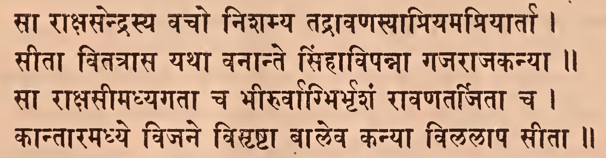
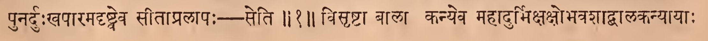
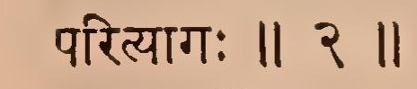
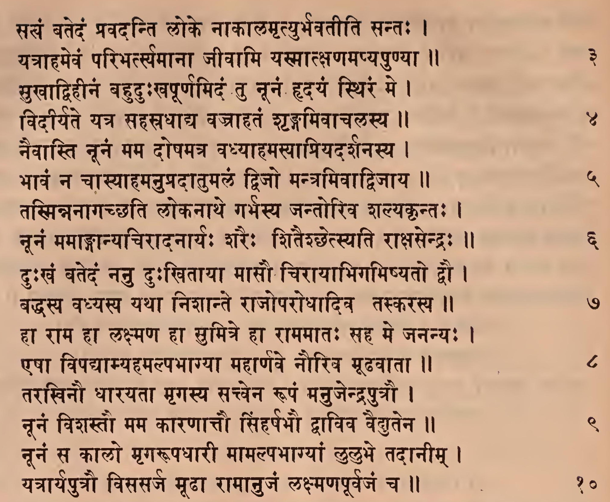
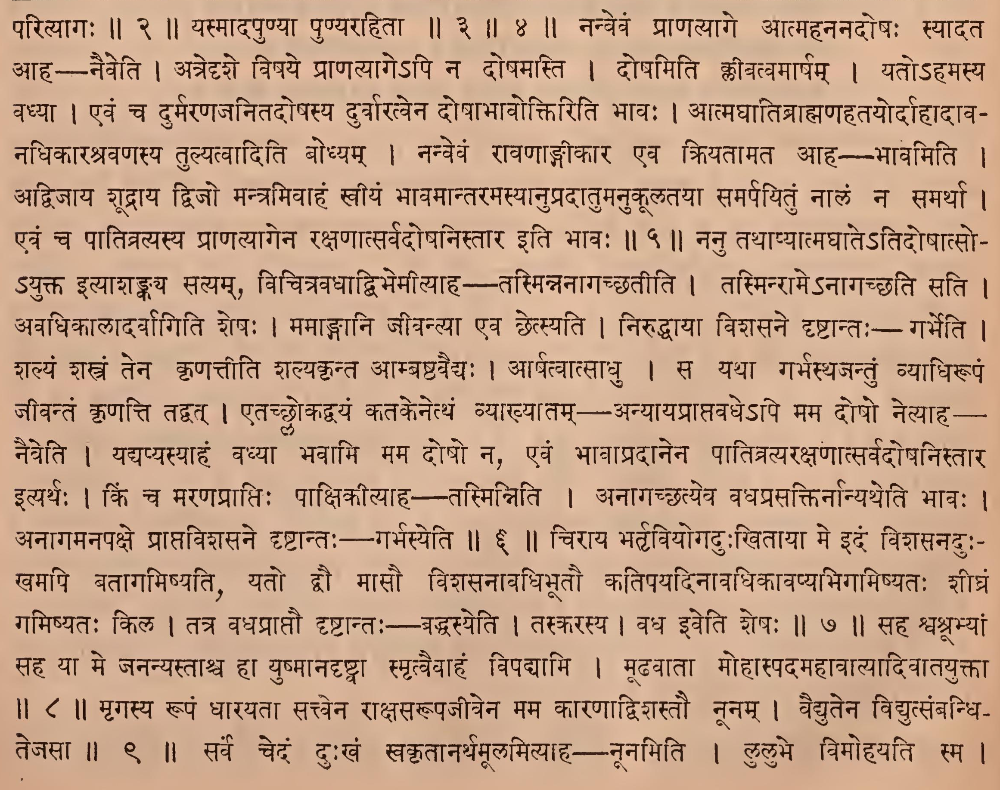
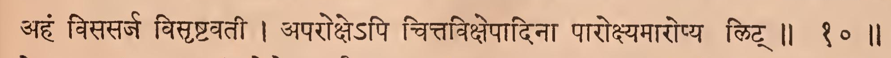
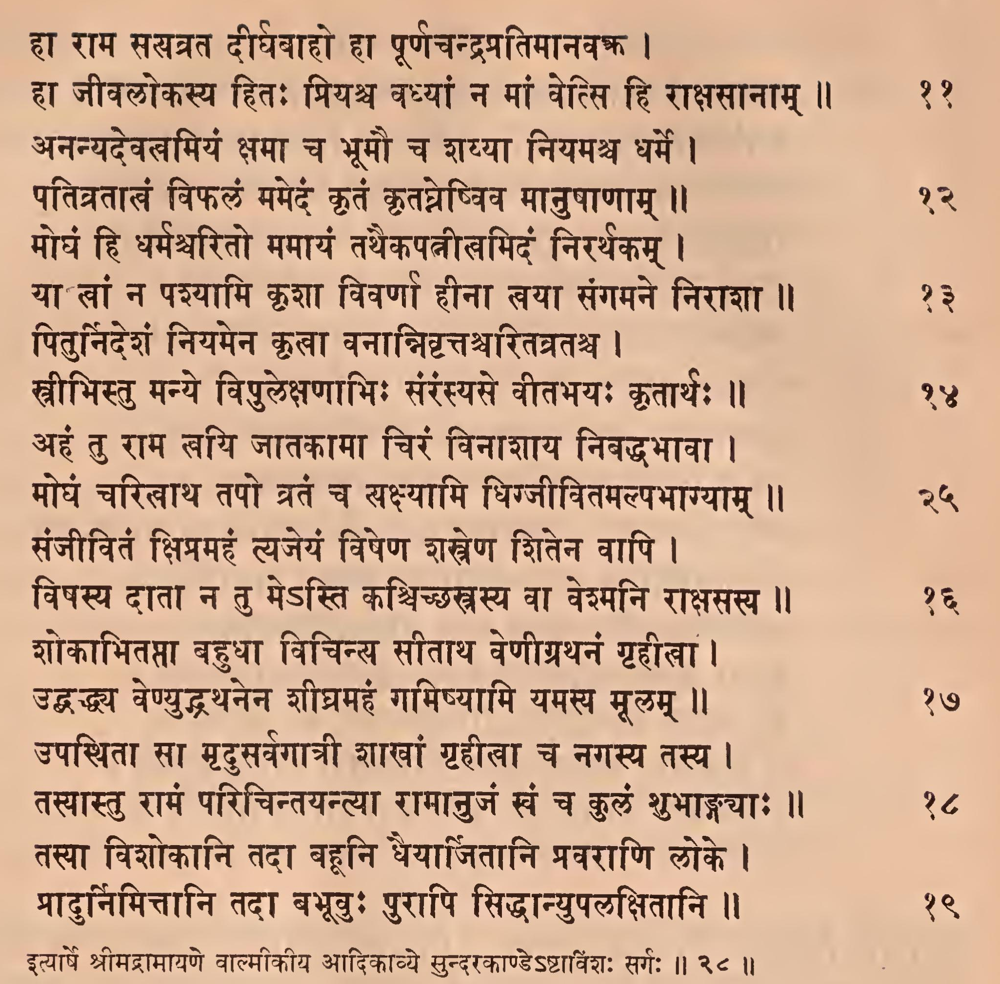
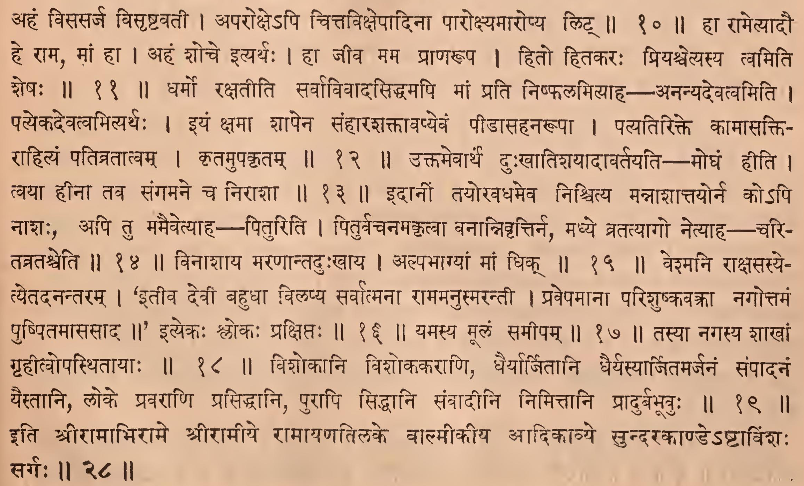

_Created: 07-07-2026 · Last updated: 05-09-2026_

॥ श्रीः॥ ॥śrīḥ॥

ādikaviśrīvālmīkimahāmunipraṇītaṃ

rāmāyaṇam

tilakākhyayā vyākhyayā sametam।\
sundarakāṇḍam।

# aṣṭaviṃśaḥ sargaḥ \|\| 28

*Source in Sanskrit (devanāgarī) (file [Ramayana 2.pdf](https://drive.google.com/open?id=18roDak0GMr30lg8CN1aqfkz__r9X_9ID&usp=drive_fs))*

<table style="width:47%;">
<colgroup>
<col style="width: 7%" />
<col style="width: 12%" />
<col style="width: 27%" />
</colgroup>
<thead>
<tr>
<th style="text-align: center;"><strong>Page</strong></th>
<th style="text-align: center;"><strong>Verse</strong></th>
<th style="text-align: center;"><strong>Comment</strong></th>
</tr>
</thead>
<tbody>
<tr>
<td style="text-align: center;">113</td>
<td style="text-align: center;">1-2</td>
<td><blockquote>

1-2 (beginning)

</blockquote></td>
</tr>
<tr>
<td style="text-align: center;">114</td>
<td style="text-align: center;">3-10</td>
<td><blockquote>

2 (ending)- 10 (beginning)

</blockquote></td>
</tr>
<tr>
<td style="text-align: center;">115</td>
<td style="text-align: center;">11-19</td>
<td><blockquote>

10 (ending) – 19

</blockquote></td>
</tr>
</tbody>
</table>

## devanāgarī. 

### Page 113. Verse (1-2) 

### Page 113. Comment (1-2)

### Page 114. Verse (3-10)

### Page 114. Comment (3-10)

### Page 115. Verse (11-19)

### Page 115. Comment (11-19)

## IAST - International Alphabet of Sanskrit Transliteration

sā rākṣasendrasya vaco niśamya tadrāvaṇasyāpriyamapriyārtā \|

sītā vitatrāsa yathā vanānte siṃhāvipannā gajarājakanyā \|\| 1

> punarduḥkhapāramadṛṣṭveva sītāpralāpaḥ - seti \|\| 1 \|\|

sā rākṣasīmadhyagatā ca bhīruvagbhirbhṛśaṃ rāvaṇatarjitā ca \|

kāntāramadhye vijane visṛṣṭā vāleva kanyā vilalāpa sītā \|\| 2

> visṛṣṭā bālā kanyeva mahādurbhikṣobhavaśādvālakanyāyāḥ parityāgaḥ \|\| 2 \|\|

satyaṃ vatedaṃ pravadanti loke nākālamṛtyurbhavatīti santaḥ \|

yatrāhamevaṃ paribhartyamānā jīvāmi yasmātkṣaṇamapyapuṇyā \|\| 3

mukhādvihīnaṃ bahuduḥkhapūrṇamidaṃ tu nūnaṃ hṛdayaṃ sthiraṃ me \|

vidīryate yatra sahasradhādya vajrāhataṃ śṛṅgamivācalasya \|\| 4

> yasmādapuṇyā puṇyarahitā \|\| 3 \|\| 4 \|\|

naivāsti nūnaṃ mama doṣamatra vadhyāhamasyāpriyadarśanasya \|

bhāvaṃ na cāsyāhamanupradātumalaṃ dvijo mantramivādvijāya \|\| 5

> nanvevaṃ prāṇatyāge ātmahananadoṣaḥ syādata āha— naiveti \| atredṛśe viṣaye prāṇatyāge'pi na doṣamasti \| doṣamiti klīvatvamārṣam \| yato'hamasya vadhyā \| evaṃ ca durmaraṇajanitadoṣasya durvāratvena doṣābhāvoktiriti bhāvaḥ \| ātmaghātibrāhmaṇahatayordāhādāva- nadhikāraśravaṇasya tulyatvāditi bodhyam \| nanvevaṃ rāvaṇāṅgīkāra evaṃ kriyatāmata āha— bhāvamiti \| advijāya śūdrāya dvijo mantramivāhaṃ svīyaṃ bhāvamāntaramasyānupradātumanukūlatayā samarpayituṃ nālaṃ na samarthā \| evaṃ ca pātivratyasya prāṇatyāgena rakṣaṇātsarvadoṣanistāra iti bhāvaḥ \|\| 5 \|\|

tasminnanāgacchati lokanāthe garbhasya jantoriva śalyakṛntaḥ \|

nūnaṃ mamāṅgānyacirādanāryaḥ śaraiḥ śitaiśchetsyati rākṣasendraḥ \|\| 6

> nanu tathāpyātmaghāte'tidoṣātso- 'yukta ityāśaṅkaya satyam, vicitravadhādvibhemītyāha - tasminnanāgacchatīti \| tasminrāme'nāgacchati sati \| avadhikālādarvāgiti śeṣaḥ \| mamāṅgāni jīvantyā eva chetsyati \| niruddhāyā viśasane dṛṣṭāntaḥ - garbheti \| śalyaṃ śastraṃ tena kṛṇattīti śalyakṛnta āmbaṣṭavaidyaḥ \| ārpatvātsādhu \| sa yathā garbhasthajantuṃ vyādhirūpaṃ jīvantaṃ kṛṇatti tadvat \| etacchlokadvayaṃ katakenetthaṃ vyākhyātam — anyāyaprāptavadhe'pi mama doṣo netyāha— \| naiveti \| yadyapyasyāhaṃ vavyā bhavāmi mama doṣo na, evaṃ bhāvāpradānena pātitratyarakṣaṇātsarvadoṣanistāra ityarthaḥ \| kiṃ ca maraṇaprāptiḥ pākṣikītyāha —tasminniti \| anāgacchatyeva vadhaprasaktirnānyatheti bhāvaḥ \| anāgamanapakṣe prāptaviśasane dṛṣṭāntaḥ - garbhasyeti \|\| 6 \|\|
>
> 

duḥkhaṃ vatedaṃ nanu duḥkhitāyā māsau cirāyābhigamiṣyato dvau \|

baddhasya vadhyasya yathā niśānte rājoparodhādiva taskarasya \|\| 7

> cirāya bhartṛviyogaduḥkhitāyā meṃ idaṃ viśasanaduḥ- khamapi batāgamiṣyati, yato dvau māsau viśasanāvadhibhūtau katipayadināvadhikāvapyabhigamiṣyataḥ śīghraṃ gamiṣyataḥ kila \| tatra vadhaprāptau dṛṣṭāntaḥ - baddhasyeti \| taskarasya \| vadha iveti śeṣaḥ \|\| 7 \|\|

hā rāma hā lakṣmaṇa hā sumitre hā rāmamātaḥ saha me jananyaḥ \|

eṣā vipadyāmyahamalpabhāgyā mahārṇave nauriva mūḍhavātā \|\| 8

> saha śvaśrabhyāṃ saha yā me jananyastāśca hā yuṣmānadṛṣṭvā smṛtvaivāhaṃ vipadyāmi \| mūḍhavātā mohāspada mahāvātyādivātayuktā \|\| 8 \|\|

tarakhinau dhārayatā mṛgasya sattvena rūpaṃ manujendraputrau \|

nūnaṃ viśastau mama kāraṇāttau siṃharṣabhau dvāviva vaidyutena \|\| 9

> mṛgasya rūpaṃ dhārayatā sattvena rākṣasarūpajīvena mama kāraṇādviśastau nūnam \| vaidyutena vidyutsaṃbandhi- tejasā \|\| 9 \|\|

nūnaṃ sa kālo mṛgarūpadhārī māmalpabhāgyāṃ lulubhe tadānīm \|

yatrāryaputrau visasarja mūḍhā rāmānujaṃ lakṣmaṇapūrvajaṃ ca \|\| 10

> sarve cedaṃ duḥkhaṃ svakṛtānarthamūlamityāha — nūnamiti \| lulubhe vimohayati sma \| ahaṃ visasarja visṛṣṭavatī \| aparokṣe'pi cittavikṣepādinā pārokṣyamāropya liṭ \|\| 10 \|\|

hā rāma satyavrata dīrghavāho hā pūrṇacandrapratimānava \|

hā jīvalokasya hitaḥ priyaśca vadhyāṃ na māṃ vetsi hi rākṣasānām \|\| 11

> hā rāmetyādau he rāma, māṃ hā \| ahaṃ śoce ityarthaḥ \| hā jīva mama prāṇarūpa \| hito hitakaraḥ priyaścetyasya tvamiti śeṣaḥ \|\| 11 \|\|

ananyadevatvamiyaṃ kṣamā ca bhūmau ca śayyā niyamaśca dharme \|

pativratālaṃ viphalaṃ mamedaṃ kṛtaṃ kṛtaghneṣviva mānuṣāṇām \|\| 12

> dharmo rakṣatīti sarvāvivādasiddhamapi māṃ prati niṣphalamityāha — ananyadevatvamiti \| patyeka devatvamityarthaḥ \| iyaṃ kṣamā śāpena saṃhāraśaktāvapyevaṃ pīḍāsahanarūpā \| patyatirikte kāmāsakti- rāhityaṃ pativratātvam \| kṛtamupakṛtam \|\| 12 \|\|

moghaṃ hi dharmaśvarito mamāyaṃ tathaikapatnītvamidaṃ nirarthakam \|

yā khāṃ na paśyāmi kṛśā vivarṇā hīnā khayā saṅgamane nirāśā \|\| 13

> uktamevārthaṃ duḥkhātiśayādāvartayati — moghaṃ hīti \| tvayā hīnā tava saṅgamane ca nirāśā \|\| 13 \|\|

piturnideśaṃ niyamena kṛtvā vanānnivṛttaścaritavrataśca \|

strībhistu manye vipulekṣaṇābhiḥ saṃraṃsyase vītabhayaḥ kṛtārthaḥ \|\| 14

> idānīṃ tayoravadhameva niścitya mannāśāttayorna ko'pi nāśaḥ, api tu mamaivetyāha--— pituriti \| piturvacanamakṛtvā vanānnivṛttirna, madhye vratatyāgo netyāha – cari- tatrataśceti \|\| 14 \|\|

ahaṃ tu rāma tvayi jātakāmā ciraṃ vināśāya nibaddhabhāvā \|

moghaṃ caritvātha tapo vrataṃ ca sakṣyāmi dhigjīvitamalpabhāgyām \|\| 15

> vināśāya maraṇāntaduḥkhāya \| alpabhāgyāṃ māṃ dhik \|\| 15 \|\|

sañjīvitaṃ kṣimamahaṃ tyajeyaṃ viṣeṇa śastreṇa śitena vāpi \|

viṣasya dātā na tu me'sti kaścicchastrasya vā veśmani rākṣasasya \|\| 16

> veśmani rākṣasasye- tyetadanantaram \| ‘itīva devī bahudhā vilapya sarvātmanā rāmamanusmarantī \| pravepamānā pariśuṣkavakrā nagottamaṃ puṣpitamāsasāda \|\|' ityekaḥ ślokaḥ prakṣiptaḥ \|\| 16 \|\|

śokābhitaptā bahudhā vicinya sītātha veṇīgrathanaṃ gṛhīlā \|

uddhaddhaya veṇyuddhathanena śīghramahaṃ gamiṣyāmi yamasya mūlam \|\| 17

> yamasya mūlaṃ samīpam \|\| 17 \|\|

upasthitā sā mṛdusarvagātrī śākhāṃ gṛhīlā ca nagasya tasya \|

tasyāstu rāmaṃ paricintayantyā rāmānujaṃ khaṃ ca kulaṃ śubhāṅgayāḥ \|\| 18

> tasyā nagasya śākhāṃ gṛhītvopasthitāyāḥ \|\| 18 \|\|

tasyā viśokāni tadā bahūni dhaiyārjitāni pravarāṇi loke \|

prādurnimittāni tadā babhūvuḥ purāpi siddhānyupalakṣitāni \|\| 19

> viśokāni viśokakarāṇi, dhairyārjitāni dhairyasyārjitamarjanaṃ saṃpādanaṃ yestāni, loke pravarāṇi prasiddhāni purāpi siddhāni saṃvādīni nimittāni prādurbabhūvuḥ \|\| 19 \|\|

ityārṣe śrīmadrāmāyaṇe vālmīkīya ādikāvye sundarakāṇḍe'ṣṭāviṃśaḥ sargaḥ \|\| 28 \|\|

> iti śrīrāmābhirāme śrīrāmīye rāmāyaṇatilake vālmīkīya ādikāvye sundarakāṇḍe'ṣṭāviṃśaḥ sargaḥ \|\| 28 \|\|

_Dr. Mārcis Gasūns_
