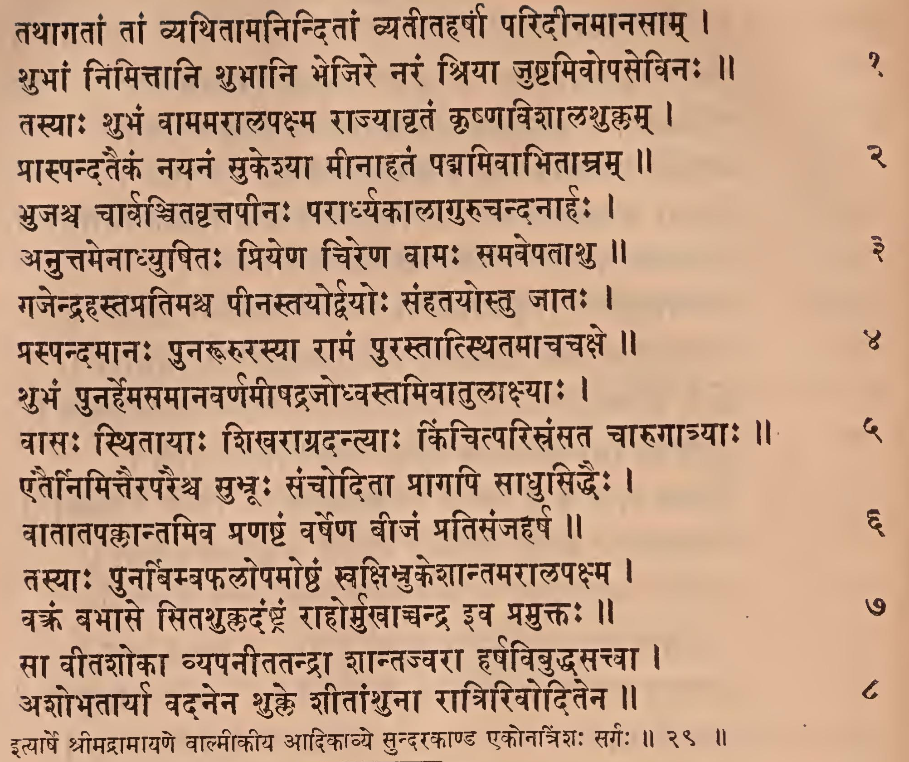
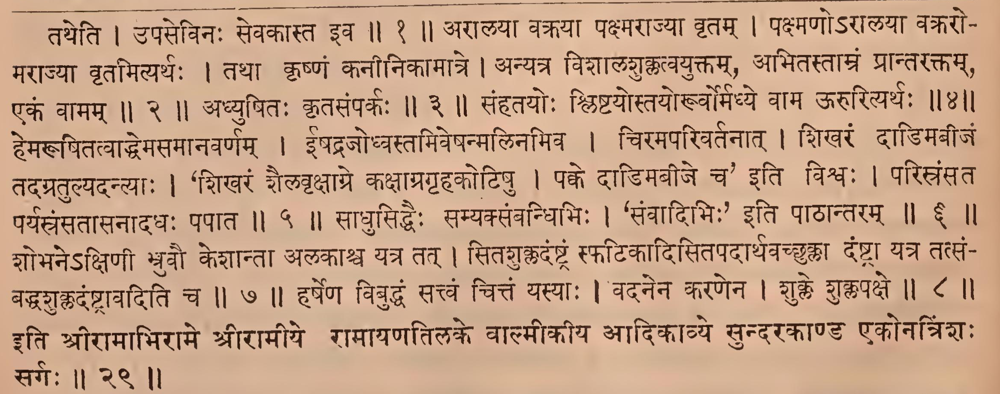

_Created: 07-07-2026 · Last updated: 05-09-2026_

॥ श्रीः॥ ॥śrīḥ॥

ādikaviśrīvālmīkimahāmunipraṇītaṃ

rāmāyaṇam

tilakākhyayā vyākhyayā sametam।\
sundarakāṇḍam।

# ekonatriṃśaḥ sargaḥ \|\| 29

*Source in Sanskrit (devanāgarī) (file [Ramayana 2.pdf](https://drive.google.com/open?id=18roDak0GMr30lg8CN1aqfkz__r9X_9ID&usp=drive_fs))*

| **Page** | **Verse** | **Comment** |
|:--------:|:---------:|:-----------:|
|   116    |    1-8    |     1-8     |

## devanāgarī. 

### Page 116. Verse (1-8) 

### Page 116. Comment (1-8)

## IAST - International Alphabet of Sanskrit Transliteration

tathāgatāṃ tāṃ vyathitāmaninditāṃ vyatītaharṣā paridīnamānasām \|

śubhāṃ nimittāni śubhāni bhejire naraṃ śriyā juṣṭamivopasevinaḥ \|\| 1

> tatheti \| upasevinaḥ sevakāsta iva \|\| 1 \|\|

tasyāḥ śubhaṃ vāmamarālapakṣma rājyāhṛtaṃ kṛṣṇaviśālaśuklam \|

prāspandataikaṃ nayanaṃ sukeśyā mīnāhataṃ padmamivābhitāmram \|\| 2

> arālayā vakrayā pakṣmarājyā vṛtam \| pakṣmaṇo'rālayā vakraro- marājyā vṛtamityarthaḥ \| tathā kṛṣṇaṃ kanīnikāmātre \| anyatra viśālaśuklatvayuktam, abhitastāmraṃ prāntaraktam, ekaṃ vāmam \|\| 2 \|\|

bhujaśca cārvañcitavṛttapīnaḥ parārdhyakālāgurucandanāhaḥ \|

anuttamenādhyuṣitaḥ priyeṇa cireṇa vāmaḥ samavepatāśu \|\| 3

> adhyuṣitaḥ kṛtasaṃparkaḥ \|\| 3 \|\|

gajendra hastapratimaśca pīnastayordvayoḥ saṃhatayostu jātaḥ \|

praspandamānaḥ punarūrurasyā rāmaṃ purastātsthitamācacakṣe \|\| 4

> saṃhatayoḥ śliṣṭayostayoruvormadhye vāma ūrurityarthaḥ \|\| 4 \|\|

śubhaṃ punarhemasamānavarṇamīṣadrajodhvastamivātulākṣyāḥ \|

vāsaḥ sthitāyāḥ śikharāgradantyāḥ kiñcitparisraṃsata cārugātryāḥ \|\| 5

> hemarūpitatvāddhemasamānavarṇam \| īṣadrajodhvastamiveṣanmalinamiva \| ciramaparivartanāt \| śikharaṃ dāḍimabījaṃ tadagratulyadantyāḥ \| ‘śikharaṃ śailavṛkṣāgre kakṣāpragṛhakoṭiṣu \| pakke dāḍimabīje ca' iti viśvaḥ \| parisraṃsata paryasraṃsatāsanādadhaḥ papāta \|\| 5 \|\|

etairnimittairaparaiśca subhrūḥ sañcoditā prāgapi sādhusiddhaiḥ \|

vātātapakkāntamiva praṇaṣṭaṃ varṣeṇa vījaṃ pratisañjaharṣa \|\| 6

> sādhusiddhaiḥ samyaksaṃvandhibhiḥ \| ' saṃvādibhiḥ' iti pāṭhāntaram \|\| 6 \|\|

tasyāḥ punarvimbaphalopamoṣṭhaṃ svakṣinukeśāntamarālapakṣma \|

vakraṃ babhāse sitaśukkadaṃṣṭraṃ rāhormukhāccandra iva pramuktaḥ \|\| 7

> śobhane'kṣiṇī bhruvau keśāntā alakāśca yatra tat \| sitaśukkadaṃṣṭraṃ sphaṭikādisitapadārthavacchukkā daṃṣṭrā yatra tatsaṃ- baddhaśukladaṃṣṭrāvaditi ca \|\|7\|\|

sā vītaśokā vyapanītatandrā śāntajvarā harṣavibuddhasattvā \|

aśobhatāryā vadanena śukle śītāṃśunā rātririvoditena \|\| 8

> harṣeṇa vibuddhaṃ sattvaṃ cittaṃ yasyāḥ \| vadanena karaṇena \| śukle śuklapakṣe \|\| 8 \|\|

ityārṣe śrīmadrāmāyaṇe vālmīkīya ādikāvye sundarakāṇḍa ekonatriṃśaḥ sargaḥ \|\| 29 \|\|

> iti śrīrāmābhirāme śrīrāmīye rāmāyaṇatilake vālmīkīya ādikāvye sundarakāṇḍa ekonatriṃśaḥ sargaḥ \|\| 29 \|\|

_Dr. Mārcis Gasūns_
