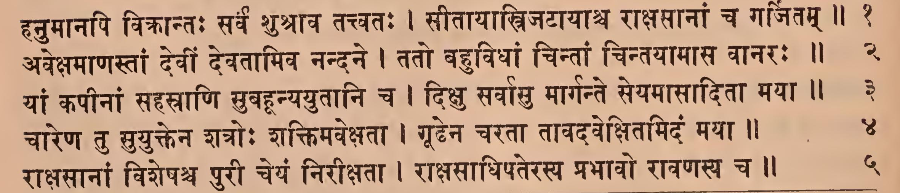
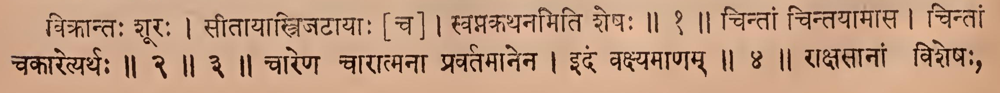
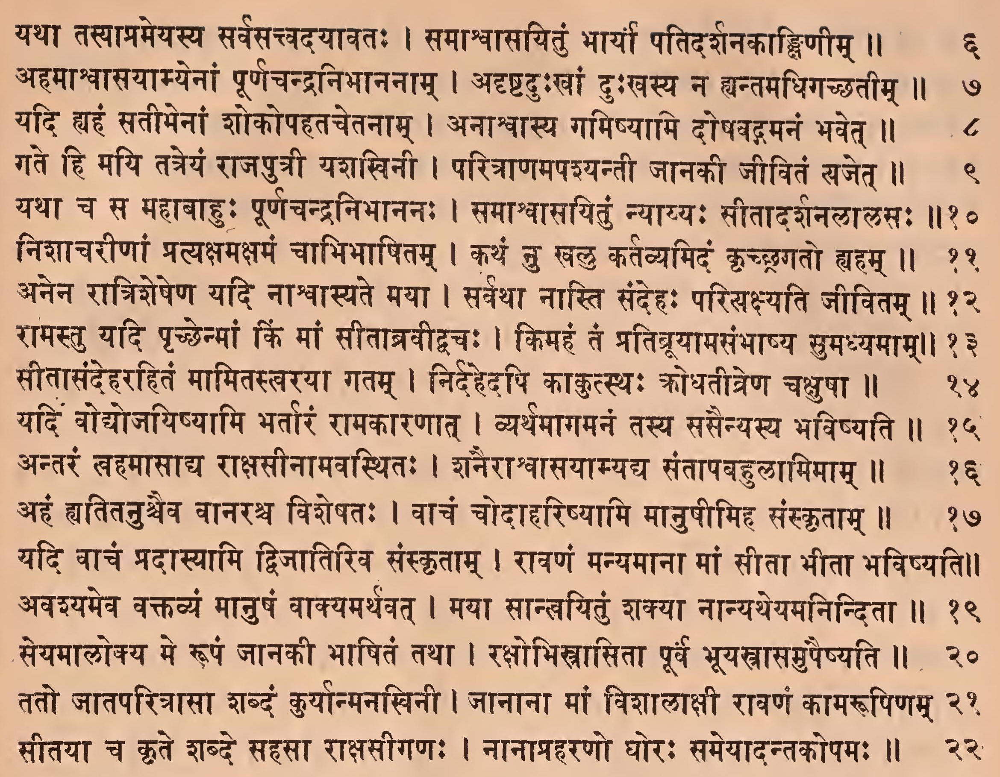
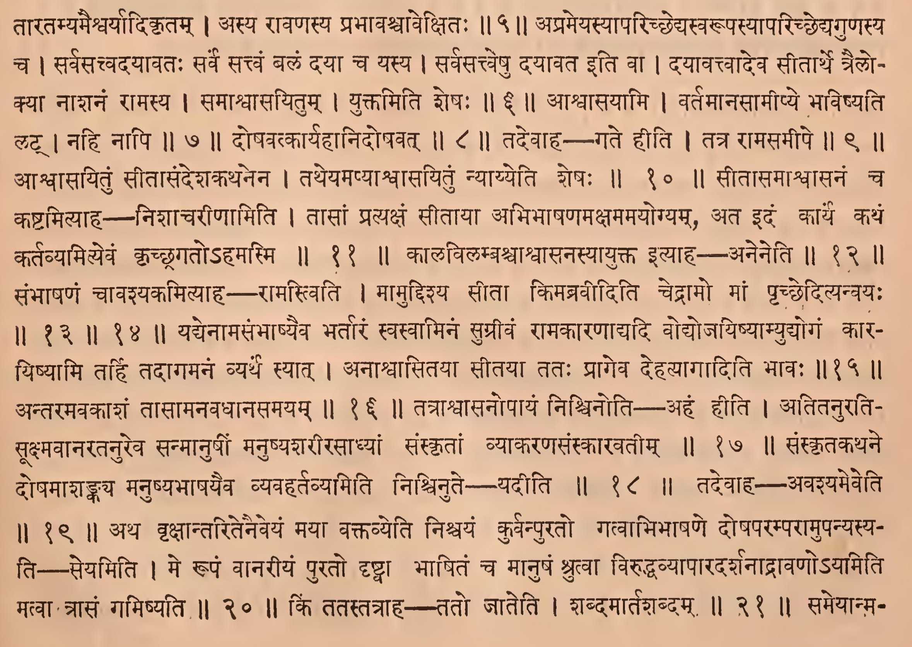
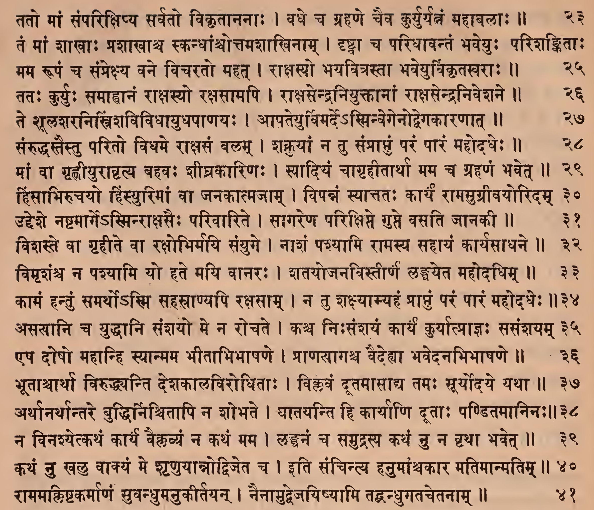
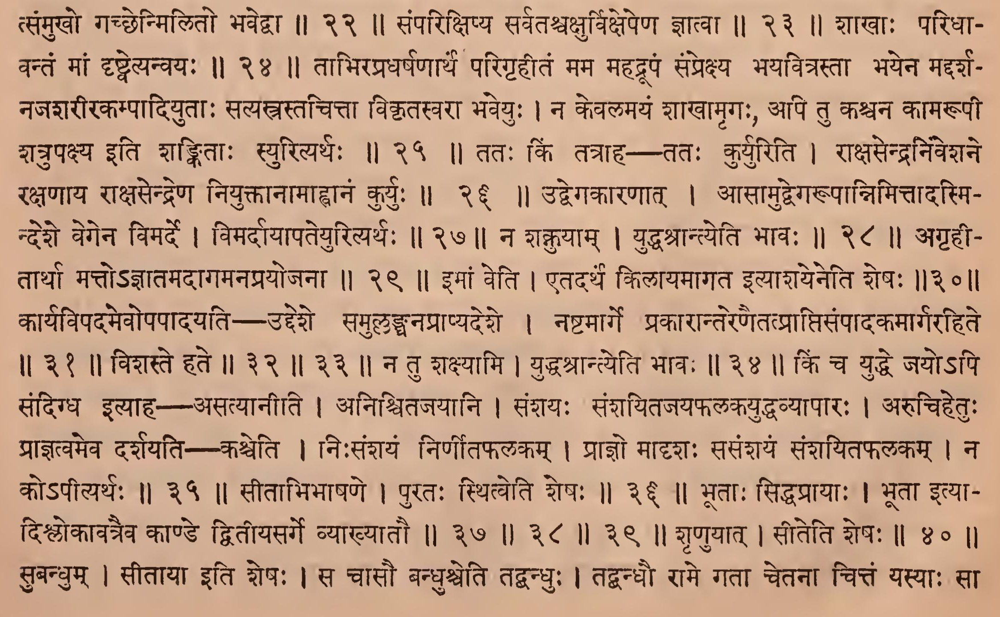
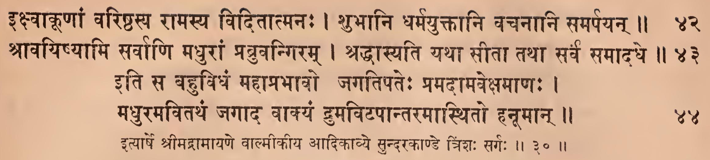
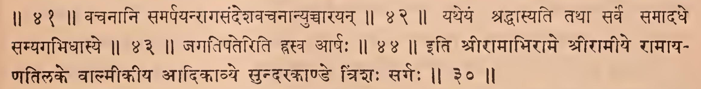

_Created: 07-07-2026 · Last updated: 05-09-2026_

॥ श्रीः॥ ॥śrīḥ॥

ādikaviśrīvālmīkimahāmunipraṇītaṃ

rāmāyaṇam

tilakākhyayā vyākhyayā sametam।\
sundarakāṇḍam।

# triṃśaḥ sargaḥ \|\| 30

*Source in Sanskrit (devanāgarī) (file [Ramayana 2.pdf](https://drive.google.com/open?id=18roDak0GMr30lg8CN1aqfkz__r9X_9ID&usp=drive_fs))*

| **Page** | **Verse** | **Comment**  |
|:--------:|:---------:|:------------:|
|   116    |    1-5    |  1-5 (beg.)  |
|   117    |   6-22    | 5-22 (beg.)  |
|   118    |   23-41   | 22-41 (beg.) |
|   119    |   42-44   |    41-44     |

## devanāgarī. 

### Page 116. Verse (1-5) 

### Page 116. Comment (1-5 beg.)

### Page 117. Verse (5-22) 

### Page 117. Comment (5-22 beg.)

### Page 118. Verse (23-41) 

### Page 118. Comment (23-41 beg.)

### Page 119. Verse (42-44) 

### Page 119. Comment (41-44)

## IAST - International Alphabet of Sanskrit Transliteration

hanumānapi vikrāntaḥ sarva śuśrāva tattvataḥ \|

sītāyāstrijaṭāyāśca rākṣasānāṃ ca garjitam \|\| 1

> vikrāntaḥ śūraḥ \| sītāyātrijaṭāyāḥ \[ca\] \| svapnakathanamiti śeṣaḥ \|\| 1 \|\|

avekṣamāṇastāṃ devīṃ devatāmiva nandane \|

tato bahuvidhāṃ cintāṃ cintayāmāsa vānaraḥ \|\| 2

yāṃ kapīnāṃ sahasrāṇi suvahanyayutāni ca \|

dikṣu sarvāsu mārgante seyamāsāditā mayā \|\| 3

> cintāṃ cintayāmāsa \| cintāṃ cakāretyarthaḥ \|\| 2 \|\| 3 \|\|

cāreṇa tu suyuktena śatroḥ śaktimavekṣatā \|

gūḍhena caratā tāvadavekṣitamidaṃ mayā \|\| 4

> cāreṇa cārātmanā pravartamānena \| idaṃ vakṣyamāṇam \|\| 4 \|\|

rākṣasānāṃ viśeṣaśca purī ceyaṃ nirīkṣatā \|

rākṣasādhipaterasya prabhāvo rāvaṇasya ca \|\| 5

> rākṣasānāṃ viśeṣaḥ, tāratamyamaiśvaryādikṛtam \| asya rāvaṇasya prabhāvaścāvekṣitaḥ \|\| 5 \|\|

yathā tasyāprameyasya sarvasattvadayāvataḥ \|

samāśvāsayituṃ bhāryā patidarśanakāṅkṣiṇīm \|\| 6

> aprameyasyāparicchedyasvarūpasyāparicchedyaguṇasya ca \| sarvasacvadayāvataḥ sarve sattvaṃ balaṃ dayā ca yasya \| sarvasattveṣu dayāvata iti vā \| dayāvattvādeva sītārthe trailokyā nāśanaṃ rāmasya \| samāśvāsayitum \| yuktamiti śeṣaḥ \|\| 6 \|\|

ahamāśvāsayāmyenāṃ pūrṇacandranibhānanām \|

adṛṣṭaduḥkhāṃ duḥkhasya na hyantamadhigacchatīm \|\| 7

> āśvāsayāmi \| vartamānasāmīpye bhaviṣyati laṭ \| nahi nāpi \|\| 7 \|\|

yadi hyahaṃ satīnāṃ śokopahatacetanām \|

anāśvāsya gamiṣyāmi doṣavagamanaṃ bhavet \|\| 8

> doṣavatkāryahānidoṣavat \|\| 8 \|\|

gate hi mayi tatreyaṃ rājaputrī yaśakhinī \|

paritrāṇamapaśyantī jānakī jīvitaṃ yajet \|\| 9

> tadevāha – gate hīti \| tatra rāmasamīpe \|\| 9 \|\|

yathā ca sa mahābāhuḥ pūrṇacandranibhānanaḥ \|

samāśvāsayituṃ nyāyyaḥ sītādarśanalālasaḥ \|\| 10

> āśvāsayituṃ sītāsandeśakathanena \| tatheyamapyāśvāsayituṃ nyāyyeti śeṣaḥ \|\| 10 \|\|

niśācarīṇāṃ pratyakṣamakṣamaṃ cābhibhāṣitam \|

kathaṃ nu khalu kartavyamidaṃ kṛcchragato hyaham \|\| 11

> sītāsamāśvāsanaṃ ca kaṣṭamityāha---niśācarīṇāmiti \| tāsāṃ pratyakṣaṃ sītāyā abhibhāṣaṇamakṣamamayogyam, ata idaṃ kārya kathaṃ kartavyamityevaṃ kṛcchragato'hamasmi \|\| 11 \|\|

anena rātriśeṣeṇa yadi nāśvāsyate mayā \|

sarvathā nāsti sandehaḥ pariyakṣyati jīvitam \|\| 12

> kālavilambaśvāśvāsanasyāyukta ityāhaaneneti \|\| 12 \|\|

rāmastu yadi pṛcchenmāṃ kiṃ māṃ sītābravīdvacaḥ \|

kimahaṃ taṃ pratibrūyāmasaṃbhāṣya sumadhyamām \|\| 13

sītāsandeharahitaṃ māmitastvarayā gatam \|

nirdahedapi kākutsthaḥ krodhatītreṇa cakṣuṣā \|\| 14

> saṃbhāṣaṇaṃ cāvaśyakamityāha - rāmastviti \| māmuddiśya sītā kimabravīditi cedrāmo māṃ pṛcchedityanvayaḥ \|\| 13 \|\| 14 \|\|

yadi vodyojayiṣyāmi bhartāraṃ rāmakāraṇāta \|

vyarthamāgamanaṃ tasya sasainyasya bhaviṣyati \|\| 15

> yadyenāmasaṃbhāṣyaiva bhartāraṃ svasvāminaṃ sugrīvaṃ rāmakāraṇādyadi vodyojayiṣyāmyudyogaṃ kārayiṣyāmi tarhi tadāgamanaṃ vyartha syāt \| anāśvāsitayā sītayā tataḥ prāgeva dehatyāgāditi bhāvaḥ \|\| 15 \|\|

antaraṃ tvahamāsādya rākṣasīnāmavasthitaḥ \|

śanairāśvāsayāmyadya santāpabahulāmimām \|\| 16

> antaramavakāśaṃ tāsāmanavadhānasamayam \|\| 16 \|\|

ahaṃ hyatitanuścaiva vānaraśca viśeṣataḥ \|

vācaṃ codāhariṣyāmi mānuṣīmiha saṃskṛtām \|\| 17

> tatrāśvāsanopāyaṃ niścinoti — ahaṃ hīti \| atitanuratisūkṣmavānaratanureva sanmānuṣīṃ manuṣyaśarīrasādhyāṃ saṃskṛtāṃ vyākaraṇasaṃskāravatīm \|\| 17 \|\|

yadi vācaṃ pradāsyāmi dvijātiriva saṃskṛtām \|

rāvaṇaṃ manyamānā māṃ sītā bhītā bhaviṣyati \|\| 18

> saṃskṛtakathane doṣamāśaṅkaya manuṣyabhāṣayaiva vyavahartavyamiti niścinute - yadīti \|\| 18 \|\|

avaśyameva vaktavyaṃ mānuṣaṃ vākyamarthavat \|

mayā sānvayituṃ śakyā nānyatheyamaninditā \|\| 19

> tadevāha —– avaśyameveti \|\| 19 \|\|

seyamālokya me rūpaṃ jānakī bhāṣitaṃ tathā \|

rakṣobhistrāsitā pūrva bhūyastrāsamupaiṣyati \|\| 20

> atha vṛkṣāntaritenaiveyaṃ mayā vaktavyeti niścayaṃ kurvanpurato gatvābhibhāṣaṇe doṣaparamparāmupanyasyati — seyamiti \| me rūpaṃ vānarīyaṃ purato dṛṣṭvā bhāṣitaṃ ca mānuṣaṃ śrutvā viruddhavyāpāradarśanādrāvaṇo'yamiti matvā trāsaṃ gamiṣyati \|\| 20 \|\|

tato jātaparitrāsā śabdaṃ kuryānmanakhinī \|

jānānā māṃ viśālākṣī rāvaṇaṃ kāmarūpiṇam \|\| 21

> kiṃ tatastatrāha - tato jāteti \| śabdamārtaśabdam \|\| 21 \|\|

sītayā ca kṛte śabde sahasā rākṣasīgaṇaḥ \|

nānāpraharaṇo ghoraḥ sameyādantakopamaḥ \|\| 22

> sameyānmatsaṃmukho gacchenmilito bhavedvā \|\| 22 \|\|

tato māṃ saṃparikṣipya sarvato vikṛtānanāḥ \|

vadhe ca grahaṇe caiva kuryuryatnaṃ mahābalāḥ \|\| 23

> saṃparikṣipya sarvataścakṣurvikṣepeṇa jñātvā \|\| 23 \|\|

taṃ māṃ śākhāḥ praśākhāśca skandhāṃścottamaśākhinām \|

dṛṣṭvā ca paridhāvantaṃ bhaveyuḥ pariśaṅkitāḥ \|\| 24

> śākhāḥ paridhāvantaṃ māṃ dṛṣṭvetyanvayaḥ \|\| 24 \|\|

mama rūpaṃ ca saṃprekṣya vane vicarato mahat \|

rākṣasyo bhayavitrastā bhaveyurvikṛtasvarāḥ \|\| 25

> tābhirapradharṣaṇārthaṃ parigṛhītaṃ mama mahadrūpaṃ saṃprekṣya bhayavitrastā bhayena maddarśanajaśarīrakampādiyutāḥ satyastrastacittā vikṛtasvarā bhaveyuḥ \| na kevalamayaṃ śākhāmṛgaḥ, api tu kaścana kāmarūpī śatrupakṣya iti śaṅkitāḥ syurityarthaḥ \|\| 25 \|\|

tataḥ kuryuḥ samāhvānaṃ rākṣasyo rakṣasāmapi \|

rākṣasendraniyuktānāṃ rākṣasendraniveśane \|\| 26

> tataḥ kiṃ tatrāha — tataḥ kuryuriti \| rākṣasendraniveśane rakṣaṇāya rākṣasendreṇa niyuktānāmāhvānaṃ kuryuḥ \|\| 26 \|\|

te śūlaśaranistriṃśavividhāyudhapāṇayaḥ \|

āpateyurvimarde'sminvegenodvegakāraṇāt \|\| 27

> udvegakāraṇāt \| āsāmudvegarūpānnimittādasmindeśe vegena vimarde \| vimardāyāpateyurityarthaḥ \|\| 27 \|\|

saṃruddhastaistu parito vidhame rākṣasaṃ balam \|

śaknuyāṃ na tu saṃprāptuṃ paraṃ pāraṃ mahodadheḥ \|\| 28

> na śaknuyām \| yuddhaśrāntyeti bhāvaḥ \|\| 28 \|\|

māṃ vā gṛhṇīyurānṛtya bahavaḥ śīghrakāriṇaḥ \|

syādiyaṃ cāgṛhītārthā mama ca grahaṇaṃ bhavet \|\| 29

> agṛhītārthā matto'jñātamadāgamanaprayojanā \|\| 29 \|\|

hiṃsābhirucayo hiṃsyurimāṃ vā janakātmajām \|

vipannaṃ syāttataḥ kāryaṃ rāmasugrīvayoridam \|\| 30

> imāṃ veti \| etadarthaṃ kilāyamāgata ityāśayeneti śeṣaḥ \|\| 30 \|\|

uddeśe naṣṭamārge'sminrākṣasaiḥ parivārite \|

sāgareṇa parikṣipte gupte vasati jānakī \|\| 31

> kāryavipadamevopapādayati — uddeśe samullaṅghanaprāpyadeśe \| naṣṭamārge prakārāntareṇaitatprāptisaṃpādaka mārgarahite \|\| 31 \|\|

viśaste vā gṛhīte vā rakṣobhirmayi saṃyuge \|

nāśaṃ paśyāmi rāmasya sahāyaṃ kāryasādhane \|\| 32

vimṛśaṃśca na paśyāmi yo hate mayi vānaraḥ \|

śatayojanavistīrṇa laṅghayeta mahodadhim \|\| 33

> viśaste hate \|\| 32 \|\| 33 \|\|

kāmaṃ hantuṃ samartho'smi sahasrāṇyapi rakṣasām \|

na tu śakṣyāmyahaṃ prāptuṃ paraṃ pāraṃ mahodadheḥ \|\| 34

> na tu śakṣyāmi \| yuddhaśrāntyeti bhāvaḥ \|\| 34 \|\|

asasāni ca yuddhāni saṃśayo me na rocate \|

kaśca niḥsaṃśayaṃ kāryaṃ kuryātprājñaḥ sasaṃśayam \|\| 35

> kiṃ ca yuddhe jayo'pi sandigdha ityāha — asatyānīti \| aniścitajayāni \| saṃśayaḥ saṃśayitajayaphalakayuddhavyāpāraḥ \| arucihetuḥ prājñatvameva darśayati—kaśceti \| niḥsaṃśayaṃ nirṇītaphalakam \| prājño mādṛśaḥ sasaṃśayaṃ saṃśayitaphalakam \| na ko'pītyarthaḥ \|\| 35 \|\|

eṣa doṣo mahānhi syānmama bhītābhibhāṣaṇe \|

prāṇasāgaśca vaidehyā bhavedanabhibhāṣaṇe \|\| 36

> sītābhibhāṣaṇe \| purataḥ sthitveti śeṣaḥ \|\| 36 \|\|

bhūtācārthā viruddhyanti deśakālavirodhitāḥ \|

viklavaṃ dūtamāsādya tamaḥ sūryodaye yathā \|\| 37

arthānarthāntare buddhirniścitāpi na śobhate \|

ghātayanti hi kāryāṇi dūtāḥ paṇḍitamāninaḥ \|\| 38

na vinaśyetkathaṃ kārya vaiklavyaṃ na kathaṃ mama \|

laṅghanaṃ ca samudrasya kathaṃ nu na vṛthā bhavet \|\| 39

> bhūtāḥ siddhaprāyāḥ \| bhūtā ityādiślokāvatraiva kāṇḍe dvitīyasarge vyākhyātau \|\| 37 \|\| 38 \|\| 39 \|\|

kathaṃ nu khalu vākyaṃ me śṛṇuyānnodvijeta ca \|

iti sañcintya hanumāṃścakāra matimānmatim \|\| 40

> śṛṇuyāt \| sīteti śeṣaḥ \|\| 40 \|\|

rāmamakliṣṭakarmāṇaṃ subandhumanukīrtayan \|

naināmudvejayiṣyāmi tadbandhugatacetanām \|\| 41

> subandhum \| sītāyā iti śeṣaḥ \| sa cāsau bandhuśceti tadbandhuḥ \| tadbandhau rāme gatā cetanā cittaṃ yasyāḥ sā \|\| 41 \|\|

ikṣvākūṇāṃ variṣṭhasya rāmasya viditātmanaḥ \|

śubhāni dharmayuktāni vacanāni samarpayan \|\| 42

> vacanāni samarpayanrāgasandeśavacanānyuccārayan \|\| 42 \|\|

śrāvayiṣyāmi sarvāṇi madhurāṃ prabruvangiram \|

śraddhāsyati yathā sītā tathā sarva samādadhe \|\| 43

> yatheyaṃ śraddhāsyati tathā sarva samādadhe samyagabhidhāsye \|\| 43 \|\|

iti sa bahuvidhaṃ mahāprabhāvo jagatipateḥ pramadāmavekṣamāṇaḥ \|

madhuramavitathaṃ jagāda vākyaṃ drumaviṭapāntaramāsthito hanūmān \|\| 44

> jagatipateriti hrasva ārṣaḥ \|\| 44 \|\|

ityārṣe śrīmadrāmāyaṇe vālmīkīya ādikāvye sundarakāṇḍe triṃśaḥ sargaḥ \|\| 30

> iti śrīrāmābhirāme śrīrāmīye rāmāyatilake vālmīkīya ādikāvye sundarakāṇḍe triśaḥ sargaḥ \|\| 30 \|\|

_Dr. Mārcis Gasūns_
