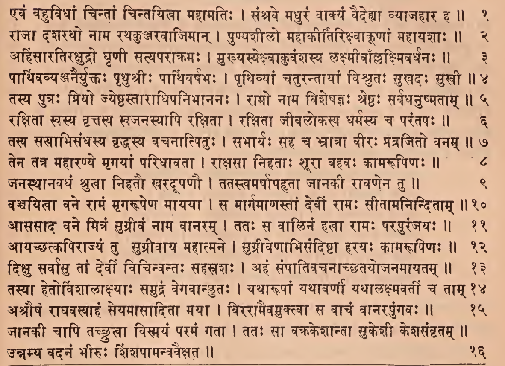
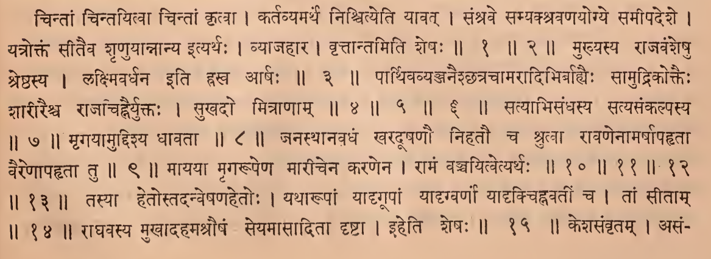
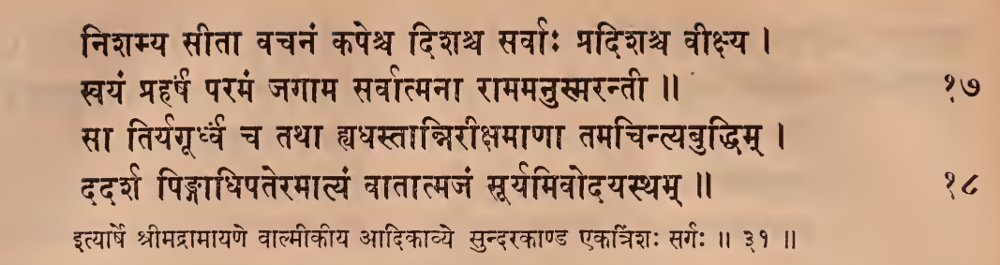
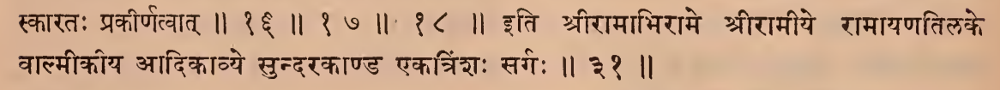

_Created: 07-07-2026 · Last updated: 05-09-2026_

॥ श्रीः॥ ॥śrīḥ॥

ādikaviśrīvālmīkimahāmunipraṇītaṃ

rāmāyaṇam

tilakākhyayā vyākhyayā sametam।\
sundarakāṇḍam।

# ekatriṃśaḥ sargaḥ \|\| 31

*Source in Sanskrit (devanāgarī) (file [Ramayana 2.pdf](https://drive.google.com/open?id=18roDak0GMr30lg8CN1aqfkz__r9X_9ID&usp=drive_fs))*

| **Page** | **Verse** |   **Comment**   |
|:--------:|:---------:|:---------------:|
|   119    |   1-16    |   1-16 (beg.)   |
|   120    |   17-18   | 16 (ending) -18 |

## devanāgarī. 

### Page 119. Verse (1-16) 

### Page 119. Comment (1-16 beg.)

### Page 120. Verse (17-18) 

### Page 120. Comment (16 ending-18 beg.)

## IAST - International Alphabet of Sanskrit Transliteration

ekatriṃśaḥ sargaḥ \|

evaṃ bahuvidhāṃ cintāṃ cintayitvā mahāmatiḥ \|

saṃśrave madhuraṃ vākyaṃ vaidehyā vyājahāra ha \|\| 1

rājā daśaratho nāma rathakuñjaravājimān \|

puṇyaśīlo mahākīrtirikṣvākūṇāṃ mahāyaśāḥ \|\| 2

> cintāṃ cintayitvā cintāṃ kṛtvā \|
>
> kartavyamarthe niścityeti yāvat \|
>
> saṃśrave samyakśravaṇayogye samīpadeśe \|
>
> yatroktaṃ sītaiva śṛṇuyānnānya ityarthaḥ \|
>
> vyājahāra \|
>
> vṛttāntamiti śeṣaḥ \|\| 1 \|\| 2 \|\|

ahiṃsāratirakṣudro ghṛṇī satyaparākramaḥ \|

mukhyasyekṣvākuvaṃśasya lakṣmīvāl lakṣmavardhanaḥ \|\| 3

> mukhyasya rājavaṃśeṣu śreṣṭhasya \|
>
> lakṣmivardhana iti hrasva ārṣaḥ \|\| 3 \|\|

pārthivavyañjanairyuktaḥ pṛthuśrīḥ pārthivarṣabhaḥ \|

pṛthivyāṃ caturantāyāṃ viśrutaḥ sukhadaḥ sukhī \|\| 4

tasya putraḥ priyo jyeṣṭhastārādhipanibhānanaḥ \|

rāmo nāma viśeṣajñaḥ śreṣṭhaḥ sarvadhanuṣmatām \|\| 5

rakṣitā svasya vṛttasya svajanasyāpi rakṣitā \|

rakṣitā jīvalokasya dharmasya ca parantapaḥ \|\| 6

> pārthivavyañjanaiśchatracāmarādibhirbahyaiḥ sāmudrikoktaiḥ śārīraiśca rājacihnairyuktaḥ \|
>
> sukhado mitrāṇām \|\| 4 \|\| 5 \|\| 6 \|\|

tasya satyābhisandhasya vṛddhasya vacanātpituḥ \|

sabhāryaḥ saha ca bhrātrā vīraḥ pravrajito vanam \|\| 7

> satyābhisandhasya satyasaṅkalpasya \|\| 7 \|\|

tena tatra mahāraṇye mṛgayāṃ paridhāvatā \|

rākṣasā nihatāḥ śūrā bahavaḥ kāmarūpiṇaḥ \|\| 8

> mṛgayāmuddiśya dhāvatā \|\| 8 \|\|

janasthānavadhaṃ śrutvā nihatau kharadūṣaṇau \|

tatastvamarṣāpahṛtā jānakī rāvaṇena tu \|\| 9

> janasthānavadhaṃ kharadūṣaṇau nihatau ca śrutvā rāvaṇenāmarṣāpahṛtā vaireṇāpahṛtā tu \|\| 9 \|\|

vañcayitvā vane rāmaṃ mṛgarūpeṇa māyayā \|

sa mārgamāṇastāṃ devīṃ rāmaḥ sītāmaninditām \|\| 10

āsasāda vane mitraṃ sugrīvaṃ nāma vānaram \|

tataḥ sa vālinaṃ hatvā rāmaḥ parapurañjayaḥ \|\| 11

āyacchatkapirājyaṃ tu sugrīvāya mahātmane \|

sugrīveṇābhisandiṣṭā harayaḥ kāmarūpiṇaḥ \|\| 12

dikṣu sarvāsu tāṃ devīṃ vicinvantaḥ sahasraśaḥ \|

ahaṃ saṃpātivacanācchatayojanamāyatam \|\| 13

> māyayā mṛgarūpeṇa mārīcena karaṇena \|
>
> rāmaṃ vañcayitvetyarthaḥ \|\| 10 \|\| 11 \|\| 12 \|\| 13 \|\|

tasyā hetorviśālākṣyāḥ samudraṃ vegavānpluṭaḥ \|

yathārūpāṃ yathāvarṇāṃ yathālakṣmavatīṃ ca tām \|\| 14

> tasyā hetostadanveṣaṇahetoḥ \|
>
> yathārūpāṃ yādṛgūpāṃ yādṛgvarṇaṃ yādṛkcihnavatīṃ ca \|
>
> tāṃ sītām \|\| 14 \|\|

aśrauṣaṃ rāghavasyāhaṃ seyamāsāditā mayā \|

virarāmaivamuktvā sa vācaṃ vānarapuṅgavaḥ \|\| 15

> rāghavasya mukhādahamaśrauṣaṃ seyamāsāditā dṛṣṭā \|
>
> iheti śeṣaḥ \|\| 15 \|\|

jānakī cāpi tacchrutvā vismayaṃ paramaṃ gatā \|

tataḥ sā vakrakeśāntā sukeśī keśasaṃvṛtam \|\|

unnamya vadanaṃ bhīruḥ śiṃśapāmanvavaikṣata \|\| 16

niśamya sītā vacanaṃ kapeśca diśaśca sarvāḥ pradiśaśca vīkṣya \|

svayaṃ praharṣaṃ paramaṃ jagāma sarvātmanā rāmamanusmarantī \|\| 17

sā tiryagūrdhvaṃ ca tathā hyadhastānnirīkṣamāṇā tamacintyabuddhim \|

dadarśa piṅgādhipateramātyaṃ vātātmajaṃ sūryamivodayastham \|\| 18

> keśasaṃvṛtam \|
>
> asaṃskārataḥ prakīrṇatvāt \|\| 16 \|\| 17 \|\| 18 \|\|

ityārṣe śrīmadrāmāyaṇe vālmīkīye ādikāvye sundarakāṇḍe ekatriṃśaḥ sargaḥ \|\| 31 \|\|

> iti śrīrāmābhirāme śrīrāmīye rāmāyaṇatilake vālmīkīya ādikāvye sundarakāṇḍa ekatriṃśaḥ sargaḥ \|\| 31 \|\|

_Dr. Mārcis Gasūns_
