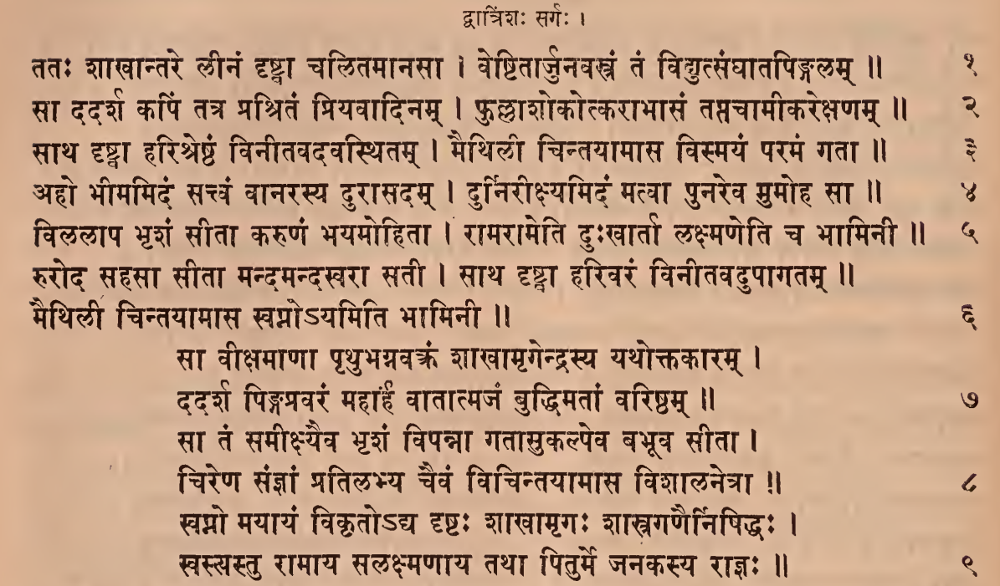
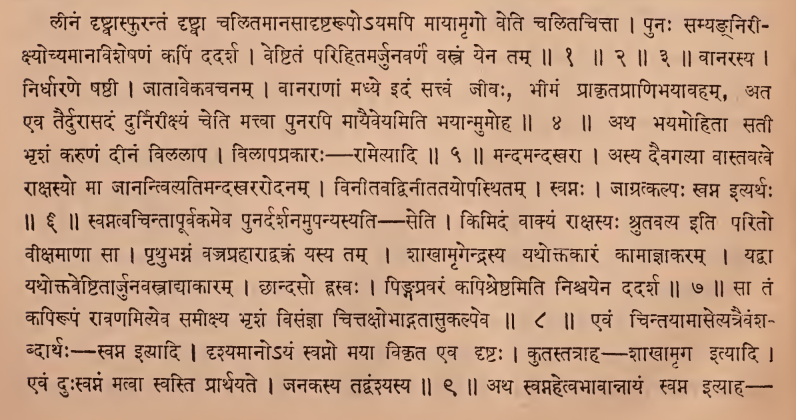
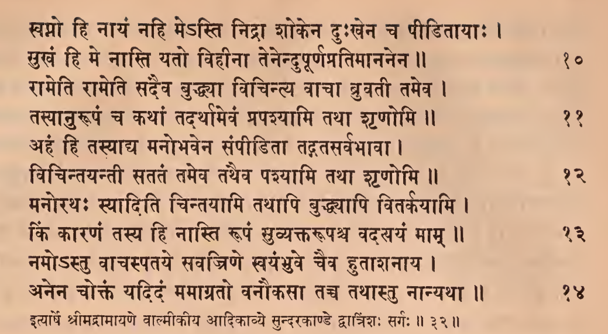
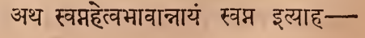
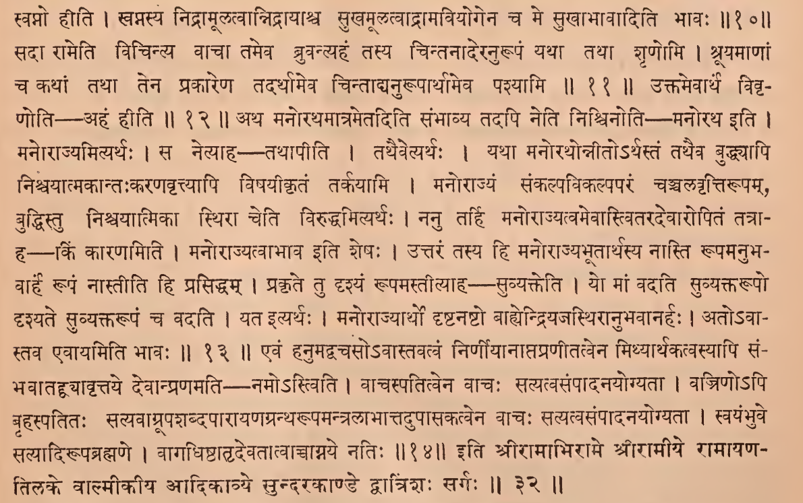

॥ श्रीः॥ ॥śrīḥ॥

ādikaviśrīvālmīkimahāmunipraṇītaṃ

rāmāyaṇam

tilakākhyayā vyākhyayā sametam।\
sundarakāṇḍam।

# dvātriṃśaḥ sargaḥ \|\| 32

*Source in Sanskrit (devanāgarī) (file [Ramayana 2.pdf](https://drive.google.com/open?id=18roDak0GMr30lg8CN1aqfkz__r9X_9ID&usp=drive_fs))*

| **Page** | **Verse** | **Comment** |
|:--------:|:---------:|:-----------:|
|   120    |    1-9    | 1-10 (beg.) |
|   121    |   10-14   |    10-14    |

## devanāgarī. 

### Page 120. Verse (1-9) 

### Page 120. Comment (1-10 beg.)

### Page 121. Verse (10-14) 

### Page 121. Comment (10-14)

## IAST - International Alphabet of Sanskrit Transliteration

dvātriṃśaḥ sargaḥ \|

tataḥ śākhāntare līnaṃ dṛṣṭvā calitamānasā \|

veṣṭitārjunavastraṃ taṃ vidyutsaṅghātapiṅgalam \|\| 1

sā dadarśa kapiṃ tatra praśritaṃ priyavādinam \|

phullāśokotkarābhāsaṃ taptacāmīkarekṣaṇam \|\| 2

sātha dṛṣṭvā hariśreṣṭhaṃ vinītavadavasthitam \|

maithilī cintayāmāsa vismayaṃ paramaṃ gatā \|\| 3

> līnaṃ dṛṣṭvāsphurantaṃ dṛṣṭvā calitamānasādṛṣṭarūpo'yamapi māyāmṛgo veti calitacittā \|
>
> punaḥ samyagnirīkṣyocyamānaviśeṣaṇaṃ kapiṃ dadarśa \|
>
> veṣṭitaṃ parihitamarjunavarṇaṃ vastraṃ yena tam \|\| 1 \|\| 2 \|\| 3 \|\|

aho bhīmamidaṃ sattvaṃ vānarasya durāsadam \|

durnirīkṣyamidaṃ matvā punareva mumoha sā \|\| 4

> vānarasya \|
>
> nirdhāraṇe ṣaṣṭhī \|
>
> jātāvekavacanam \|
>
> vānarāṇāṃ madhye idaṃ sattvaṃ jīvaḥ, bhīmaṃ prākṛtaprāṇibhayāvaham ata eva tairdurāsadaṃ durnirīkṣyaṃ ceti mattvā punarapi māyaiveyamiti bhayānmumoha \|\| 4 \|\| vilalāpa bhṛśaṃ sītā karuṇaṃ bhayamohitā \|

rāmarāmeti duḥkhārtā lakṣmaṇeti ca bhāminī \|\| 5

> atha bhayamohitā satī bhṛśaṃ karuṇaṃ dīnaṃ vilalāpa \|
>
> vilāpaprakāraḥ – rāmetyādi \|\| 5 \|\|

ruroda sahasā sītā mandamandasvarā satī \|

sātha dṛṣṭvā harivaraṃ vinītavadupāgatam \|\|

maithilī cintayāmāsa svapno'yamiti bhāminī \|\| 6

> mandamandasvarā \|
>
> asya daivagatyā vāstavatve rākṣasyo mā jānantvityatimandakhararodanam \|
>
> vinītavadvinītatayopasthitam \|
>
> svapnaḥ \|
>
> jāgratkalpaḥ svapna ityarthaḥ \|\| 6 \|\|

sā vīkṣamāṇā pṛthubhagnavaktraṃ śākhāmṛgendrasya yathoktakāram \|

dadarśa piṅgapravaraṃ mahārhaṃ vātātmajaṃ buddhimatāṃ variṣṭham \|\| 7

> svatvacintāpūrvakameva punardarśanamupanyasyati — seti \|
>
> kimidaṃ vākyaṃ rākṣasyaḥ śrutavalyaḥ iti parito vīkṣamāṇā sā \|
>
> pṛthubhagnaṃ vajraprahārādvakraṃ yasya tam \|
>
> śākhāmṛgendrasya yathoktakāraṃ kāmājñākaram \|
>
> yadvā yathoktaveṣṭitārjunavastrādyākāram \|
>
> chāndaso hrasvaḥ \|
>
> piṅgapravaraṃ kapiśreṣṭhamiti niścayena dadarśa \|\| 7 \|\|

sā taṃ samīkṣyaiva bhṛśaṃ vipannā gatāsukalpeva babhūva sītā \|

cireṇa sañjñāṃ pratilabhya caivaṃ vicintayāmāsa viśālanetrā \|\| 8

> sā taṃ kapirūpaṃ rāvaṇamityeva samīkṣya bhṛśaṃ visañjñā\
> cittakṣobhādgatāsukalpeva \|\| 8 \|\|

svapno mayāyaṃ vikṛto'dya dṛṣṭaḥ śākhāmṛgaḥ śāstragaṇairniṣiddhaḥ \|

svastyastu rāmāya salakṣmaṇāya tathā piturme janakasya rājñaḥ \|\| 9

> evaṃ cintayāmāsetyatraivaṃśabdārthaḥ—svapna ityādi \|
>
> dṛśyamāno'yaṃ svapno mayā vikṛta eva dṛṣṭaḥ \|
>
> kutastatrāha — śākhāmṛga ityādi \|
>
> evaṃ duḥsvapnaṃ matvā svasti prārthayate \|
>
> janakasya tadvaṃśyasya \|\| 9 \|\|

svapno hi nāyaṃ nahi me'sti nidrā śokena duḥkhena ca pīḍitāyāḥ \|

sukhaṃ hi me nāsti yato vihīnā tenendupūrṇapratimānanena \|\| 10

> atha svapnahetvabhāvānnāyaṃ svapna ityāha - svapno hīti \|
>
> svapnasya nidrāmūlatvānnidrāyāśca sukhamūlatvādrāmaviyogena ca me sukhābhāvāditi bhāvaḥ \|\|10\|\|

rāmeti rāmeti sadaiva buddhyā vicintya vācā bruvatī tameva \|

tasyānurūpaṃ ca kathāṃ tadarthāmevaṃ prapaśyāmi tathā śṛṇomi \|\| 11

> sadā rāmeti vicintya vācā tameva bruvantyahaṃ tasya cintanāderanurūpaṃ yathā tathā śṛṇomi \|
>
> śrūyamāṇāṃ ca kathāṃ tathā tena prakāreṇa tadarthāmeva cintādyanurūpārthameva paśyāmi \|\| 11 \|\|

ahaṃ hi tasyādya manobhavena saṃpīḍitā tadgatasarvabhāvā \|

vicintayantī satataṃ tameva tathaiva paśyāmi tathā śṛṇomi \|\| 12

> uktamevārthaṃ vivṛṇoti - ahaṃ hīti \|\| 12 \|\|

manorathaḥ syāditi cintayāmi tathāpi buddhyāpi vitarkayāmi \|

kiṃ kāraṇaṃ tasya hi nāsti rūpaṃ suvyaktarūpaśca vadatyayaṃ mām \|\| 13

> atha manorathamātrametaditi saṃbhāvya tadapi neti niścinoti - manoratha iti \|
>
> manorājyamityarthaḥ \|
>
> sa netyāha – tathāpīti \|
>
> tathaivetyarthaḥ \|
>
> yathā manorathonnīto'rthastaṃ tathaiva buddhyāpi niścayātmakāntaḥkaraṇavṛttyāpi viṣayīkṛtaṃ tarkayāmi \|
>
> manorājyaṃ saṅkalpavikalpaparaṃ cañcalavṛttirūpam, buddhistu niścayātmikā sthirā ceti viruddhamityarthaḥ \|
>
> nanu tarhi manorājyatvamevāstvitaradevāropitaṃ tatrāha—kiṃ kāraṇamiti \|
>
> manorājyatvābhāva iti śeṣaḥ \|
>
> uttaraṃ tasya hi manorājyabhūtārthasya nāsti rūpamanubhavārhaṃ rūpaṃ nāstīti hi prasiddham \|
>
> prakṛte tu dṛśyaṃ rūpamastītyāha – suvyakteti \|
>
> yo māṃ vadati suvyaktarūpo dṛśyate suvyaktarūpaṃ ca vadati \|
>
> yata ityarthaḥ \|
>
> manorājyārtho dṛṣṭanaṣṭo bāhyendriyajasthirānubhavānarhaḥ \|
>
> ato'vāstava evāyamiti bhāvaḥ \|\| 13 \|\|

namo ’stu vācaspataye savajriṇe svayaṃbhuve caiva hutāśanāya \|

anena coktaṃ yadidaṃ mamāgrato vanaukasā tacca tathāstu nānyathā \|\| 14

> evaṃ hanumadvacaso'vāstavatvaṃ nirṇīyānāptapraṇītatvena mithyārthakatvasyāpi saṃbhavātaddvyāvṛttaye devānpraṇamati namo'stviti \|
>
> vācaspatitvena vācaḥ satyatvasaṃpādanayogyatā \|
>
> vajriṇo'pi bṛhaspatitaḥ satyavāgrūpaśabdapārāyaṇagrantharūpamantralābhāttadupāsakatvena vācaḥ satyatvasaṃpādanayogyatā \|
>
> svayaṃbhuve satyādirūpabrahmaṇe \|
>
> vāgadhiṣṭhātṛdevatātvāccāgnaye natiḥ \|\| 14 \|\|

ityārṣe śrīmadrāmāyaṇe vālmīkīya ādikāvye sundarakāṇḍe dvātriṃśaḥ sargaḥ \|\|32\|\|

> iti śrīrāmābhirāme śrīrāmīye rāmāyaṇatilake vālmīkīya ādikāvye sundarakāṇḍe dvātriṃśaḥ sargaḥ \|\| 32 \|\|
