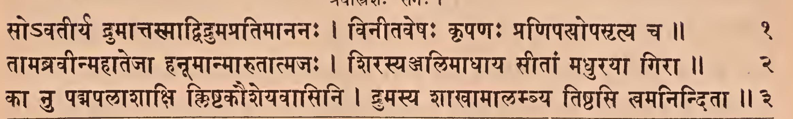
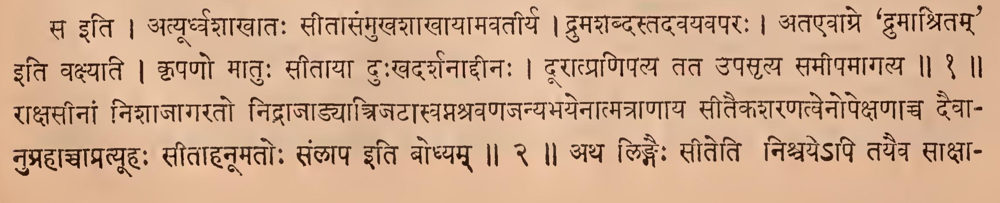
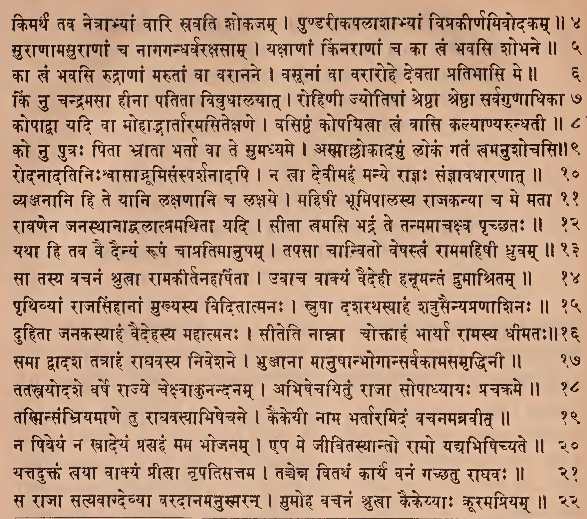
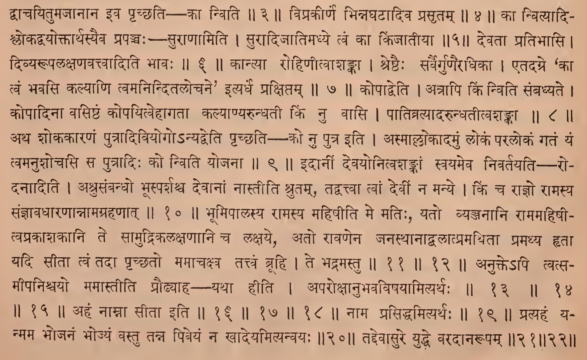
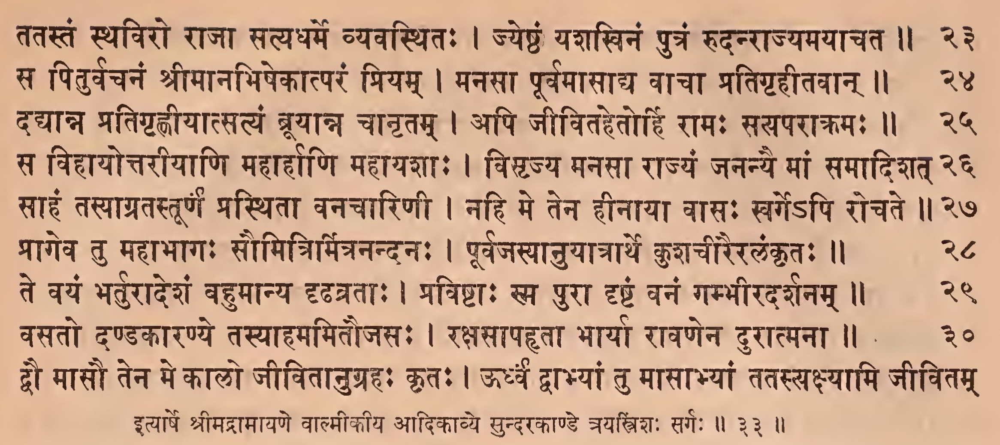
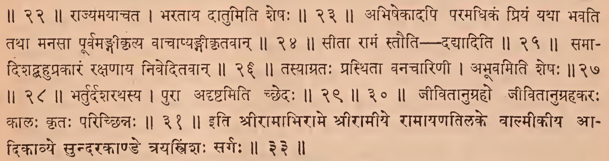

_Created: 07-07-2026 · Last updated: 05-09-2026_

॥ श्रीः॥ ॥śrīḥ॥

ādikaviśrīvālmīkimahāmunipraṇītaṃ

rāmāyaṇam

tilakākhyayā vyākhyayā sametam।\
sundarakāṇḍam।

# trayastriṃśaḥ sargaḥ \|\| 33

*Source in Sanskrit (devanāgarī) (file [Ramayana 2.pdf](https://drive.google.com/open?id=18roDak0GMr30lg8CN1aqfkz__r9X_9ID&usp=drive_fs))*

| **Page** | **Verse** | **Comment** |
|:--------:|:---------:|:-----------:|
|   121    |    1-3    | 1-3 (beg.)  |
|   122    |   4-22    |    4-22     |
|   123    |   23-30   |    23-31    |

## devanāgarī. 

### Page 121. Verse (1-3) 

### Page 121. Comment (1-3 beg.)

### Page 122. Verse (5-22) 

### Page 122. Comment (4-22)

### Page 123. Verse (23-31) 

### Page 123. Comment (23-31)

## IAST - International Alphabet of Sanskrit Transliteration

trayastriṃśaḥ sargaḥ \|

so'vatīrya māttasmādvidumapratimānanaḥ \|

vinītaveṣaḥ kṛpaṇaḥ praṇipasopasṛtya ca \|\| 1

> sa iti \|
>
> atyūrdhvaśākhātaḥ sītāsaṃmukhaśākhāyāmavatīrya \|
>
> drumaśabdastadavayavaparaḥ \|
>
> ataevāgre 'drumāśritam' iti vakṣyati \|
>
> kṛpaṇo mātuḥ sītāyā duḥkhadarśanāddīnaḥ \|
>
> dūrātpraṇipatya tata upasṛtya samīpamāgatya \|\| 1 \|\|

tāmabravīnmahātejā hanūmānmārutātmajaḥ \|

śirasya alimādhāya sītāṃ madhurayā girā \|\| 2

> rākṣasīnāṃ niśājāgarato nidrājāḍyātrijaṭāsvapnaśravaṇajanyabhayenātmatrāṇāya sītaikaśaraṇatvenopekṣaṇācca devānuprahāñcāpratyūhaḥ sītāhanūmato: saṃlāpa iti bodhyam \|\| 2 \|\|

kā nu padmapalāśākṣi kliṣṭakauśeyavāsini \|

drumasya śākhāmālambya tiṣṭhasi tvamaninditā \|\| 3

> atha liṅgaiḥ sīteti niścaye'pi tayaiva sākṣādvācayitumajānāna iva pṛcchati — kā nviti \|\| 3 \|\|

kimarthaṃ tava netrābhyāṃ vāri sravati śokajam \|

puṇḍarīkapalāśābhyāṃ viprakīrṇamivodakam \|\| 4

> viprakīrṇe bhinnaghaṭādiva prasṛtam \|\| 4 \|\|

surāṇāmasurāṇāṃ ca nāgagandharvarakṣasām \|

yakṣāṇāṃ kiṃnarāṇāṃ ca kā tvaṃ bhavasi śobhane \|\| 5

> kā nvityādiślokadvayoktārthasyaiva prapañcaḥ - surāṇāmiti \|
>
> surādijātimadhye tvaṃ kā kiñjātīyā \|\| 5 \|\|

kā khaṃ bhavasi rudrāṇāṃ marutāṃ vā varānane \|

vasūnāṃ vā varārohe devatā pratibhāsi me \|\| 6

> devatā pratibhāsi \|
>
> divyarūpalakṣaṇavattvāditi bhāvaḥ \|\| 6 \|\|

kiṃ nu candramasā hīnā patitā vibudhālayāt \|

rohiṇī jyotiṣāṃ śreṣṭhā śreṣṭhā sarvaguṇādhikā \| 7

> kāntyā rohiṇītvāśaṅkā \|
>
> śreṣṭhaiḥ sarvairguṇairadhikā \|
>
> etadagre 'kā tvaṃ bhavasi kalyāṇi tvamaninditalocane' ityardha prakṣiptam \|\| 7 \|\|

kopādvā yadi vā mohādbhārtāramasitekṣaṇe \|

vasiṣṭha kopayitvā tvaṃ vāsi kalyāṇyarundhatī \|\| 8

> kopādveti \|
>
> atrāpi kiṃ nviti saṃbadhyate \|
>
> kopādinā vasiṣṭhaṃ kopayitvehāgatā kalyāṇyarundhatī kiṃ nu vāsi \|
>
> pātivratyādarundhatītvaśaṅkā \|\| 8 \|\|

ko nu putraḥ pitā bhrātā bhartā vā te sumadhyame \|

asmāllokādamuṃ lokaṃ gataṃ tvamanuśocasi \|\| 9

> atha śokakāraṇaṃ putrādiviyogo'nyadveti pṛcchati — ko nu putra iti \|
>
> asmāllokādamuṃ lokaṃ paralokaṃ gataṃ yaṃ tvamanuśocati sa putrādiḥ ko nviti yojanā \|\| 9 \|\|

rodanādatiniḥśvāsādbhūmisaṃsparśanādapi \|

na khā devīmahaṃ manye rājñaḥ sañjñāvadhāraṇāt \|\| 10

> idānīṃ devayonitvaśaṅkāṃ svayameva nivartayati — rodanāditi \|
>
> aśrusaṃbandho bhūsparśaśca devānāṃ nāstīti śrutam, tadvattvā tvāṃ devīṃ na manye \|
>
> kiṃ ca rājño rāmasya sañjñāvadhāraṇānnāmagrahaṇāt \|\| 10 \|\|

vyañjanāni hi te yāni lakṣaṇāni ca lakṣaye \|

mahiṣī bhūmipālasya rājakanyā ca me matā \|\| 11

> bhūmipālasya rāmasya mahiṣīti me matiḥ, yato vyañjanāni rāmamahiṣītvaprakāśakāni te sāmudrikalakṣaṇāni ca lakṣaye, ato rāvaṇena janasthānādbalātpramathitā pramathya hṛtā yadi sītā tvaṃ tadā pṛcchato mamācakṣva tattvaṃ brūhi \|
>
> te bhadramastu \|\| 11 \|\| 12 \|\|

rāvaṇena janasthānādvalātpramathitā yadi \|

sītā khamasi bhadraṃ te tanmamācakṣva pṛcchataḥ \|\| 12

yathā hi tava vai dainyaṃ rūpaṃ cāpratimānuṣam \|

tapasā cānvito veṣastvaṃ rāmamahiṣī dhruvam \|\| 13

> anukte'pi tvatsamīpaniścayo mamāstīti prauḍhyāha--yathā hīti \|
>
> aparokṣānubhavaviṣayāmityarthaḥ \|\| 13 \|\| 14 \|\| 15 \|\|

sā tasya vacanaṃ śrukhā rāmakīrtanaharṣitā \|

uvāca vākyaṃ vaidehī hanūmantaṃ dumāśritam \|\| 14

pṛthivyāṃ rājasiṃhānāṃ mukhyasya viditātmanaḥ \|

snuṣā daśarathasyāhaṃ śatrusainyapraṇāśinaḥ \|\| 15

duhitā janakasyāhaṃ vaidehasya mahātmanaḥ \|

sīteti nāmnā coktāhaṃ bhāryā rāmasya dhīmataḥ \|\| 16

> ahaṃ nāmnā sītā iti \|\| 16 \|\| 17 \|\| 18 \|\|

samā dvādaśa tatrāhaṃ rāghavasya niveśane \|

bhuñjanā mānuṣānbhogānsarvakāmasamṛddhinī \|\| 17

tatastrayodaśe varṣe rājye cekṣvākunandanam \|

abhiṣecayituṃ rājā sopādhyāyaḥ pracakrame \|\| 18

tasminsandhriyamāṇe tu rāghavasyābhiṣecane \|

kaikeyī nāma bhartāramidaṃ vacanamabravīt \|\| 19

> nāma prasiddhamityarthaḥ \|\| 19 \|\|

na piveyaṃ na khādeyaṃ pratyahaṃ mama bhojanam \|

eṣa me jīvitasyānto rāmo yadyabhiṣicyate \|\| 20

> pratyahaṃ yanmama bhojanaṃ bhojyaṃ vastu tanna pibeyaṃ na khādeyamityanvayaḥ \|\| 20 \|\|

yattaduktaṃ tvayā vākyaṃ prīyā nṛpatisattama \|

taccenna vitathaṃ kārya vanaṃ gacchatu rāghavaḥ \|\| 21

> taddevāsure yuddhe varadānarūpam \|\| 21 \|\| 22 \|\|

sa rājā satyavāgdevyā varadānamanusmaran \|

mumoha vacanaṃ śrulā kaikeyyāḥ krūramapriyam \|\| 22

tatastaṃ sthaviro rājā satyadharme vyavasthitaḥ \|

jyeṣṭhaṃ yaśasvinaṃ putraṃ rudanrājyamayācata \|\| 23

> rājyamayācata \|
>
> bharatāya dātumiti śeṣaḥ \|\| 23 \|\|

sa piturvacanaṃ śrīmānabhiṣekātparaṃ priyam \|

manasā pūrvamāsādya vācā pratigṛhītavān \|\| 24

> abhiṣekādapi paramadhikaṃ priyaṃ yathā bhavati tathā manasā pūrvamaṅgīkṛtya bācāpyaṅgīkṛtavān \|\| 24 \|\|

dadyānna pratigṛhṇīyātsatyaṃ brūyānna cānṛtam \|

api jīvitahetorhi rāmaḥ sayaparākramaḥ \|\| 25

> sītā rāmaṃ stauti - dadyāditi \|\| 25 \|\|

sa vihāyottarīyāṇi mahārhāṇi mahāyaśāḥ \|

visṛjya manasā rājyaṃ jananyai māṃ samādiśata \|\| 26

> sabhādiśadbahuprakāraṃ rakṣaṇāya niveditavān \|\| 26 \|\|
>
> tasyāgrataḥ prasthitā vanacāriṇī \|

sāhaṃ tasyāgratastūrṇa prasthitā vanacāriṇī \|

nahi me tena hīnāyā vāsaḥ svarge'pi rocate \|\| 27

prāgeva tu mahābhāgaḥ saumitrimitranandanaḥ \|

> abhūvamiti śeṣaḥ \|\| 27 \|\| 28 \|\|

pūrvajasyānuyātrārthe kuśacīrairalaṅkṛtaḥ \|\| 28

te vayaṃ bharturādeśaṃ bahumānya dṛḍhavratāḥ \|

praviṣṭāḥ sma purā dṛṣṭaṃ vanaṃ gambhīradarśanam \|\| 29

> bharturdaśarathasya \|
>
> purā adṛṣṭamiti cchedaḥ \|\| 29 \|\| 30 \|\|

vasato daṇḍakāraṇye tasyāhamamitaujasaḥ \|

rakṣasāpahṛtā bhāryā rāvaṇena durātmanā \|\| 30

dvau māsau tena me kālo jīvitānugrahaḥ kṛtaḥ \|

ūrdhvaṃ dvābhyāṃ tu māsābhyāṃ tatastrakṣyāmi jīvitam \|\| 31

> jīvitānugraho jīvitānugrahakaraḥ kālaḥ kṛtaḥ paricchinnaḥ \|\| 31 \|\|

ityārṣe śrīmadrāmāyaṇe vālmīkīya ādikāvye sundarakāṇḍe trayastriṃśaḥ sargaḥ \|\| 33 \|\|

> iti śrīrāmābhirāme śrīrāmīye rāmāyaṇatilake vālmīkīya ādikāvye sundarakāṇḍe trayastriṃśaḥ sargaḥ \|\| 33 \|\|

_Dr. Mārcis Gasūns_
