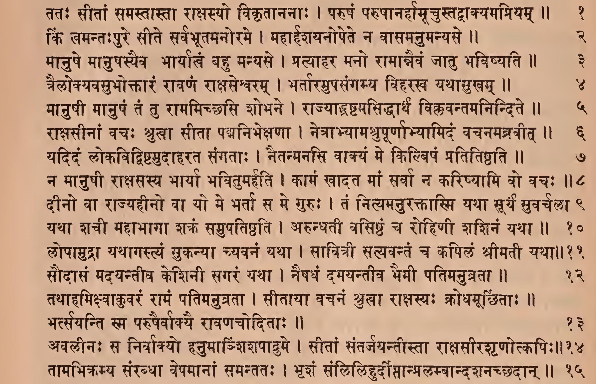
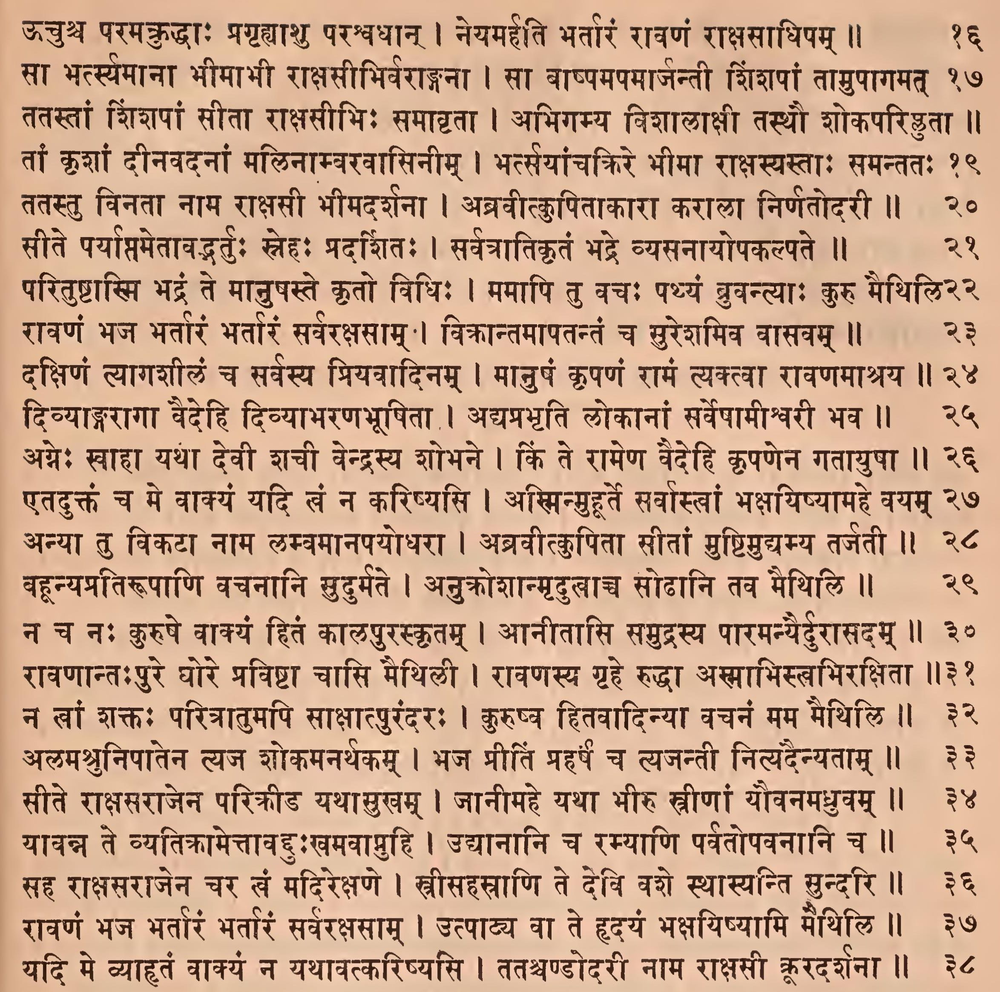
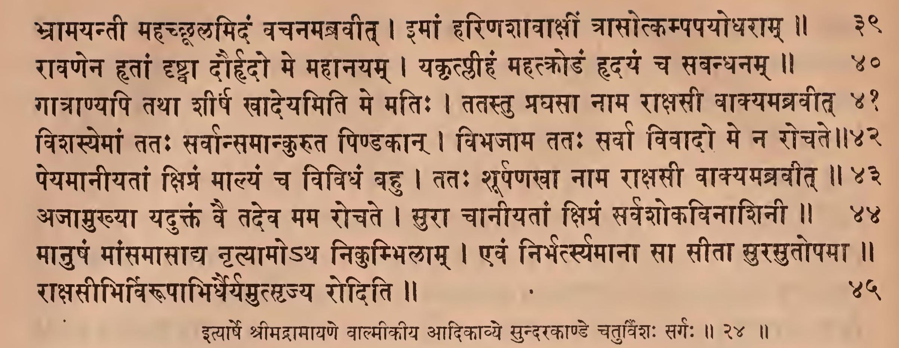

॥ श्रीः॥ ॥śrīḥ॥

ādikaviśrīvālmīkimahāmunipraṇītaṃ

rāmāyaṇam

tilakākhyayā vyākhyayā sametam।\
sundarakāṇḍam।\
[prathamaḥ sargaḥ](https://vk.com/ramayanaru?w=wall-189073372_337)।

# prathamaḥ sargaḥ \|\| 1

tato rāvaṇanītāyāḥ sītāyāḥ śatrukarṣaṇaḥ \|

iyeṣa padamanveṣṭuṃ cāraṇācarite pathi \|\| 1

> sundare yasya dāso'bdhiṃ tīrtvā dṛṣṭvā ca maithilīm \| dṛṣṭā sītetyabhyavocattaṃ rāmaṃ naumi ciddhanam \|\|
>
> atha samudrakūrdanamicchati sma-tata iti \| tataḥ śatrukarṣaṇo
>
> hanumānrāvaṇanītāyā rāvaṇahṛtāyāḥ sītāyāḥ padamavasthitisthānamanveṣṭuṃ cāraṇairdevajātiviśeṣairācarite kriyamāṇasaṃcāre pathyākāśamārge gamanāyeyeṣa \|\| 1 \|\|

duṣkaraṃ niṣpratidvandvaṃ cikīrṣankarma vānaraḥ \| samudagraśirogrīvo gavāṃ patirivābabhau \|\| 2

> niṣpratidvandvaṃ sahāyāntararahitaṃ pratibandharahitaṃ ca \| anyairduṣkaraṃ karma laṅghanapūrvaṃ sītānveṣaṇakarma \| samudagramunnataṃ śiro grīvā ca yasya saḥ, ataeva gavāṃ patirvṛṣa ivābabhau \|\| 2 \|\|

atha vaidūryavarṇeṣu śādvaleṣu mahābalaḥ \| dhīraḥ salilakalpeṣu vicacāra yathāsukham \|\| 3

dvijānvitrāsayandhīmānurasā pādapānharan \| mṛgāṃśca subahūnnighnanpravṛddha iva kesarī \|\| 4

> vaidūryavarṇaśādvalapradeśasya samudrajalavacchyā-matvamṛdutvābhyāmurasā plavanasadṛśakriyākālikoraḥpeṣaṇena pravṛddhaḥ kesarīva vicacāra \|\|3\|\| 4 \|\|

nīlalohitamāñjiṣṭhapadmavarṇaiḥ sitāsitaiḥ \| svabhāvasiddhairvimalairdhātubhiḥ samalaṃkṛtam \|\| 5

kāmarūpibhirāviṣṭamabhīkṣṇaṃ saparicchadaiḥ \| yakṣakiṃnaragandharvairdevakalpaiḥ sapannagaiḥ \|\| 6

sa tasya girivaryasya tale nāgavarāyute \| tiṣṭhankapivarastatra hrade nāga ivababhau \|\| 7

> nīlalo-hito raktaśyāmaḥ \| māñjiṣṭhaḥ kṛṣṇapāṇḍura iti katakaḥ \| māñjiṣṭhaḥ pāṭala ityanye \| padmavarṇaḥ prasiddhaḥ \| sitā-sitaiḥ kalmāṣaiḥ \| kṛṣṇapāṇḍurairiti yāvat \| svabhāvasiddhaiḥ śailasvabhāvasiddhairuktarūpairdhātubhiḥ samalaṃkṛtam \| kāmarūpitvādiviśeṣaṇavadbhiryakṣādibhirabhīkṣṇamāviṣṭaṃ yattasya girivaryasya talaṃ tatra nāgavarairāsamantādyute tiṣṭhansa kapirhrade nāga ivābabhau \| girau hradasāmyaṃ śyāmalatvena \|\| 5 \|\| 6 \|\| 7 \|\|

sa sūryāya mahendrāya pavanāya svayaṃbhuve \| bhūtebhyaścāñjaliṃ kṛtvā cakāra gamane matim \|\| 8

> svayaṃbhuve pavanāya pūyate yena svajñānena yogivṛndaṃ sa pavano bhagavānpratyaktattvabhūto rāmaḥ \| etena sakalavighnanivāraṇāyeṣṭadevatā-prārthanāpūrvaṃ yātrā kartavyeti sadācāro bodhitaḥ \|\| 8 \|\|

añjaliṃ prāṅmukhaṃ kurvanpavanāyātmayonaye \| tato hi vavṛdhe gantuṃ dakṣiṇo dakṣiṇāṃ diśam \|\| 9

> ātmayonaye. pavanāya \| svajanakavāyava ityarthaḥ \| dakṣiṇaḥ kuśalaḥ \|\| 9

plavagapravarairdṛṣṭaḥ plavane kṛtaniścayaḥ \| vavṛdhe rāmavṛddhyarthaṃ samudra iva parvasu \|\| 10

> rāmavṛddhyarthaṃ rāmābhyudayāya \|\| 10 \|\|

niṣpramāṇaśarīraḥ saṃllilaṅghayiṣurarṇavam \| bāhubhyāṃ pīḍayāmāsa caraṇābhyāṃ ca parvatam \|\| 11

> niṣpramāṇaśarīraḥ paricchedātikrāntadehaḥ \| pīḍayāmāsa lilaṅdhayiṣāsaṃnāhavaśataḥ \|\| 11 \|\|

sa cacālācalaścāśu muhūrtaṃ kapipīḍitaḥ \| tarūṇāṃ puṣpitāgrāṇāṃ sarvaṃ ṣpamaśātayat \|\| 12

> ekena pīḍanavyāpāreṇa muhūrtaparyantaṃ calanam \| aśātayat \| parvataḥ kartā, calanaṃ karaṇam \|\| 12 \|\|

tena pādapamuktena puṣpaugheṇa sugandhinā \| sarvataḥ sa vṛtaḥ śailo babhau puṣpamayo yathā \|\| 13

> puṣpamayo yathā \| puṣpapracuraḥ svayabhivetyarthaḥ \|\| 13 \|\|

tena cottamavīryeṇa pīḍyamānaḥ sa parvataḥ \| salilaṃ saṃprasusrāva madamatta iva dvipaḥ \|\| 14

> uttamavī-ryeṇa tena pīḍyamānaḥ sa parvataḥ salilaṃ prasusrāva \|\| 14 \|\|

pīḍyamānastu balinā mahendrastena parvataḥ \| rītīrnirvartayāmāsa kāñcanāñcanarājatīḥ \|\| 15

> uktārthasyaiva vivaraṇam-pīḍyamāna iti \| kāñcanāñjanarājatīstadābhā rītīḥ srotaḥprakārānnirvartayāmāsa \| tadābhatvamupādhikṛtam \|\| 15 \|\|

mumoca ca śilāḥ śailo viśālāḥ samanaḥśilāḥ \| madhyamenāciṣā juṣṭo dhūmarājirivānalaḥ \|\| 16

> kiṃ ca sa śailaḥ samanaḥśilā viśālāḥ śilā mumoca nipīḍanāt \| ataeva madhyamena madhyabhāgenārciṣā jvālayā juṣṭo yo'nalastasya dhūmarājiriva babhāvityarthaḥ \| yasyetyadhyāhāraḥ\| ’dhūmarājiriva‘ iti hrasvapāṭhaḥ \|tīrthastu— madhyamenārciṣā madhyamākhyayāgnijihvayā juṣṭo viśiṣṭo'gnirdhūmarājīriva \| dhūmanicayānivetyarthaḥ \| ’dhūmarājīriva‘ iti ca pāṭha ityāha \|\| 16 \|\|

hariṇā pīḍyamānena pīḍyamānāni sarvataḥ \| guhāviṣṭāni sattvāni vinedurvikṛtaiḥ svaraiḥ \|\| 17

> hariṇā hanumatā pīḍyamānena parvatena pīḍyamānāni sattvāni \|\| 17 \|\|

sa mahānsattvasaṃnādaḥ śailapīḍānimittajaḥ \| pṛthivīṃ pūrayāmāsa diśaścopavanāni ca \|\| 18

> ’sa mahāsattva-‘iti pāṭhe mahāsattvā mahājantavasteṣāṃ saṃnāda iti tīrthaḥ \| ’sa mahānsattvasaṃnādaḥ‘ iti pāṭhāntaram \|\| 18 \|\|

śirobhiḥ pṛthubhirnāgā vyaktasvastikalakṣaṇaiḥ \| vamantaḥ pāvakaṃ ghoraṃ dadaṃśurdaśanaiḥ śilāḥ \|\| 19

> svastikaḥ phaṇāsthanīlarekhā taccihnaiḥ śirobhirupalakṣitāḥ \| dadaṃśuḥ \| pīḍājanita-krodhavaśāt \|\| 19 \|\|

tāstadā saviṣairdaṣṭāḥ kupitaistairmahāśilāḥ \| jajvaluḥ pāvakoddīptā bibhiduśca sahasradhā \|\| 20

> saviṣaistaiḥ sarperdaṣṭāḥ satyaḥ pāvakoddīptā iva jajvaluḥ \| bibhidurbhinnā babhūvuśca \|\| 20 \|\|

yāni tvauṣadhajālāni tasmiñjātāni parvate \| viṣaghnānyapi nāgānāṃ na śekuḥ śamituṃ viṣam \|\| 21

> śamituṃ śamayitum \|\| 21 \|\|

bhidyate'yaṃ girirbhūtairiti mattvā tapasvinaḥ \| trastā vidyādharāstasmādutpetuḥ strīgaṇaiḥ saha \|\| 22

> bhūtairbrahmarakṣaḥprabhṛtimahābhūtaiḥ \|\| 22 \|\|

pānabhūmigataṃ hitvā haimamāsanabhājanam \| pātrāṇi ca mahārhāṇi karakāṃśca hiraṇmayān \|\| 23

> hitvetyatra vidyādharāḥ kartāraḥ \|\| 23 \|\|

lehyānuccāvacānbhakṣyānmāṃsāni vividhāni ca \| ārṣabhāṇi ca carmāṇi khaḍgāṃśca kanakatsarūn \|\| 24

> ārṣabhāṇi ṛṣabhacarmanirmitāni carmāṇi phalakāni \| tsaruḥ khaḍgamuṣṭiḥ \|\| 24 \|\|

kṛtakaṇṭhaguṇāḥ kṣīvā raktamālyānulepanāḥ \| raktākṣāḥ puṣkarākṣāśca gaganaṃ pratipadire \|\| 25

> kṛtāḥ kaṇṭheṣu guṇāḥ srajo yaiste \| kṣībā mattāḥ \| puṣkaraṃ padmam \|\| 25

hāranūpurakeyūrapārihāryadharāḥ striyaḥ \| vismitāḥ sasmitāstasthurākāśe ramaṇaiḥ saha \|\| 26

eṣa parvatasaṃkāśo hanumānmārutātmajaḥ \| titīrṣati mahāvegaḥ samudraṃ varuṇālayam \|\| 27

rāmārthaṃ vānarārthaṃ ca cikīrṣankarma duṣkaram \| samudrasya paraṃ pāraṃ duṣprāpaṃ prāpnumicchati \|\| 28

> pārihāryaśabdaḥ śreṣṭhavācīti katakaḥ \| pārihāryo valaya iti tīrthaḥ \| etadagre ’darśayanto mahāvidyāṃ vidyādharamaharṣayaḥ \| sahitāstasthurākāśe vīkṣāṃcakruśca parvatam \|\| śuśruvuśca tadā śabdamṛṣīṇāṃ bhāvitātmanām \| cāraṇānāṃ ca siddhānāṃ sthitānāṃ vima-le'mbare\|\|‘ iti ślokadvayaṃ prakṣiptaṃ kvaciditi katakaḥ \|\|26\|\|27\|\|28\|\|

iti vidyādharā vācaḥ śrutvā teṣāṃ tapasvinām \| tamaprameyaṃ dadṛśuḥ parvate vānararṣabham \|\| 29

> teṣāṃ tapasvināmākāśacāritapasvināṃ vācaḥ 'eṣa parvatasaṃkāśaḥ' ityādiślokadvayarūpāḥ śrutvā vidyādharāstamaprameyaṃ dadṛśuḥ \| tadvākśravaṇātpūrvaṃ tu bhūtairayaṃ girirbhidyata iti jñātavantaḥ \|\| 29\|\|

dudhuve ca sa romāṇi cakampe cānalopamaḥ \| nanāda ca mahānādaṃ sumahāniva toyadaḥ \|\| 30

> dudhuve ca \| sa hanūmān \|\| 30 \|\|

ānupūrvyā ca vṛttaṃ tallāṅgūlaṃ lomabhiścitam \| utpatiṣyanvicikṣepa pakṣirāja ivoragam \|\| 31

> ānupūrvyādvṛttaṃ trivalayaṃ lāṅgūlaṃ vicikṣepetyanvayaḥ \|\| 31 \|\|

tasya lāṅgūlamāviddhamativegasya pṛṣṭhataḥ \| dadṛśe garuḍeneva hriyamāṇo mahoragaḥ \|\| 32

> āviddhamāsphālitaṃ bhugnaṃ ca \|\| 32\|\|

bāhū saṃstambhayāmāsa mahāparighasaṃnibhau \| āsasāda kapiḥ kaṭyāṃ caraṇau saṃcukoca ca \|\| 33

> bāhū saṃstambhayāmāsetyutplavanasaṃnāhābhinayaḥ \|
>
> bāhvoḥ saṃstambhanaṃ nāma parvatopari dṛḍhapratiṣṭhāpanam \| kapiḥ kaṭyāṃ kaṭipradeśe āsasāda kāyaprasāraṇātkṛśo'bhūt \| uraḥśirasorūrdhvaprasāraṇe sapṛṣṭhacaraṇabhāgasyādhaḥsaṃkocane tathātvaṃ kaṭideśasyeti bodhyam \|\| 33 \|\|

saṃhṛtya ca bhujau śrīmāṃstathaiva ca śirodharām \| tejaḥ sattvaṃ tathā vīryamāviveśa sa vīryavān \|\| 34

> bhujau saṃhṛtyāṃsapradeśe saṃkucya \| śirodharāṃ grīvāṃ kaṇṭhadeśe saṃkucya \| tejaḥ parābhibhavasāmarthyam \| sattvaṃ balaṃ
>
> śārīram \| vīryamāntaraṃ balam \|\| 34 \|\|

mārgamālokayandūrādūrdhvapraṇihitekṣaṇaḥ \| rurodha hṛdaye prāṇānākāśamavalokayan \|\| 35

> dūrānmārgamālokayan, ataevordhvapraṇihitekṣaṇaḥ \| hṛdaye prāṇapratiṣṭhāsthāne \|\|35\|\|

padbhayāṃ dṛḍhamavasthānaṃ kṛtvā sa kapikuñjaraḥ \| nikucya karṇau hanumānutpatiṣyanmahābalaḥ \|\| 36

> karṇau nikucya saṃkucya \| utpatanasaṃnāhavaśāddhi karṇasaṃkoco bhavati \|\| 36 \|\|

vānarānvānaraśreṣṭha idaṃ vacanamabravīt \| yathā rāghavanirmuktaḥ śaraḥ śvasanavikramaḥ \|\| 37

> śvasanasya vāyoriva vikramo vego yasya saḥ \|\| 37 \|\|

gacchettadvadgamiṣyāmi laṅkāṃ rāvaṇapālitām \| nahi drakṣyāmi yadi tāṃ laṅkāyāṃ janakātmajām \|\| 38

> tadvadgamiṣyāmi \| anena tadvadeva gatvā kṛtakārya āgamiṣyāmīti sūcitam \| tasyaiva prapañca:—nahītyādi \|\| 38

anenaiva hi vegena gamiṣyāmi surālayam \| yadi vā tridive sītāṃ na drakṣyāmi kṛtaśramaḥ \|\| 39

> anenaiva evaṃ vidhenaiva \|\| 39 \|\|

baddhvā rākṣasarājānamānayiṣyāmi rāvaṇam \| sarvathā kṛtakāryo'hameṣyāmi saha sītayā \|\| 40

> ānayiṣyāmyāneṣyāmi \| sītayā saha \| militveti śeṣaḥ \|\| 40 \|\|

ānayiṣyāmi vā laṅkāṃ samutpāṭya sarāvaṇām \| evamuktvā tu hanumānvānaro vānarottamaḥ \|\| 41

> samutpāṭyeti \| oṣadhiparvatotpāṭanavaditi bhāvaḥ \|\| 41 \|\|

utpapātātha vegena vegavānavicārayan \| suparṇamiva cātmānaṃ mene sa kapikuñjaraḥ \|\| 42

> avicārayaṃllaṅghanakleśaleśamapyagaṇayan \| tasyaiva prapañcanam—suparṇamityādi \|\| 42 \|\|

samutpatati vegāttu vegātte nagarohiṇaḥ \| saṃhṛtya viṭapānsarvānsamutpetuḥ samantataḥ \|\| 43

> vegāddhanūmati samutpatati sati te nagarohiṇaḥ parvatasthavṛkṣāḥ sarvānviṭapānsarvāḥ śākhāḥ saṃhṛtya saṃkṣipya vegātsamutpetuḥ\|\| 43 \|\|

sa mattakoyaṣṭibhakānpādapānpuṣpaśālinaḥ \| udvahannuruvegena jagāma vimale'mbare \|\| 44

ūruvegotthitā vṛkṣā muhūrtaṃ kapimanvayuḥ \| prasthitaṃ

dīrghamadhvānaṃ svabandhumiva bāndhavāḥ \|\| 45

> mattāḥ koyaṣṭibhā yeṣu tān \| koyaṣṭikoyaṣṭibhau paryāyau \|\| 44 \|\| 45 \|\|

tamūruvegonmathitāḥ sālāścānye nagottamāḥ\| anujagmurhanūmantaṃ sainyā iva mahīpatim \|\| 46

> sālā: sarjavṛkṣāḥ \| sainyaśabdo'rdharcādiḥ \|\| 46\|\|

supuṣpitāgrairbahubhiḥ pādapairanvitaḥ kapiḥ \| hanūmānparvatākāro babhūvādbhutadarśanaḥ \|\| 47

> parvatākāraḥ \| tattvaṃ bṛhattvena puṣpitavṛkṣavattvena ca \|\|47\|\|

sāravanto'tha ye vṛkṣā nyamajjaṁllavaṇāmbhasi \| bhayādiva mahendrasya parvatā varuṇālaye \|\| 48

> sāravanto gurutvātiśayayuktāḥ khadirādayaste gurutvāllavaṇāmbhasi nyamajjan \| arthādanye laghavaḥ sahaiva gatā iti bodhyam \| mahendrasya bhayātpakṣacchedabhayātparvatā iva nyamajjan \|\| 48 \|\|

sa nānākusumaiḥ kīrṇaḥ kapiḥ sāṅkurakorakaiḥ \| śuśubhe

meghasaṃkāśaḥ khadyotairiva parvataḥ \|\| 49

> nānākusumaiḥ svānuyāyidrumīyaiḥ \| sāṅkurakorakaiḥ kānicitkusumānyaṅkuritāni, kānicitkorakarūpāṇi,
>
> kānicidvikasitānītyarthaḥ \|\| 49 \|\|

vimuktāstasya vegena muktvā puṣpāṇi te drumāḥ \| vyavaśīryanta salile nivṛttāḥ suhṛdo yathā \|\| 50

> tasya hanūmato vegena vimuktāstato vibhaktāste vṛkṣāḥ salile
>
> vyavaśīryanta \| ārṣo'ḍabhāvaḥ \| suhṛdo yathā \| bandhuprasthāpanārthaṃ gatāḥ suhṛdo yathā tānprasthāpya nivartante tadvat \|\|50\|\|

laghutvenopapannaṃ tadvicitraṃ sāgare'patat \| drumāṇāṃ vividhaṃ puṣpaṃ kapivāyusamīritam \|\| 51

> apataditi cchedaḥ \| yadapatattallaghutvenopapannamupapattimat \|\|51\|\|

puṣpaugheṇa sugandhena nānāvarṇena vānaraḥ \| babhau megha ivodyanvai vidyudgaṇavibhūṣitaḥ \|\| 52

> sarvavarṇānāṃ vidyutsusattvānnānāvarṇapuṣpodyānabaddhasya savidyudgaṇameghopamā \|\|52\|\|

tasya vegasamudbhūtaiḥ puṣpaistoyamadṛśyata \| tārābhiriva rāmābhiruditābhirivāmbaram \|\| 53

tasyāmbaragatau bāhū dadṛśāte prasāritau \| parvatāgrādviniṣkrāntau pañcāsyāviva pannagau \|\| 54

> rāmābhīḥ ramaṇīyābhiḥ \|\| 53\|\| 54 \|\|

pibanniva vabhau cāpi sormijālaṃ mahārṇavam \| pipāsuriva cākāśaṃ dadṛśe sa mahākapiḥ \|\| 55

> vivṛtavaktratvātpibanniveti \| adhovaktratve iyamutprekṣā \| ūrdhvavaktratve ākāśaṃ pipāsurivati \|\| 55 \|\|

tasya vidyutprabhākāre vāyumārgānusāriṇaḥ \| nayane viprakāśete parvatasthāvivānalau \|\| 56

> viprakāśete viśeṣeṇa prakāśete sma \| analau dāvānalau \|\| 56 \|\|

piṅge piṅgākṣamukhyasya bṛhatī parimaṇḍale \| cakṣuṣī saṃprakāśete candrasūryāviva sthitau \|\| 57

> piṅge piṅgalavaṇe parimaṇḍale parito baddhaprabhāmaṇḍale sthitau candrasūryāviva ekagirāvudaye pigalamaṇḍalatayāvasthitau candrasūryāvivetyarthaḥ \|\| 57 \|\|

mukhaṃ nāsikayā tasya tāmrayā tāmramābabhau \| saṃdhyayā samabhispṛṣṭaṃ yathā syātsūryamaṇḍalam \|\| 58

lāṅgūlaṃ ca samāviddhaṃ plavamānasya śobhate \| ambare vāyuputrasya śakradhvaja ivocchritam \|\| 59

> nāsikayā yuktamiti śeṣaḥ \| saṃdhyākālikaṃ sūryamaṇḍalaṃ yathā tathā babhāvityarthaḥ \|\| 58 \|\| 59\|\|

lāṅgūlacakro hanumāñśukladaṃṣṭro'nilātmajaḥ \| vyarocata mahāprājñaḥ pariveṣīva bhāskaraḥ \|\| 60

> śukladaṃṣṭratvaṃ svarūpakathanamātram, na tu
>
> pariveṣibhāskaropamopayogi \|\| 60 \|\|

sphigdeśenātitāmraṇa rarāja sa mahākapiḥ \| mahatā dāriteneva girirgairikadhātunā \|\| 61

> sphigdeśena kāṭipradeśena \| tanmātrasyātitāmratvavarṇanādanyatrālpavadvarṇatvam, ataeva dāritagairikadhātuyuktagiryupamā \|\| 61 \|\|

tasya vānarasiṃhasya plavamānasya sāgaram \| kakṣāntaragato

vāyurjīmūta iva garjati \|\| 62

> jīmūta iti saptamyantamiti katakaḥ \| garjāti jagarja \|\|62\|\|

khe yathā nipatatyulkā uttarāntādviniḥsṛtā \| dṛśyate sānubandhā ca tathā sa kapikuñjaraḥ \|\| 63

> uttarāntāduttarordhvadigbhāgāt \| sānubandhā sūkṣmolkāntarānubaddhā \| idaṃ viśeṣaṇaṃ pucchasāhityāt \|\| 63 \|\|

patatpataṅgasaṃkāśo vyāyataḥ śuśubhe kapiḥ \| pravṛddha iva

mātaṅgaḥ kakṣyayā badhyamānayā \|\| 64

> patatpataṅgasaṃkāśo gacchatsūryasaṃkāśo vyāyato dīrghaḥ kāpirvastreṇa badhyamānayā kakṣyayā gajamadhyabandhanarajjvā yuktaḥ pravṛddho mātaṅga iva babhau \| 'kakṣyā prakoṣṭhe harmyādeḥ kāñcyāṃ madhyebhabandhane' iti \|\| 64 \|\|

upariṣṭāccharīreṇa cchāyayā cāvagāḍhayā \| sāgare mārutāviṣṭā naurivāsīttadā kapiḥ \|\| 65

> upariṣṭātkhe gacchatā svaśarīreṇādhaḥ sāgare'vagāḍhayā svasya cchāyayā pratibimbena lakṣitaḥ sasāgare mārutāviṣṭā naurivāsīt \| nauścopari vidyamānapadārthena saha sāgare vāyuvaśādvegena cañcalā gacchatīti tadupamā \|\| 65 \|\|

yaṃ yaṃ deśaṃ samudrasya jagāma sa mahākapiḥ \| sa tu tasyāṅgavegena sonmāda iva lakṣyate \|\| 66

> sonmāda iva sāpasmāra iva \| ghūrṇanaphenavamanavikrośanādivikārasāmyāt \|\| 66 \|\|

sāgarasyormijālānāmurasā śailavarṣmaṇā \| abhighnaṃstu mahāvegaḥ pupluve sa mahākapiḥ \|\| 67

> ūrmijālānāmabhighnan \| karmaṇaḥ śeṣatvavivakṣayā ṣaṣṭhī \| tānyabhighnanniti yāvat \| śailasadṛśena \| anena sāgarormīṇāmatyunnatatvaṃ sūcitam \|\| 67 \|\|

kapivātaśca balavānmeghavātaśca nirgataḥ \| sāgaraṃ bhīmanirhrādaṃ kampayāmāsaturbhṛśam \|\| 68

> kapivātaḥ kapinotthāpito vātaḥ \| meghavāto meghamaṇḍalago vātaḥ \|\| 68\|\|

vikarṣannūrmijālāni bṛhanti lavaṇāmbhasi \| pupluve kapiśārdūlo vikiranniva rodasī \|\| 69

> rodasī dyāvāpṛthivyau \| vikiranniva pṛthakkṣipanniva \|\| 69 \|\|

merumandarasaṃkāśānudgatānsumahārṇave \|

atyakrāmanmahāvegastaraṅgāngaṇayanniva \|\| 70

> atītyātītya gamanādvigaṇayannivetyutprekṣā \|\| 70 \|\|

tasya vegasamuddhuṣṭaṃ jalaṃ sajaladaṃ tadā \| ambarasthaṃ vibabhrāje śaradabhramivātatam \|\| 71

> tasya vegena samuddhuṣṭamūrdhvakṣiptam,ataeva sajaladaṃ jaladasahacaraṃ meghamaṇḍalaparyantamūrdhvaṃ gatamambarasthaṃ jalamātataṃ vitataṃ śaradabhramiva śaranmegha iva babhau \| śuklatvāditi bhāvaḥ \|\| 71\|\|

timinakrajhaṣāḥ kūrmā dṛśyante vivṛtāstadā \| vastrāpakarṣaṇeneva

śarīrāṇi śarīriṇām \|\| 72

kramamāṇaṃ samīkṣyātha bhujagāḥ sāgaraṃgamāḥ \| vyomni taṃ kapiśārdūlaṃ suparṇamiva menire \|\| 73

> vivṛtā vegājjalotsāraṇena vyaktadehāḥ \| vastrāpakarṣaṇena vastrāpahāreṇa \| śarīrāṇyavayavāḥ \|\| 72\|\| 73 \|\|

daśayojanavistīrṇā triṃśadyojanamāyatā \| chāyā vānarasiṃhasya jave cārutarābhavat \|\| 74

> chāyāpramāṇavarṇanena taccharīrapramāṇamapi varṇitaprāyam \| iyaṃ mādhyāhnikī cchāyā \|\|74 \|\|

śvetābhraghanarājīvavāyuputrānugāminī \| tasya sā śuśubhe chāyā patitā lavaṇāmbhasi \|\| 75

śuśubhe sa mahātejā mahākāyo mahākapiḥ \| vāyumārge nirālambe pakṣavāniva parvataḥ \|\| 76

> śvetābhraghanā rājīvaśvetābhrayuktemaghapaṅktivattasya cchāyā
>
> śuśubhe \| śukladaṃṣṭrādinā nānāvarṇatvāduktopamānirvāhaḥ \|\| 75 \|\| 76\|\|

yenāsau yāti balavānvegena kapikuñjaraḥ \| tena mārgeṇa sahasā droṇīkṛta ivārṇavaḥ \|\| 77

> droṇī harmyādau jalanirgamakāṣṭhayantraṃ tajjaladhārāyukta iva kṛto droṇīkṛtaḥ \| megheṣu \| tadāghātena tebhyo jalasravaṇāditi bhāvaḥ \|\| 77 \|\|

āpāte pakṣisaṅghānāṃ pakṣirāja iva vrajan \| hanumānmeghajālāni prakarṣanmāruto yathā \|\| 78

> āpatantyasminnityāpāto mārgaḥ \| pāṇḍuratvādiguṇakāni meghajālāni prakarṣanmāruto yathā tathā babhūveti śeṣaḥ \|\| 78 \|\|

pāṇḍurāruṇavarṇāni nīlamañjiṣṭhakāni ca \| kapinākṛṣyamāṇāni mahābhrāṇi cakāśire \|\| 79

praviśannabhrajālāni niṣpataṃśca punaḥpunaḥ \| pracchannaśca prakāśaśca candramā iva dṛśyate \|\| 80

> kāpinākṛṣyamāṇāni mahābhrāṇi cakāśire \| mārutenākṛṣyamāṇānīveti
>
> śeṣaḥ \|\| 79 \|\| 80 \|\|

plavamānaṃ tu taṃ dṛṣṭvā plavagaṃ tvaritaṃ tadā \| vavṛṣustatra puṣpāṇi devagandharvadānavāḥ \|\| 81

> tatra plavage \|\| 81 \|\|

tatāpa nahi taṃ sūryaḥ plavantaṃ vānareśvaram \| siṣeve ca tadā vāyū rāmakāryārthasiddhaye \|\| 82

ṛṣayastuṣṭuvuścainaṃ plavamānaṃ vihāyasā \| jaguśca devagandharvāḥ

praśaṃsanto vanaukasam \|\| 83

> taṃ nahi tatāpetyanvayaḥ \| vāyuḥ siṣeve \| śramāpanayanāyeti bhāvaḥ\|\| 82 \|\| 83 \|\|

nāgāśca tuṣṭuvuryakṣā rakṣāṃsi vividhāni ca \| prekṣya sarve kapivaraṃ sahasā vigataklamam \|\| 84

> kapivaraṃ vigataklamaṃ vīkṣya nāgādayastuṣṭuvuḥ \|\| 84 \|\|

tasminplavagaśārdūle plavamāne hanūmati \| ikṣvākukulamānārthī

cintayāmāsa sāgaraḥ \|\| 85

> ikṣvākukulasya svotpādakasya mānaṃ satkāramarthayate
>
> tathābhūtaḥ \|\| 85 \|\|

sāhāyyaṃ vānarendrasya yadi nāhaṃ hanūmataḥ \| kariṣyāmi bhaviṣyāmi sarvavācyo vivakṣatām \|\| 86

> vivakṣatāṃ vāgindriyavatprāṇinām \| sarvavācyaḥ sarvaṃ vācyaṃ nindā yasmiṃstādṛśo bhaviṣyāmi \| sarvanindāspadaṃ bhaviṣyāmītyarthaḥ \|\| 86 \|\|

ahamikṣvākunāthena sāgareṇa vivardhitaḥ \| ikṣvākusacivaścāyaṃ tannārhatyavasāditum \|\| 87

> uktameva vivṛṇoti--ahamiti \| tattasmādeṣo'vasāditumavasattuṃ śramaṃ gantuṃ nārhati \| sāgareṇa vivardhita ityuktyā kāściddeśaḥ sagarakhātasyāpyetatsaṃbaddha iti jñāyate \|\| 87 \|\|

tathā mayā vidhātavyaṃ viśrameta yathā kapiḥ\| śeṣaṃ ca mayi viśrāntaḥ sukhī so'titariṣyati \|\| 88

> śeṣaṃ mārgaśeṣam \|\| 88 \|\|

iti kṛtvā matiṃ sādhvīṃ samudraśchannamambhasi \| hiraṇyanābhaṃ mainākamuvāca girisattamam \|\| 89

> ambhasi svāmbhasi cchannaṃ hiraṇyanābhaṃ hiraṇyapradhānam \| tanmayamiti yāvat \| 'nābhiḥ pradhāne kastūryām' iti \|\| 89 \|\|

tvamihāsurasaṅghānāṃ devarājñā mahātmanā \| pātālanilayānāṃ hi parighaḥ saṃniveśitaḥ \|\| 90

> parigha iti \| pakṣacchedabhayātsamudrapraveśānantaraṃ pātālastharākṣasanirodhārthaṃ dvāranirodhakaparighavanmainākaḥ sthāpita ityarthaḥ \|\| 90 \|\|

tvameṣāṃ jñātavīryāṇāṃ punarevotpatiṣyatām \| pātālasyāprameyasya dvāramāvṛtya tiṣṭhasi \|\| 91

> jñātavīryāṇām \| devarājeneti śeṣaḥ \| eṣāmasurāṇām \|\| 91 \|\|

tiryagūrdhvamadhaścaiva śaktiste śaila vardhitum \|

tasmātsaṃcodayāmi tvāmuttiṣṭha girisattama \|\| 92

> śaktiste \| astīti śeṣaḥ \| tasmātpihitapātālamukha eva sanvṛddhiśaktyā vardhamānaḥ sannūrdhvamuttiṣṭha \|\| 92 \|\|

sa eṣa kapiśārdūlastvāmuparyeti vīryavān \| hanūmānrāmakāryārthī bhīmakarmā khamāplutaḥ\|\| śramaṃ ca plavagendrasya samīkṣyotthātumarhasi \|\| 93

> uparyeti tavoparipradeśaṃ prāpnoti \| tasmādviśrāmāya tvamuttiṣṭheti
>
> pūrveṇānvayaḥ \| etaduttaram ‘hanūmānrāmakāryārthī bhīmakarmā khamāplutaḥ \| śramaṃ ca plavagendrasya samīkṣyotthātumarhasi \|\|' iti prācīnaḥ pāṅkti pāṭhaḥ \| atra khamāpluta ityanantaraṃ kecicchlokāḥ prakṣiptāḥ parairiti katakaḥ \| yato rāmakāryārthī yataśca śrāmyati tatastasya śramaṃ samīkṣyotthātumarhasi \|\| 93 \|\|

hiraṇyagarbho maināko niśamya lavaṇāmbhasaḥ \| utpapāta jalāttūrṇaṃ mahādrumalatāvṛtaḥ \|\| 94

sa sāgarajalaṃ bhittvā babhūvātyucchritastadā \| yathā jaladharaṃ

bhittvā dīptaraśmirdivākaraḥ \|\| 95

sa mahātmā muhūrtena parvataḥ salilāvṛtaḥ \| darśayāmāsa śṛṅgāṇi sāgareṇa niyojitaḥ \|\| 96

> lavaṇāmbhasaḥ \| vaco niśamyetyarthaḥ \|\| 94 \|\| 95 \|\| 96 \|\|

śātakumbhamayaiḥ śṛṅgaiḥ sakiṃnaramahoragaiḥ \| ādityodayasaṃkāśairullikhadbhirivāmbaram \|\| 97

> etaduttaram ‘śātakumbhamayaiḥ' ityādi \| atrāpi dvitraślokaprakṣepaḥ
>
> pareṣām \| hiraṇyanābhatvavivaraṇam–śātakumbhamayairiti \| ādityodayasaṃkāśairiti \| upalakṣita iti śeṣaḥ\|\|97\|\|

tasya jāmbūnadaiḥ śṛṅgaiḥ parvatasya samutthitaiḥ \| ākāśaṃ śastrasaṃkāśamabhavatkāñcanaprabham \|\| 98

jātarūpamayaiḥ śṛṅgairbhrājamānairmahāprabhaiḥ \| ādityaśatasaṃkāśaḥ so'bhavadgirisattamaḥ \|\| 99

> śastrasaṃkāśaṃ śastravacchyāmamākāśaṃ
>
> kāñcanaprabhamabhavat\|\|98\|\|99\|\|

samutthitamasaṅgena hanumānagrataḥ sthitam \| madhye lavaṇatoyasya vighno'yamiti niścitaḥ \|\| 100

> asaṅgenāvilambena\|\|100\|\|

sa tamucchritamatyarthaṃ mahāvego mahākapiḥ \| urasā pātayāmāsa jīmūtamiva mārutaḥ \|\| 101

> pātayāmāsa \| tamatyarthamucchritaṃ dṛṣṭvā tacchṛṅgaṃ
>
> pātayāmāsetyarthaḥ\|\|101\|\|

sa tadāsāditastena kapinā parvatottamaḥ \| buddhvā tasya harervegaṃ jaharṣa ca nanāda ca \|\| 102

> sādito'vasāditaḥ \| adhaḥkṛta iti yāvat \| 'jaharṣa ca nanāda ca' iti prācīnaḥ pāṭhaḥ \| balavaibhavaṃ dṛṣṭvā jaharṣa svotthānaprayojanāvedanāya nanāda śabdaṃ kṛtavān \| 'nananda' iti tvādhunikakalpitaḥ pāṭhaḥ \|\| 102 \|\|

tamākāśagataṃ vīramākāśe samupasthitaḥ \| prīto hṛṣṭamanā

vākyamabravītparvataḥ kapim \|\| 103

mānuṣaṃ dhārayanrūpamātmanaḥ śikhare sthitaḥ \| duṣkaraṃ kṛtavānkarma tvamidaṃ vānarottama \|\| 104

> tadeva vivṛṇoti-tamiti \|\| 103 \|\| 104\|\|

nipatya mama śṛṅgeṣu sukhaṃ viśramya gamyatām \| rāghavasya kule jātairudadhiḥ parivardhitaḥ \|\| 105

> rāghavasya kule jātaiḥ sagaraputraiḥ \|\| 105 \|\|

sa tvāṃ rāmahite yuktaṃ pratyarcayati sāgaraḥ \| kṛte ca pratikartavyameṣa dharmaḥ sanātanaḥ \|\| 106

> kṛtamupakāraḥ \|\| 106\|\|

so'yaṃ tatpratikārārthī tvattaḥ saṃmānamarhati \| tvannimittamanenāhaṃ vahumānātpracoditaḥ \|\| 107

> so'yaṃ rāghavakulajaḥ sāgarastatpratikārārthī tatkulapratyupakārārthī \|
>
> tvattaḥ satkriyamāṇādvārabhūtātsaṃmānaṃ rāghavakulapūjāmarhati \|
>
> tvannimittaṃ tvatsatkārārthaṃ pracoditaḥ preritaḥ \|\| 107 \|\|

yojanānāṃ śataṃ cāpi kapireṣa khamāplutaḥ \| tava sānuṣu viśrāntaḥ śeṣaṃ prakramatāmiti \|\| 108

> preraṇāprakāra:---yojanānāmiti \| yojanānāṃ śatamapi prakramituṃ khamāpluta eṣa kapiḥ śeṣaṃ prakrāntāvaśeṣaṃ tava sānuṣu viśrāntaḥ sanprakramatāmiti yataḥ prerito'smi, ato mayi tiṣṭha \| sthitvā viśramya paścādgamyatāmiti yojanā \| atra ‘tiṣṭha tvam’ ityardhaṃ prakṣiptamiti
>
> kecit \|\| 108 \|\|

tiṣṭha tvaṃ hariśārdūla mayi viśramya gamyatām \| tadidaṃ gandhavatsvādu kandamūlaphalaṃ bahu \|\| 109

> tattasmādyadidaṃ kandādi mayi bahu dṛśyate tadāsvādyetyanvayaḥ \|\|109\|\|

tadāsvādya hariśreṣṭha viśrānto'tha gamiṣyasi \| asmākamapi saṃbandhaḥ kapimukhya tvayāsti vai \|\| prakhyātastriṣu lokeṣu mahāguṇaparigrahaḥ \|\| 110

> asmākamapi saṃbandhastvatsāhāyyakaraṇaprayojaka iti śeṣaḥ \| taṃ
>
> saṃbandhaṃ vaktumāha-prakhyāta iti \| bhavānmahāguṇa-
>
> parigrahaḥ \| bahuvrīhirayam \| atastriṣu lokeṣu prakhyātaḥ \|\|110\|\|

vegavantaḥ plavanto ye plavagā mārutātmaja \| teṣāṃ mukhyatamaṃ manye tvāmahaṃ kapikuñjara \|\| 111

> tādṛśaṃ tvāṃ ye vegavantaḥ plavagāḥ santi teṣāṃ mukhyatamaṃ manye \|\| 111 \|\|

atithiḥ kila pūjārha: prākṛto'pi vijānatā \| dharma jijñāsamānena kiṃ

punaryādṛśo bhavān \|\| 112

> bhavānyādṛśastādṛśaḥ pūjya iti kiṃ punariti yojanā \|\| 112 \|\|

tvaṃ hi devavariṣṭhasya mārutasya mahātmanaḥ \| putrastasyaiva vegena sadṛśaḥ kapikuñjara \|\| 113

> vivakṣitaprāśastyamevāha---tvaṃ hīti \|\| 113 \|\|

pūjite tvayi dharmajñe pūjāṃ prāpnoti mārutaḥ \| tasmāttvaṃ pūjanīyo me śṛṇu cāpyatra kāraṇam \|\| 114

pūrva kṛtayuge tāta parvatāḥ pakṣiṇo'bhavan \| te'pi jagmurdiśaḥ sarvā garuḍā iva veginaḥ \|\| 115

tatasteṣu prayāteṣu devasaṅghāḥ saharṣibhiḥ \| bhūtāni ca bhayaṃ jagmusteṣāṃ patanaśaṅkayā \|\| 116

tataḥ kruddhaḥ sahasrākṣaḥ parvatānāṃ śatakratuḥ \| pakṣāṃściccheda vajreṇa tataḥ śatasahasraśaḥ \|\| 117

> hanūmaddvārakamārutapūjāyāṃ kāraṇāntaramapyāha-śṛṇu cāpīti \|\| 114 \|\| 115 \|\| 116 \|\| 117 \|\|

sa māmupagataḥ kruddho vajramudyamya devarāṭ \| tato'haṃ sahasā kṣiptaḥ śvasanena mahātmanā \|\| 118

asmiṃllavaṇatoye ca prakṣiptaḥ plavagottama \| guptapakṣaḥ samagraśca tava pitrābhirakṣitaḥ \|\| 119

> kṣipta ākāśamutkṣiptaḥ \|\| 118 \|\| 119 \|\|

tato'haṃ mānayāmi tvāṃ mānyo'si mama mārute \| tvayā mamaiṣa saṃbandhaḥ kapimukhya mahāguṇaḥ \|\| 120

> tata uktakāraṇādeṣa saṃbandhaḥ pūjāprayojakaḥ svarakṣakaputratvarūpaḥ \|\|120\|\|

asminnevaṃgate kārye sāgarasya mamaiva ca \| prītiṃ prītamanāḥ kartuṃ tyamarhasi mahāmate \|\| 121

> asminkārye pratyupakārarūpe \| evaṃgate sati cirātprāpte sati \|
>
> mayā samudreṇa ceti śeṣaḥ \| tvaṃ pūjāsvīkāreṇa tayoḥ prītiṃ kartumarhasi \|\| 121 \|\|

śramaṃ mokṣaya pūjāṃ ca gṛhāṇa harisattama \| prītiṃ ca mama mānyasya prīto'smi tava darśanāt \|\| 122

> mānyasya vāyusaṃbandhāttava pūjyasya mama prīti kurviti śeṣaḥ \|\| 122 \|\|

evamuktaḥ kapiśreṣṭhastaṃ nagottamamabravīt \| prīto'smi kṛtamātithyaṃ manyureṣopanīyatām \|\| 123

tvarate kāryakālo me ahaścāpyativartate \| pratijñā ca mayā dattā na sthātavyamihāntarā \|\| 124

> manyuḥ pūjānaṅgagīkārajaṃ dainyam \|\| 123 \|\| 124 \|\|

ityuktvā pāṇinā śailamālabhya haripuṃgavaḥ \| jagāmākāśamāviśya vīryavānprahasanniva \|\| 125

> śailamālabhya spṛṣṭvā \| prahasanniveti \| etāvatplavane'pi śramamāropya vṛthāyaṃ prayāsa etayoriti prahāsaḥ \|\| 125 \|\|

sa parvatasamudrābhyāṃ bahumānādavekṣitaḥ \|

pūjitaścopapannābhirāśīrbhirabhinanditaḥ \|\| 126

> upapannābhistatkāle yuktābhiḥ \|\|126\|\|

athordhvaṃ dūramāplutya hitvā śailamahārṇavau \| pituḥ panthānamāsādya jagāma vimale'mbare \|\| 127

> athordhvaṃ yatra deśe sthitastato'pi bahūrdhvam \| pituḥ panthānaṃ vāyumāgam \|\| 127 \|\|

bhūyaścordhvaṃ gatiṃ prāpya giriṃ tamavalokayan \| vāyusūnuniṃrālambo jagāma kapikuñjaraḥ \|\| 128

> bhūya ūrdhvaṃ tato'pi bahūrdhvaṃ taṃ
>
> girimadhaḥpradeśavartinamavalokayan \|\| 128 \|\|

taddvitīyaṃ hanumato dṛṣṭvā karma suduṣkaram \| praśaśaṃsuḥ surāḥ sarve siddhāśca paramarṣayaḥ \|\| 129

> taddvitīyaṃ karmāviśramyaiva punaratyūrdhvaṃ patanarūpaṃ
>
> karma \|\| 129 \|\|

devatāścābhavanhṛṣṭāstatrasthāstasya karmaṇā \| kāñcanasya sunābhasya sahasrākṣaśca vāsavaḥ \|\| 130

uvāca vacanaṃ dhīmānparitoṣātsagadgadam \| sunābhaṃ parvataśreṣṭhaṃ svayameva śacīpatiḥ \|\| 131

> tatrasthā mainākasthā gaganasthā vā \| tasya kāñcanasya kāñcanamayasya
>
> sunābhasya śobhanamadhyasya mainākasya karmaṇā jalādutthānarūpeṇa
>
> devatā indraśca tuṣṭaḥ \|\| 130 \|\| 131 \|\|

hiraṇyanābha śailendra parituṣṭo'smi te bhṛśam \| abhayaṃ te prayacchāmi gaccha saumya yathāsukham \|\| 132

> abhayaṃ svakṛtapakṣacchedaśaṅkājanitabhayābhāvam \|\| 132 \|\|

sāhyaṃ kṛtaṃ te sumahadviśrāntasya hanūmataḥ \| kramato yojanaśataṃ nirbhayasya bhaye sati \|\| 133

rāmasyaiṣa hitāyaiva yāti dāśaratheḥ kapiḥ \| satkriyāṃ kurvatā śaktyā

toṣito'smi dṛḍhaṃ tvayā \|\| 134

sa tatpraharṣamalabhadvipulaṃ parvatottamaḥ \| devatānāṃ patiṃ dṛṣṭvā parituṣṭaṃ śatakratum \|\| 135

> nirbhayasyāpi bhaye satīvopacārārthaṃ sāhyaṃ kṛtaṃ yataḥ, ataḥ parituṣṭa ityanvayaḥ \|\| 133\|\| 134\|\| 135 \|\|

sa vai dattavaraḥ śailo babhūvāvasthitastadā \| hanūmāṃśca muhūrtena vyaticakrāma sāgaram \|\| 136

> avasthitaḥ \| jalāntaramagna ityarthaḥ \| sāgaraṃ mainākādhiṣṭhitasāgarapradeśam \|\|136\|\|

tato devāḥ sagandharvāḥ siddhāśca paramarṣayaḥ \|

abruvansūryasaṃkāśāṃ surasāṃ nāgamātaram \|\| 137

ayaṃ vātātmajaḥ śrīmānplavate sāgaropari \| hanūmānnāma tasya tvaṃ muhūrta vighnamācara \|\| 138

> atha devairlaṅkāṃ praviṣṭhasya hanumataḥ kāryakṣamabalaparīkṣaṇārthaṃ
>
> surasāpravartanam--tata ityādi \|\|137\|\|138\|\|

rākṣasaṃ rūpamāsthāya sughoraṃ parvatopamam \| daṃṣṭrākarālaṃ piṅgākṣaṃ vaktraṃ kṛtvā nabhaḥspṛśam \|\| 139

> nabhaḥ spṛśamiti puṃstvamārṣam \| vakraśabdo'rdharcādirvā \|\| 139\|\|

balamicchāmahe jñātuṃ bhūyaścāsya parākramam \| tvaṃ vijeṣyatyupāyena viṣādaṃ vā gamiṣyati \|\| 140

evamuktā tu sā devī devatairabhisatkṛtā \| samudramadhye surasā

bibhratī rākṣasaṃ vapuḥ \|\| 141

> labaṃ jñānabalamupāyabalaṃ ca parākramaṃ ca jñātumicchāmahe \| tadeva vivṛṇoti-tvāmiti \|\| 140\|\|141\|\|

vikṛtaṃ ca virūpaṃ ca sarvasya ca bhayāvaham \| plavamānaṃ hanūmantamāvṛtyedamuvāca ha \|\| 142

> bhayasya ca bhayāvaham' iti pāṭhe sarvalokabhayasyāpītyarthaḥ \|\|142\|\|

mama bhakṣyaḥ pradiṣṭasvamīśvarairvānararṣabhaḥ \| ahaṃ tvāṃ

bhakṣayiṣyāmi praviśedaṃ mamānanam \|\| 143

> īśvarairdevaiḥ \|\|143\|\|

vara eṣa purā datto mama dhātreti satvarā \| vyādāya vakraṃ vipulaṃ

sthitā sā māruteḥ puraḥ \|\| 144

> eṣa varaḥ pura āgatasya vadanapraveśarūpaḥ \| ityuktveti śeṣaḥ \| satvarā tvarāsahitā \| sā surasā \|\|144\|\|

evamuktaḥ surasayā prahṛṣṭavadano'bravīt \| rāmo dāśarathirnāma

praviṣṭo daṇḍakāvanam \|\| lakṣmaṇena saha bhrātrā vaidehyā cāpi bhāryayā \|\| 145

> prahṛṣṭavadanaḥ \| dattabhakṣaṇavarāyā api sakāśānnistāropāyajñānajo
>
> harṣaḥ \|\|145\|\|

asya kāryaviṣaktasya baddhavairasya rākṣasaiḥ \| tasya sītā hṛtā bhāryā rāvaṇena yaśasvinī \|\| 146

> kārya viṣaktasya māyāmṛgavadhe prasaktasya \| baddhavairasya
>
> \|śūrpaṇakhāvirūpakaraṇādikarmaṇeti śeṣaḥ \|\| 146\|\|

tasyāḥ sakāśaṃ dūto'haṃ gamiṣye rāmaśāsanāt \| kartumarhasi rāmasya sāhyaṃ viṣayavāsini \|\| 147

> rāmasāhyakaraṇe hetuḥ-rāmasya viṣayavāsinīti \| tasya
>
> sarvādhipatitvāt \|\|147\|\|

athavā maithilīṃ dṛṣṭvā rāmaṃ cākliṣṭakāriṇam \| āgamiṣyāmi te vaktraṃ satyaṃ pratiśṛṇomi te \|\| 148

> rāmaṃ ceti \| dṛṣṭvā \| vṛttāntaṃ ca vijñāpyeti śeṣaḥ \|\| 148 \|\|

evamuktā hanumatā surasā kāmarūpiṇī \| abravīnnātivartenmāṃ kaścideṣa varo mama \|\| 149

> kaścidapi māṃ nātivartet \| abhakṣito na gacchedityarthaḥ \| parasmaipadamārṣam \|\|149\|\|

taṃ prayāntaṃ samudvīkṣya surasā vākyamabravīt \| balaṃ jijñāsamānā sā nāgamātā hanūmataḥ \|\| 150

> taṃ prayāntaṃ punarāgacchāmītyuktyā varadānaṃ śrutvāpi prayāṇonmukham \| hanumatastasya balaṃ jijñāsamānā surasā vākyamabravīt \|\| 150 \|\|

niviśya vadanaṃ me'dya gantavyaṃ vānarottama \| vara eṣa purā datto mama dhātreti satvarā \|\| 151

vyādāya vipulaṃ vaktraṃ sthitā sā māruteḥ puraḥ \| evamuktaḥ surasayā kruddho vānarapuṃgavaḥ \|\| 152

> niviśyati \| praviśyaiva gantavyam \| yadi śaktirastītyarthaḥ \| ityabravīdityanvayaḥ \|\| 151 \|\| 152\|\|

abravītkuru vai vaktraṃ yena māṃ viṣahiṣyasi \| ityuktvā surasāṃ kruddho daśayojanamāyatām \|\| 153

> daśayojanamāyatām \| āyatavāktramityarthaḥ\|\|153\|\|

daśayojanavistāro hanūmānabhavattadā \| cakāra surasāpyāsyaṃ viṃśadyojanamāyatam \|\| 154

> 'cakāra surasāpyāsyaṃ viṃśadyojanamāyatam' ityanantaram 'taddṛṣṭvā vyāditaṃ tvāsyam' iti prācīnaḥ pāṭhaḥ \|
>
> atra 'taddṛṣṭvā meghasaṃkāśaṃ viṃśadyojanamāyatam \| hanumāṃstu tataḥ kruddhastriṃśadyojanamāyataḥ \|\| cakāra surasā vaktraṃ
>
> catvāriṃśattathocchritam \| babhūva hanumānvīraḥ pañcāśadyojanocchritaḥ \|\| cakāra surasā vaktraṃ
>
> ṣaṣṭiyojanamucchritam \| tadaiva hanumānvīraḥ saptatiṃ yojanocchritaḥ \|\| cakāra surasā vaktramaśītiyojanācchritam \| hanūmānanalaprakhyo na-vatīṃ yojanocchritaḥ \|\| cakāra surasā vaktraṃ śatayojanamāyatam \|\| iti ślokāstu prakṣiptā iti katakaḥ \|\|154\|\|

taddṛṣṭvā vyāditaṃ tvāsyaṃ vāyuputraḥ sa buddhimān \| dīrghajihva surasayā subhīmaṃ narakopamam \|\| 155

sa saṃkṣipyātmanaḥ kāyaṃ jīmūta iva mārutiḥ \| tasminmuhūrte hanumānvabhūvāṅguṣṭhamātrakaḥ \|\| 156

so'bhipadyātha tadvaktraṃ niṣpatya ca mahābalaḥ \| antarikṣe sthitaḥ

śrīmānidaṃ vacanamabravīt \|\| 157

> vyāditaṃ vyāttam \| dīrghajihvatvādiguṇaviśiṣṭaṃ vyāttaṃ tattasyā āsyaṃ dṛṣṭvetyanvayaḥ \|\|155\|\|156\|\|197\|\|

praviṣṭo'smi hi te vaktraṃ dākṣāyaṇi namo'stu te \| gamiṣye yatra vaidehī satyaścāsīdvarastava \|\| 158

taṃ dṛṣṭvā vadanānmuktaṃ candraṃ rāhumukhādiva \| abravītsurasā devī svena rūpeṇa vānaram \|\| 159

> idaṃ vacanamitīdaṃśabdārthaḥ-praviṣṭa iti \| dākṣāyaṇi
>
> dakṣaprajāpatisaṃtāne, ataeva natiḥ \| satya āsīt \| satyo jāta ityarthaḥ \| vadanapraveśarūpatvāttasya \|\|158\|\|159\|\|

arthasiddhyai hariśreṣṭha gaccha saumya yathāsukham \| samānaya ca vaidehīṃ rāghaveṇa mahātmanā \|\| 160

> atha sānugṛhṇāti-arthasiddhayai iti \| rāghaveṇa tvadvijñāpi-tavṛttāntena samānaya saṃgamaya \|\|160\|\|

tattṛtīyaṃ hanumato dṛṣṭvā karma suduṣkaram \| sādhusādhviti bhūtāni

praśaśaṃsustadā harim \|\| 161

sa sāgaramanādhṛṣyamabhyetya varuṇālayam \| jagāmākāśamāviśya vegena garuḍopamaḥ \|\| 162

> tattṛtīyaṃ surasāvaktrānniṣkramaṇarūpam \|\| 161 \|\| 162 \|\|

sevite vāridhārābhiḥ patagaiśca niṣevite \| carite kaiśikācāryairarāvataniṣevite \|\| 163

> vāridhārāsevitatvādiviśeṣaṇake candrasūryapathe jagāmetyanvaya
>
> ekonasaptatitamena \| patagaiḥ pakṣibhiḥ kaiśikaṃ
>
> gānanṛtyavidyā tadācāryaistumburuprabhṛtigandharvaiścarite sevite \| airāvatam \| ṛjudīrghamindradhanuriti tīrthaḥ \| gajaviśeṣa ityanye \|\|163 \|\|

siṃhakuñjaraśārdūlapatagoragavāhanaiḥ \| vimānaiḥ saṃpatadbhiśca vimalaiḥ samalaṃkṛte \|\| 164

> patagoragāḥ pakṣisarpāḥ \|\|164 \|\|

vajrāśanisamasparśaiḥ pāvakairiva śobhite \| kṛtapuṇyairmahābhāgaiḥ

svargajidbhiradhiṣṭhite \|\| 165

> vajrāśanisamasparśaistadvatprāṇaharaiḥ pāvakaiḥ pañcāgnibhiriva svargajidbhiradhiṣṭhite \| 'samāghātaiḥ' iti pāṭhe tābhyāṃ tulya āghāto'bhighāto yeṣāṃ tairityarthaḥ \|\| 165 \|\|

vahatā havyamatyantaṃ sevite citrabhānunā \|

grahanakṣatracandrārkatārāgaṇavibhūṣite \|\| 166

> citrabhānunā \| pañcāgnibhinno'yamagniścitrabhānuḥ \|\| 166 \|\|

maharṣigaṇagandharvanāgayakṣasamākule \| vivikte vimale viśve viśvāvasuniṣevite \|\| 167

> viśve viśvāśraye \| viśvāvasurgandharvarājaḥ \|\|167 \|\|

devarājagajākrānte candrasūryapathe śive \| vitāne jīvalokasya vimale brahmanirmite \|\| 168

bahuśaḥ sevite vīrairvidyādharagaṇairvṛte \| jagāma vāyumārge ca garutmāniva mārutiḥ \|\| 169

hanumānmeghajālāni prākarṣanmāruto yathā \| kālāgurusavarṇāni raktapītasitāni ca \|\| 170

kapinā kṛṣyamāṇāni mahābhrāṇi cakāśire \| praviśannabhrajālāni niṣpataṃśca punaḥ punaḥ \|\| 171

prāvṛṣīndurivābhāti niṣpatanpraviśaṃstathā \| pradṛśyamānaḥ sarvatra hanūmānmārutātmajaḥ \|\| 172

bheje'mbaraṃ nirālambaṃ pakṣayukta ivādrirāṭ \| plavamānaṃ tu taṃ dṛṣṭvā siṃhikā nāma rākṣasī \|\| 173

> devarājānāṃ gajāḥ puṇḍarīkādayaḥ \| vitāne'vakāśāvaraṇavastre 'cāṃdvā' iti prasiddha \|\| 168 \|\| 169 \|\| 170 \|\| 171 \|\| 172 \|\| 173 \|\|

manasā cintayāmāsa pravṛddhā kāmarūpiṇī \| adya dīrghasya kālasya bhaviṣyāmyahamāśitā \|\| 174

> āśitā kṛtabhojanā \|\| 174 \|\|

idaṃ mama mahāsattvaṃ cirasya vaśamāgatam \| iti saṃcintya manasā cchāyāmasya samākṣipat \|\| 175

> samākṣipajjagrāha \| chāyāgrahaṇena tadvastunirodhaśaktistasyā brahmadattā \|\| 175 \|\|

chāyāyāṃ gṛhyamāṇāyāṃ cintayāmāsa vānaraḥ \| samākṣipto'smi sahasā paṅgūkṛtaparākramaḥ \|\| 176

> paṅgūkṛtaḥ stabdhagatiḥ parākramo yasya \|\| 176 \|\|

pratilomena vātena mahānauriva sāgare \| tiryagūrdhvamadhaścaiva vīkṣamāṇastadā kapiḥ \|\| 177

> mahānauryathā paṅgūkṛtaparākramā stabdhagatiḥ pratilomena vātena kriyate \| gamyadeśagatinirodha evātra stabdhagatitvam \| yadvā tena yathā viparītagativāraṇāya yantraiḥ stabdhagatiḥ kāryate, tathāhaṃ kenacitstabdhagatiḥ kṛtaḥ \|\| 177 \|\|

dadarśa sa mahāsattvamutthitaṃ lavaṇāmbhasi \| taddṛṣṭvā cintayāmāsa

mārutirvikṛtānanām \|\| 178

kapirājñā yathākhyātaṃ sattvamadbhutadarśanam \| chāyāgrāhi mahāvīryaṃ tadidaṃ nātra saṃśayaḥ \|\| 179

> mahāsattvaṃ strīrūpaṃ prāṇinam \|\| 178 \|\| 179 \|\|

satāṃ buddhvārthatattvena siṃhikāṃ matimānkapiḥ \| vyavardhata mahākāyaḥ prāvṛṣīva balāhakaḥ \|\| 180

> arthatattvena cchāyāgrahaṇarūpārthakriyayā \|\| 180 \|\|

tasya sā kāyamudvīkṣya vardhamānaṃ mahākapeḥ \| vaktraṃ prasārayāmāsa pātālāmbarasaṃnibham \|\| 181

ghanarājīva garjantī vānaraṃ samabhidravat \| sa dadarśa tatastasyā vikṛtaṃ sumahanmukham \|\| 182

> pātālāmbarasaṃnibhaṃ pātālākāśamadhyabhāgasadṛśam \|\| 181 \|\| 182 \|\|

kāyamātraṃ ca medhāvī marmāṇi ca mahākapiḥ \| sa tasyā vikṛte vaktre vajrasaṃhananaḥ kapiḥ \|\| 183

saṃkṣipya muhurātmānaṃ nipapāta mahākapiḥ \| āsye tasyā nimajjantaṃ dadṛśuḥ siddhacāraṇāḥ \|\| 184

grasyamānaṃ yathā candraṃ pūrṇa parvaṇi rāhuṇā \| tatastasyā nakhaistīkṣṇairmarmāṇyutkṛtya vānaraḥ \|\| 185

> kāyamātraṃ svaśarīrakavalanaparyāptaṃ śarīrapramāṇamityartha iti tīrthaḥ \| mātraśabdo'lpavācīti katakaḥ \| marmāṇi
>
> ca bhedanārthaṃ dadarśetyanvayaḥ \| tasyā vaktra ātmānaṃ muhuḥ
>
> saṃkṣipyādhikaṃ saṃkucya nipapātetyanvayaḥ \|\| 183 \|\| 184 \|\| 185 \|\|

utpapātātha vegena manaḥsaṃpātavikramaḥ \| tāṃ tu diṣṭyā ca dhṛtyā ca dākṣiṇyena nipātya saḥ \|\| 186

> manaḥsaṃpātavikramo manovegatulyavegaḥ \| diṣṭyā daivānugraheṇa \| 'dṛṣṭvā' iti pāṭhe sūkṣmadarśanenetyarthaḥ \| dhṛtyā sahajadhairyeṇa \| dākṣiṇyena kālocitakṛtyacāturyeṇa ca tāṃ nipātya nihatya vegenotpapāta \|\| 186 \|\|

kapipravīro vegena vavṛdhe punarātmavān \| hṛtahṛtsā hanumatā

papāta vidhurāmbhasi \|\| svayaṃbhuvaiva hanumānsṛṣṭastasyā nipātane \|\| 187

tāṃ hatāṃ vānareṇāśu patitāṃ vīkṣya siṃhikām \| bhūtānyākāśacārīṇi tamūcuḥ plavagottamam \|\| 188

> nanu prathamapravṛttavegasya surasādibhiḥ kuṇṭhībhāve sati kathaṃ punarākāśagamanaṃ tatrāha — atmavānvāyoriva svādhīna eva tadgamanaviṣayo yatnaḥ \| prathamaṃ tvākāśamārgaprāptimātrāya mahendraparvatāla-mbanamitarajanapratāraṇāya vetyāhuḥ \| hṛtahṛddhvastahṛdayalakṣaṇaprāṇasthānā, ataeva vidhurā prāṇaśūnyāmbhasi papāta \| atra kavirutprekṣate—tasyāśchāyāgrahaṇamātreṇa bhakṣaṇādiśaktimatyāḥ siṃhikāyā nipātane
>
> nipātanimittaṃ rāvaṇanāśāya svātmarūparāmavatsvasvarūpo hanumānsṛṣṭaḥ \|\| 187 \|\| 188 \|\|

bhīmamadya kṛtaṃ karma mahatsattvaṃ tvayā hatam \| sādhayārthamabhipretamariṣṭaṃ plavatāṃ vara \|\| 189

> mahatsattvaṃ mahābalā rākṣasī rāvaṇavadaśakyasaṃhārā tvayā saṃhṛtetyarthaḥ \| ariṣṭaṃ bādhārahitam \| 'riṣa hiṃsāyām' \|\| 189 \|\|

yasya tvetāni catvāri vānarendra yathā tava \| dhṛtirdṛṣṭirmatirdākṣyaṃ sa karmasu na sīdati \|\| 190

> nirbādhaṃ karmasādhanahetumāha—yasya tviti \|\| 190 \|\|

sa taiḥ saṃpūjitaḥ pūjyaḥ pratipannaprayojanaiḥ \| jagāmākāśamāviśya pannagāśanavatkapiḥ \|\| 191

> sa taiḥ saṃpūjitastaiḥ pūrvoktabhūtaiḥ \| pratipannaprayojanairabhimataṃ sādhayetyanumatyānugṛhītakāryaiḥ \|\| 191 \|\|

prāptabhūyiṣṭhapārastu sarvataḥ parilokayan \| yojanānāṃ śatasyānte vanarājīṃ dadarśa saḥ \|\| 192

> prāptabhūyiṣṭhaḥ prāptakalpaḥ pāro yena saḥ \|\| 192\|\|

dadarśa ca patanneva vividhadrumabhūṣitam \| dīpaṃ śākhāmṛgaśreṣṭho malayopavanāni ca \|\| 193

> patanneva gacchanneva malayopavanāni \| anenottaratīra iva dakṣiṇatīre'pi malayākhyaḥ parvato'stīti gamyate \|\| 193 \|\|

sāgaraṃ sāgarānūpānsāgarānūpajāndrumān \| sāgarasya ca patnīnāṃ mukhānyapi vilokayat \|\| 194

> sāgaraṃ dakṣiṇatīrasamīpavartisāgaram \| anūpaḥ kacchadeśaḥ \| sāgarasya patnīnāṃ laṅkādvīpādāgatya sāgaraṃ praviśantīnāṃ nadīnāṃ mukhāni saṃgamasthānāni vilokayadvyalokayat \|\| 194 \|\|

sa mahāmeghasaṃkāśaṃ samīkṣyātmānamātmavān \| nirundhantamivākāśaṃ cakāra matimānmatim \|\| 195

> ātmānaṃ svaśarīraṃ mahattvādākāśaṃ nirundhantamiva \| matiṃ kartavyaniścayam \|\| 195\|\|

kāyavṛddhiṃ pravegaṃ ca mama dṛṣṭvaiva rākṣasāḥ \| mayi kautūhalaṃ kuryuriti mene mahāmatiḥ \|\| 196

> kautūhalam \| āścaryadhiyā didṛkṣāmityarthaḥ \|\| 196 \|\|

tataḥ śarīraṃ saṃkṣipya tanmahīdharasaṃnibham \| punaḥ prakṛtimāpede vītamoha ivātmavān \|\| 197

> prakṛtiṃ nijamākāram \| vītamoho vīto naṣṭo vāsanāvaśādāgataḥ kāmādimoho yasya saḥ \| ātmavāñjīvanmuktayogī \| prakṛtim \| bhagavadananyatattvatālakṣaṇasvabhāvamityarthaḥ \|\| 197 \|\|

tadrūpamatisaṃkṣipya hanūmānprakṛtau sthitaḥ \| trīnkramāniva vikramya balivīryaharo hariḥ \|\| 198

> atisaṃkṣipyātisaṃkocya \| trīnkramānpadāni vikramya prakṣipya balervīryasya haro haririva prakṛtau sthitaḥ \|\| 198 \|\|

sa cārunānāvidharūpadhārī paraṃ samāsādya samudratīram \|

parairaśakyaṃ pratipannarūpaḥ samīkṣitātmā samavekṣitārthaḥ \|\| 199

> cāru nānāvidharūpadhārī nānāvarṇākṛtirūpadhārī \| tacca taddhyāneṣu spaṣṭam \| parairaśakyaṃ samudratīramāsādyetyanvayaḥ \| samīkṣitātmā samālokitātipramāṇasvaśarīraḥ \| samavekṣitārtha ālocitāntarakāryaḥ \| pratipannarūpo'ṅgīkṛtasvalpadehaḥ \| abhūditi śeṣaḥ \|\| 199 \|\|

tataḥ sa lambasya gireḥ samṛddhe vicitrakūṭe nipapāta kūṭe \|

saketakoddālakanārikele mahābhrakūṭapratimo mahātmā \|\| 200

> lambasya lambākhyasya vicitrāṇi kūṭānyavāntaraśikharāṇi yasya tādṛśe kūṭe pradhānaśikhare \| uddālakaḥ śloṣmātakaḥ \|\| 200 \|\|

tatastu saṃprāpya samudratīraṃ samīkṣya laṅkāṃ

girivaryamūrdhni \| kapistu tasminnipapāta parvate vidhūya rūpaṃ vyathayanmṛgadvijān \|\| 201

sa sāgaraṃ dānavapannagāyutaṃ balena vikramya mahormimālinam \|

nipatya tīre ca mahodadhestadā dadarśa laṅkāmamarāvatīmiva \|\| 202

> girivaryamūrdhni \| sthitāmiti śeṣaḥ \| upasaṃharati—kapistviti \| sa kapirucyamānaviśeṣaṇaṃ sāgaramatikramya tasmiṃllambākhyaparvate mṛgādīnvyathayanpīḍayannipapāta \| nipatya ca tataḥ prācīnaṃ
>
> rūpaṃ vidhūya mahodadhestīre'marāvatīmiva sthitāṃ laṅkāṃ
>
> dadarśa \|\| 201 \|\|202 \|\|
>
> ityārṣe śrīmadrāmāyaṇe vālmīkīya ādikāvye sundarakāṇḍe prathamaḥ sargaḥ \|\| 1 \|\|
>
> iti śrīrāmābhirāme śrīrāmīye rāmāyaṇatilake vālmīkīya ādikāvye sundarakāṇḍe prathamaḥ sargaḥ \|\|1\|\|

# dvitīyaḥ sargaḥ \|\| 2

sa sāgaramanādhṛṣyamatikramya mahābalaḥ \| trikūṭasya taṭe laṅkāṃ sthitaḥ svastho dadarśa ha \|\| 1

> trikūṭasya lambāparaparyāyasya parvatasya taṭe sthitaḥ svastho bhūtvā laṅkāṃ dadarśa \|\| 1 \|\|

tataḥ pādapamuktena puṣpavarṣeṇa vīryavān \| abhivṛṣṭastatastatra babhau puṣpamayo hariḥ \|\| 2

> puṣpamayaḥ puṣpamayavānara iva \|\| 2 \|\|

yojanānāṃ śataṃ śrīmāṃstīrtvāpyuttamavikramaḥ \| aniḥśvasankapistatra na glānimadhigacchati \|\| 3

> āniḥśvasañśramajaśvāsarahitaḥ \| tadevāha — na glānimiti \| kavivākyametat \|\| 3 \|\|

śatānyahaṃ yojanānāṃ krameyaṃ subahūnyapi \| kiṃ punaḥ sāgarasyāntaṃ saṃkhyātaṃ śatayojanam \|\| 4

> ahaṃ yojanānāṃ bahūni śatānyapi krameyaṃ kāmeyaṃ kramituṃ śaktaḥ\| śatayojanamiti saṃkhyātaṃ sāgarasyāntaṃ paraṃ pāraṃ
>
> krāmeyamiti kā gaṇanā mameti \| manyate smeti śeṣaḥ \| hanumadabhiprāyānuvādaḥ kaveḥ \|\| 4 \|\|

sa tu vīryavatāṃ śreṣṭhaḥ plavatāmapi cottamaḥ \| jagāma vegavāṁllaṅkāṃ laṅghayitvā mahodadhim \|\| 5

> jagāma laṅkām \| parvataśikharādavaruhyeti śeṣaḥ \|\| 5 \|\|

śādvalāni ca nīlāni gandhavanti vanāni ca \| madhumanti ca madhyena jagāma nagavanti ca \|\| 6

> madhyena jagāma madhyamārgeṇa vanādīnpaśyañjagāma \| nagavanti vṛkṣavanti \| prāśastye matup \|\| 6 \|\|

śailāṃśca tarusaṃchannānvanarājīśca puṣpitāḥ \| abhicakrāma tejasvī hanūmānplavagarṣabhaḥ \|\| 7

> śailāṃllambagiripādarūpān \|\| 7 \|\|

sa tasminnacale tiṣṭhanvanānyupavanāni ca \| sa nagāgre sthitāṃ laṅkāṃ dadarśa pavanātmajaḥ \|\| 8

> sa tasmiṃllambaparvate tiṣṭhaṃllaṅkāyā vanānyupavanāni ca dadarśa \| api ca sa pavanātmajastāṃ laṅkāṃ nagāgre parvatāgrasthitāṃ dadarśa \|\| 8 \|\|

saralānkarṇikārāṃśca kharjūrāṃśca supuṣpitān \| priyālānmuculindāṃśca kuṭajānketakānapi \|\| 9

> asyaiva prapañca: — saralānityādi \| muculindā jambīrā ityāhuḥ \|\| 9 \|\|

priyaṅgūngandhapūrṇāśca nīpānsaptacchadāṃstathā \| asanānkovidārāṃśca karavīrāṃśca puṣpitān \|\| 10

puṣpabhāranibaddhāṃśca tathā mukulitānapi \| pādapānvihagākīrṇānpavanādhūtamastakān \|\| 11

> gandhapūrṇāngandhāḍhyān \|\| 10 \|\| 11 \|\|

haṃsakāraṇḍavākīrṇā vāpīḥ padmotpalāvṛtāḥ \| ākrīḍānvividhānramyānvividhāṃśca jalāśayān \|\| 12

saṃtatānvividhairvṛkṣaiḥ sarvartuphalapuṣpitaiḥ \| udyānāni ca ramyāṇi dadarśa kapikuñjaraḥ \|\| 13

> rāvaṇatapobalāttasyāṃ sarve vṛkṣāḥ sarvadā puṣpitā iti na kaścidvirodhaḥ \| ākrīḍāḥ krīḍāparvatā iti katakaḥ \| sādhāraṇodyānānyākrīḍā ityanye \| rājñāmasādhāraṇānyudyānānyākrīḍā iti tīrthaḥ \|\| 12\|\| 13 \|\|

samāsādya ca lakṣmīvāṁllaṅkāṃ rāvaṇapālitām \| parikhābhiḥ sapadmābhiḥ sotpalābhiralaṃkṛtām \|\| 14

> samāsādya laṅkāṃ laṅkāsamīpaṃ prāpya vakṣyamāṇaviśeṣaṇāṃ laṅkāṃ dadarśetyanvayaḥ \|\| 14 \|\|

sītāpaharaṇāttena rāvaṇena surakṣitām \| samantādvicaradbhiśca rākṣasairugradhanvabhiḥ \|\| 15

kāñcanenāvṛtāṃ ramyāṃ prākāreṇa mahāpurīm \| gṛhaiśca girisaṃkāśaiḥ śāradāmbudasaṃnibhaiḥ \|\| 16

> sītāpaharaṇāt \| sītāṃ laṅkāyāmapahṛtya sthāpanāddhetorityarthaḥ \|
>
> rākṣasāśca rakṣaṇe karaṇabhūtāḥ \|\| 15 \|\| 16 \|\|

pāṇḍurābhiḥ pratolībhiruccābhirabhisaṃkṛtām \| aṭṭālakaśatākīrṇā patākādhvajaśobhitām \|\| 17

> pratolyo rathyāḥ \| tāsāṃ pāṇḍuratvamuccatvaṃ ca tatratyasaudhasaṃbandhakṛtam \| aṭṭālakāḥ prākāraśirāṃsi \|
>
> patākādhvajapaṭastadyuktadhvajaśobhitām \|\| 17 \|\|

toraṇaiḥ kāñcanairdivyairlatāpaṅktivirājitaiḥ \| dadarśa

hanumāṁllaṅkāṃ devo devapurīmiva \|\| 18

> latāpaṅktistadākāracitraviśeṣāstayā virājitaiḥ śobhamānaistoraṇairyuktāṃ
>
> deva indro devapurīmamarāvatīmiva \| anena paranagarādikṛtakṣobhābhāvaḥ sūcita iti bodhyam \|\| 18 \|\|

girimūrdhni sthitāṃ laṅkāṃ pāṇḍurairbhavanaiḥ śubhaiḥ \| dadarśa sa kapiḥ śrīmānpurīmākāśagāmiva \|\| 19

> girimūrdhasthatvādākāśagapuropameyatā laṅkāyāḥ \|\| 19 \|\|

pālitāṃ rākṣasendreṇa nirmitāṃ viśvakarmaṇā \| plavamānāmivākāśe dadarśa hanumānkapiḥ \|\| 20

> girimūrdhasthatvādevākāśe plavamānāmiva \| laṅkāṃ draṣṭurhanūmata iva tadvarṇanaprasaktasya kaverapyāścaryamagnatayā dadarśeti punaruktirna doṣāya \| vismayena punaḥ punardadarśeti vā tātparyam \|\| 20 \|\|

vapraprākārajaghanāṃ vipulāmbuvanāmbarām \|

śataghnīśūlakeśāntāmaṭṭālakāvataṃsakām \|\| 21

> laṅkāṃ strītvena varṇayati—vapreti \| vapraḥ prākārābhyantaravedikā tayuktaprākārajaghanām \| vipulāmbuḥ samudro vanāni cāmbaraṃ vāso yasyāstām \| atrāmbuśabdena parikhāntarjalamiti tīrthaḥ \|\| 21 \|\|

manaseva kṛtāṃ laṅkāṃ nirmitāṃ viśvakarmaṇā \| dvāramuttaramāsādya cintayāmāsa vānaraḥ \|\| 22

> viśvakarmaṇā nirmitāṃ tenāpi manasā kṛtāmiva sthitām \|
>
> dvāramuttaramāsādya samudradakṣiṇataṭe plavanena tasyaiva
>
> prathamaṃ prāpteḥ \| cintā vakṣyamāṇaprakārā \|\| 22 \|\|

kailāsanilayaprakhyamālikhantamivāmbaram \| dhriyamāṇamivākāśamucchritairbhavanottamaiḥ \|\| 23

> kailāso nilayaḥ sthānaṃ yasyālakādvārasya tatprakhyamuttaradvāram \| ucchritairbhavanottamairambaramālikhantamiva \| ākāśaṃ dhriyamāṇamivākāśadhāraṇaṃ kurvadiva \|\| 23 \|\|

saṃpūrṇāṃ rākṣasairghorairguhāmāśīviṣairiva \| tasyāśca mahatīṃ guptiṃ sāgaraṃ ca nirīkṣya saḥ \|\|

rāvaṇaṃ ca ripuṃ ghoraṃ cintayāmāsa vānaraḥ\|\| 24

> etadagre 'saṃpūrṇāṃ rākṣasairghorairguhāmāśīviṣairiva' iti pāṭhaḥ, itaratprakṣiptamiti katakaḥ \| rākṣasaiḥ saṃpūrṇāṃ nagarīṃ mahatīṃ guptiṃ ripuṃ rāvaṇaṃ ca sāgaraṃ ca nirīkṣya cintayāmāsa \| sādaraṃ cintayāmāsetyarthaḥ \|\|24\|\|

āgatyāpīha harayo bhaviṣyanti nirarthakāḥ \| nahi yuddhena vai laṅkā śakyā jetuṃ surairapi \|\| 25

> cintāprakāra: –āgatyāpīti \| apinā āgamanasyaivāśakyatā sūcitā \| eṣaiva sāgaranirīkṣaṇena sūcitā \| surairapi jetumaśakyā yadataḥ \|\| 25 \|\|

imāṃ tvaviṣamāṃ laṅkāṃ durgāṃ rāvaṇapālitām \| prāpyāpi sumahābāhuḥ kiṃ kariṣyati rāghavaḥ \|\| 26

> imāṃ tviti \| aviṣamāṃ na vidyate viṣamā yatastām \| prāpyāpītyapinā
>
> padātitvādāgamanamevāśakyamiti sūcyate \| kiṃ kariṣyati rāghavaḥ \| prāyo rāghavasyāpi duḥsādhyetyarthaḥ \|\| 26 \|\|

avakāśo na sāmnastu rākṣaseṣvabhigamyate \| na dānasya na bhedasya naiva yuddhasya dṛśyate \|\| 27

> avakāśo neti \| upacitārthatvādbaladarpaparākramasaṃpannatvātsusni-gdhadṛḍhaprakṛtitvācca na sāmādīnāmavakāśa iti bhāvaḥ \|\| 27 \|\|

caturṇāmeva hi gatirvānarāṇāṃ tarakhinām \| vāliputrasya nīlasya

mama rājñaśca dhīmataḥ \|\| 28

> pūrvam ‘āgatyāpīha harayaḥ' ityuktam, idānīṃ
>
> sarvavānarāgamanāsaṃbhava evetyāha---caturṇāmeveti \|\| 28 \|\|

yāvajjānāmi vaidehīṃ yadi jīvati vā navā \| tatraiva cintayiṣyāmi dṛṣṭvā tāṃ janakātmajām \|\| 29

> nanu jānakījīvanajñāne tanmokṣaṇāya balābalādicintā, atastadarśanacintaiva prathamaṃ yuktetyāha –
>
> yāvajjānāmīti \| 'yāvatpurā-' iti laṭ \| jñāsye ityarthaḥ \| tatraiva jānakīdarśanaviṣaye eva \| prathamamiti śeṣaḥ \| prathamaṃ tāṃ dṛṣṭvā paścādyaccintyaṃ tattadānīmeva cintayāmīti śeṣaḥ \|\| 29 \|\|

tataḥ sa cintayāmāsa muhūrtaṃ kapikuñjaraḥ \| gireḥ śṛṅge sthitastasminrāmasyābhyudayaṃ tataḥ \|\| 30

> rāmasyābhyudayaṃ tadabhyudayarūpasītānveṣaṇopāyam \|\| 30 \|\|

anena rūpeṇa mayā na śakyā rakṣasāṃ purī \| praveṣṭuṃ rākṣasairguptā

krūrairbalasamanvitaiḥ \|\| 31

mahaujaso mahāvīryā balavantaśca rākṣasāḥ \| vañcanīyā mayā sarve jānakīṃparimārgatā \|\| 32

> cintāprakāraḥ-aneneti \|\| 31 \|\| 32 \|\|

lakṣyālakṣyeṇa rūpeṇa rātrau laṅkāpurī mayā \| prāptakālaṃ praveṣṭuṃ me kṛtyaṃ sādhayituṃ mahat \|\| 33

> lakṣyaṃ kāryapravṛttyānumeyam \| tacca tadalakṣyaṃ
>
> cendriyāgocaramityarthaḥ \| mahatkṛtyaṃ sītānveṣaṇarūpaṃ sādhayituṃ tena rūpeṇa laṅkāpurīṃ praveṣṭuṃ prāptakālamucitam \|\| 33 \|\|

tāṃ purīṃ tādṛśīṃ dṛṣṭvā durādharṣāṃ surāsuraiḥ \|

hanūmāṃścintayāmāsa viniḥśvasya muhurmuhuḥ \|\| 34

kenopāyena paśyeyaṃ maithilīṃ janakātmajām \| adṛṣṭo rākṣasendreṇa rāvaṇena durātmanā \|\| 35

> tena rūpeṇāpyanveṣaṇaṃ kathaṃ ghaṭeteti punaścintayati-tāṃ
>
> purīmiti \|\| 34 \|\| 35 \|\|

na vinaśyetkathaṃ kāryaṃ rāmasya viditātmanaḥ \| ekāmekastu paśyeyaṃ rahite janakātmajām \|\| 36

> neti \| rahite ekānte kathaṃ paśyeyamityanvayaḥ \|\| 36 \|\|

bhratāścārthā vinaśyanti deśakālavirodhitāḥ\| viklavaṃ dūtamāsādya tamaḥ sūryodaye yathā \|\| 37

> nanu sītādarśane kimarthamekāntāpekṣā tatrāhabhūtāśceti \| bhūtārthāḥ
>
> siddhaprāyakāryāṇi viklavaṃ kātaramavimṛśyakāriṇaṃ dūtamāsādya deśakālābhyāmucitapravṛttihīnābhyāṃ virodhitāḥ santaḥ sūryodaye tama iva vinaśyanti \| ato'sahāyena mayaitādṛśe deśe kāle kārye ca guptameva pravartitavyamiti bhāvaḥ \|\| 37 \|\|

arthānarthāntare buddhirniścitāpi na śobhate \| ghātayantīha kāryāṇi dūtāḥ paṇḍitamāninaḥ \|\| 38

> na kevalaṃ kāryahāniḥ, kiṃ tvanyadapi syādityāha-arthānarthāntare iti \| arthānarthāntare kāryākāryaviṣaye niścitāpi svāminā sacivaiḥ saha niścitāpi buddhirna śobhate \| viklavaṃ dūtamāsādyeti śeṣaḥ\| tadeva draḍhayati—ghātayantīti \| evaṃ sati loko matsvāminaṃ buddhiśūnyamapi jānīyādityāśayaḥ \|\| 38 \|\|

na vinaśyetkathaṃ kāryaṃ vaiklavyaṃ na kathaṃ bhavet \| laṅghanaṃ

ca samudrasya kathaṃ nu na bhavedvṛthā \|\| 39

> yadevam, ataḥ kārya rājakāryaṃ na vinaśyet \| vaiklavyaṃ buddhihīnatā \| tatprasiddhiḥ svasya khasvāminaśca \|\| 39 \|\|

mayi dṛṣṭe tu rakṣobhī rāmasya viditātmanaḥ \| bhavedvyarthamidaṃ kāryaṃ rāvaṇānarthamicchataḥ \|\| 40

> rāvaṇānarthaṃ rāvaṇavadham \|\| 40 \|\|

nahi śakyaṃ kvacitsthātumavijñātena rākṣasaiḥ \| api rākṣasarūpeṇa

kimutānyena kenacit \|\| 41

> adarśanena saṃcāraśca sarvathāśakya ityāha-nahīti \|\| 41 \|\|

vāyurapyatra nājñātaścarediti matirmama \| nahyatrāviditaṃ kiṃcidrakṣasāṃ bhīmakarmaṇām \|\| 42

> rakṣasāmaviditaṃ rakṣobhiraviditaṃ na kiṃcidasti \| kṛtrimarūpamiti śeṣaḥ \| ataḥ prākṛtasahajakapirūpeṇaiva sthātavyabhiti bhāvaḥ \|\| 42 \|\|

*„Общество ревнителей санскрита“\
31 октября 2021 г. – 23 февраля 2022 г.*

*последняя правка 31 января 2023 г.*

*\*

# ekonaviṃśaḥ sargaḥ \|\| 19

*(страница 94-95 PDF файла).*

tasminneva tataḥ kāle rājaputrī tvaninditā \|

rūpayauvanasaṃpannaṃ bhūṣaṇottamabhūṣitam \|\| 1

tato dṛṣṭvaiva vaidehī rāvaṇaṃ rākṣasādhipam \|

prāvepata varārohā pravāte kadalī yathā \|\| 2

> tato hanūmataḥ plavanānantaram \| tasminneva kāle'pararātrarūpe' āgamanakāla eva rāvaṇaṃ dṛṣṭvā tato'nantaraṃ prāvepata \|\| 1 \|\| 2 \|\|

ūrubhyāmudaraṃ chādya bāhubhyāṃ ca payodharau \|

upaviṣṭā viśālākṣī rudatī varavarṇinī \|\| 3

> rudatyupaviṣṭābhūt \| bhītasvabhāvoktyā svabhāvoktiratrālaṅkāraḥ \|\| 3 \|\|

daśagrīvastu vaidehīṃ rakṣitāṃ rākṣasīgaṇaiḥ \|

dadarśa dīnāṃ duḥkhārtā nāvaṃ sannāmivārṇave \|\| 4

> sannāṃ śīrṇām \| śīrṇanausthaṃ janamivetyarthaḥ \|\| 4 \|\|

asaṃvṛtāyām āsīnāṃ dharaṇyāṃ saṃśitavratām \|

chinnāṃ prapatitāṃ bhūmau śākhāmiva vanaspateḥ \|\| 5

> asaṃvṛtāyāmāstaraṇarahitāyām \| saṃśitavratāṃ rāvaṇavadhāya tīkṣṇaṃ vratamiva kurvāṇām \|\|5\|\|

malamaṇḍanadigdhāṅgīṃ maṇḍanārhāmamaṇḍanām \| mṛṇālīpaṅkadigdheva vibhāti na vibhāti ca \|\| 6

> malena maṇḍanasthāneṣu digdhāṅgīṃ rūṣitāṅgīm \| 'citrāṅgīm' iti paṭhitvā malarūpeṇa maṇḍanena citrāṅgīṃ karburāmityarthaṃ tīrtha āha \| saṃnyāsitvāducitaiva tasya male'pi maṇḍanatvabuddhiḥ \|īdṛśīṃ yāṃ dadarśa sā paṅkadigdhā mṛṇālīva vibhāti na vibhāti ca \| svarūpaśobhayātimalāvaraṇācca na vibhātītyarthaḥ \|\| 6 \|\|

samīpaṃ rājasiṃhasya rāmasya viditātmanaḥ \|

saṅkalpahayasaṃyuktairyāntīmiva manorathaiḥ \|\| 7

> saṅkalpastaccintanaṃ tadrūpāśvasaṃyuktairmanorathai rāmasamīpaṃ yāntīmiva \|\| 7 \|\|

śuṣyantīṃ rudatīmekāṃ dhyānaśokaparāyaṇām \|

duḥkhasyāntamapaśyantīṃ rāmāṃ rāmamanuvratām \|\| 8

> apaśyantīṃ tāmiva \|\| 8 \|\|

ceṣṭamānāmathāviṣṭāṃ pannagendravadhūmiva \|

dhūpyamānāṃ graheṇeva rohiṇīṃ dhūmaketunā \|\| 9

āviṣṭāṃ mantrādyavaruddhām \| dhūpyamānāṃ santapyamānām \| dhūmavarṇena ketunā \|\| 9 \|\|

vṛttaśīle kule jātāmācāravati dhārmike \|

punaḥ saṃskāramāpannāṃ jātāmiva ca duṣkule \|\| 10

> vṛttamācāraḥ, śīlaṃ satsvabhāvaḥ, tadyute vihitakarmānuṣṭhānavati ca kule jātām \| tādṛśa eva kule punaḥ saṃskāraṃ pāṇigrahaṇasaṃskāramāpannāmapi duṣkule jātāmutpannāṃ tatraiva prāptasaṃskārāmiva ca malināṃ sthitām \| strīṇāṃ vivāhasyaivopanayanavaddvitīyajanmasthānatvāditi bhāvaḥ \|\| 10\|\|

sannāmiva mahākīrti śraddhāmiva vimānitām \|

prajñāmiva parikṣīṇāmāśāṃ pratihatāmiva \|\| 11

> sannāṃ kṣīṇām \| vimānitāmanādṛtām \|\| 11 \|\|

āyatīmiva vidhvastāmājñāṃ pratihatāmiva \|

dīptāmiva diśaṃ kāle pūjāmapahatāmiva \|\| 12

> āyatī dhanādiprāptiḥ \| ājñā \| rājña iti śeṣaḥ\| kāla utpātakāle \| pūjāṃ devapūjām \|\| 12 \|\|

paurṇamāsīmiva niśāṃ tamograstendumaṇḍalām \|

padminīmiva vidhvastāṃ hataśūrāṃ camūmiva \|\| 13

> paurṇamāsīṃ tatsaṃbandhinīm \| tamo rāhuḥ \|\|13\|\|

prabhāmiva tamodhvastāmupakṣīṇāmivāpagām \|

vedīmiva parāmṛṣṭāṃ śāntāmagniśikhāmiva \|\| 14

> prabhāṃ raviprakāśam \| tamo'ndhakāraḥ \| parāmṛṣṭāṃ vedavedirahitapatitairākrāntām \|\| 14 \|\|

utkṛṣṭaparṇakamalāṃ vitrāsitavihaṅgamām \|

hastihastaparāmṛṣṭāmākulāmiva padminīm \|\| 15

> utkṛṣṭāni truṭitāni parṇāni kamalāni yasyāḥ sā \|\| 15 \|\|

patiśokāturāṃ śuṣkāṃ nadīṃ visrāvitāmiva \|

parayā mṛjayā hīnāṃ kṛṣṇapakṣe niśāmiva \|\| 16

sukumārī sujātāṅgīṃ ratnagarbhagṛhocitām \|

tapyamānāmivoṣṇena mṛṇālīmaciroddhṛtām \|\| 17

> visrāvitāṃ rodhobhaṅgādinānyataḥ prāpitajalām, ataeva śuṣkām, mṛjayāṅgaśuddhyā hīnām \|\| 16 \|\| 17 \|\|

gṛhītāṃ lāḍitāṃ stambhe yūthapena vinākṛtām \|

niḥśvasantīṃ suduḥkhārtā gajarājavadhūmiva \|\| 18

> gṛhītāṃ dhṛtām \| paścātstambhe lāḍitāṃ baddhām \| kaścittu -- ' gṛhītāmālitām' iti paṭhitvā ālitāmālā nitāmityarthamāha \|\| 18 \|\|

ekayā dīrghayā veṇyā śobhamānāmayatnataḥ \|

nīlayā nīradāpāye vanarājyā mahīmiva \|\| 19

> ayatnata iti \| keśasaṃskārābhāvādayatnataḥ \| siddhayeti śeṣaḥ \|\| 19 \|\|

upavāsena śokena dhyānena ca bhayena ca \|

parikṣīṇāṃ kṛśāṃ dīnāmalpāhārāṃ tapodhanām \|\| 20

> alpāhārāṃ jalamātrāhārām \| asnātayānnasya grahītumaśakyatvāt \| devarājataḥ pāyasalābhena tadanapekṣaṇācca \|\| 20 \|\|

āyācamānāṃ duḥkhārtā prāñjaliṃ devatāmiva \|

bhāvena raghumukhyasya daśagrīvaparābhavam \|\| 21

> tapodhanatvādeva raghumukhyasya sakāśāddaśagrīvaparābhavamāyācamānāṃ prārthayantīm, ataeva bhāvenāntaradhyānena devatāmiva \| evārthe iva \| svakuladevatāmevoddiśya prāñjaliṃ kṛtanamaskārām \|\| 21\|\|

samīkṣamāṇāṃ rudatīmaninditāṃ supakṣmatāmrāyataśuklalocanām \| anuvratāṃ rāmamatīva maithilīṃ pralobhayāmāsa vadhāya rāvaṇaḥ \|\| 22

> krodhena rodanena vā tāmraprānte āyate śukle ca locane yasyāstām \| vadhāya tāvanmātraphalakameva, na tu sveṣṭaphalakamiti tātparyam \|\| 22 \|\|

ityārṣe śrīmadrāmāyaṇe vālmīkīya ādikāvye sundarakāṇḍa ekonaviṃśaḥ sargaḥ \|\| 19 \|\|

> iti śrīrāmābhirāme śrīrāmīye rāmāyaṇatilake vālmīkīya ādikāvye sundarakāṇḍa ekonaviṃśaḥ sargaḥ \|\| 19 \|\|

# viṃśaḥ sargaḥ \|\| 20

*PDF: страницы 95 (cтихи 1-2), 96 (стихи 3-19), 97 (стихи 20-36).*

satāṃ parivṛtāṃ dīnāṃ nirānandāṃ tapasvinīm \| sākārairmadhurairvākyairnyadarśayata rāvaṇaḥ \|\|1

parivṛtām \| rākṣasībhiriti śeṣaḥ \| sākāraiḥ sābhiprāyaiḥ \| 'ākārastviṅgitākṛtī' \| nyadarśayat \| svābhiprāyamiti śeṣaḥ \|\| 1 \|\|

māṃ dṛṣṭvā nāganāsoru gūhamānā stanodaram \| adarśanamivātmānaṃ bhayānnetuṃ tvamicchasi \|\|2

> nāgo gajaḥ \| stanodaraṃ gūhamānā bhayādiva \| bhayādevātmānaṃ svaśarīramadarśanaṃ netumicchasi \| tatkimiti śeṣaḥ \|\| 2 \|\|

kāmaye tvāṃ viśālākṣi bahu manyasva māṃ priye \| sarvāṅgaguṇasaṃpanne sarvalokamanohare \|\|3

naivaṃ bhītirmattaste yuktetyāha — kāmaya ityādi \|\| 3 \|\|

neha kiñcinmanuṣyā vā rākṣasāḥ kāmarūpiṇaḥ \| vyapasarpatu te sīte bhayaṃ mattaḥ samutthitam \|\| 4

kimidānīṃ madatiriktapuruṣāntarajaṃ tava bhayam, uta mama sparśe dharmahānijam \| nādya ityāha – neheti \| matto madāgamanātsamutthitaṃ puruṣāntarāgamanasaṃbhāvanayā jātaṃ bhayaṃ vyapasarpatu \| anyeṣāmabhāvāt \|\| 4 \|\|

svadharmo rakṣasāṃ bhīru sarvadaiva na saṃśayaḥ \| gamanaṃ vā parastrīṇāṃ haraṇaṃ saṃpramathya vā \|\| 5

nāntya ityāha— svadharma iti \| taṃ svadharmamāha--— gamanaṃ veti \| ānukūlyaṃ saṃpādyeti śeṣaḥ \| saṃpramathya balātkṛtya \| evaṃ svadharmatvānmama nādharmaḥ \| balātkāre cāsvatantratvātstriyā api na doṣa iti bhāvaḥ \|\| 5 \|\|

evaṃ caivamakāmāṃ tvāṃ na ca sprakṣyāmi maithili \| kāmaṃ kāmaḥ śarīre me yathākāmaṃ pravartatām \|\| 6

evaṃ ca evamapi balātkārapakṣe tava mama ca doṣābhāve'pi tasya pakṣasya rasābhāsa saṃpādakatvāt, ataevamakāmāmanena prakāreṇa māye kāmarahitāṃ tvāṃ madbhinnecchāvatīṃ ca na ca, na tu sprakṣyāmi \| ' evaṃ caitadakāmāṃ tvām' iti pāṭhe etadrakṣodharmatvam \| evaṃ caivameva maduktarītikameva, tathāpyuktaprakāreṇa tvāmakāmāṃ na sprakṣyāmītyarthaḥ \| nanvevaṃ sati duḥsahā kāmapīḍā tava syāttatrāha -- kāmamiti \| kāmo manmatho yathākāmaṃ yathecchaṃ kāmaṃ tadviṣayecchāṃ pravartatām \| pravartayatvityarthaḥ \|\| 6 \|\|

devi neha bhayaṃ kāryaṃ mayi viśvasihi miye \| praṇayasva ca tattvena maivaṃ bhūḥ śokalālasā \|\| 7

ataḥ sarvathā bhayaṃ na kāryamityāha — devīti \| devi sarvāntaḥpurapūjye, iha mayi madviṣaye praṇayasva saṃmānanaṃ kuru \| saṃmānane nayaterātmanepadam \|\| 7 \|\|

ekaveṇī adhaḥ śayyā dhyānaṃ malinamambaram \| asthāne'pyupavāsaśca naitānyaupayikāni te \|\| 8

adhaḥśayyā bhūśayanam \| naupayikāni na puruṣārthopayuktāni \|\| 8 \|\|

vicitrāṇi ca mālyāni candanānyagurūṇi ca \| vividhāni ca vāsāṃsi divyānyābharaṇāni ca \|\| 9

mahārhāṇi ca pānāni śayanānyāsanāni ca \| gītaṃ nṛtyaṃ ca vādyaṃ ca labha māṃ prāpya maithili \|\| 10

māṃ prāpya \| vicitramālyādīni labhasvetyarthaḥ \|\| 9 \|\| 10 \|\|

strīratnamasi maivaṃ bhūḥ kuru gātreṣu bhūṣaṇam \| māṃ prāpya hi kathaṃ vā syāstvamana suvigrahe \|\| 11

anarhā \| bhūṣaṇānāmiti śeṣaḥ \| suvigrahe iti saṃbuddhiḥ \|\| 11 \|\|

idaṃ te cārusañjātaṃ yauvanaṃ hyativartate \| yadatītaṃ punarnaiti srotaḥ srotasvināmiva \|\| 12

ativartate'tikramya gacchati \| srotasvino jalapravāhāḥ \| srotastena pravahajjalam \| ato bhuṅkṣva \| bhogāniti śeṣaḥ \|\| 12 \|\|

tvāṃ kṛtvoparato manye rūpakartā sa viśvakṛt \| nahi rūpopamā hyanyā tavāsti śubhadarśane \|\| 13

rūpakartā divyarūpasraṣṭā tvāṃ kṛtvā nirmāyoparato divyarūpanirmāṇādvirata iti manye \| utprekṣāyāṃ hetuḥ - hi yatastava rūpopamā nāsti \| yadi punaḥ sa uttamarūpanirmāṇe yateta, na tathāpi tavopametyāśayaḥ \|\| 13 \|\|

tvāṃ samāsādya vaidehi rūpayauvanaśālinīm \| kaḥ punarnātivarteta sākṣādapi pitāmahaḥ \|\| 14

ko nātivarteta \| kṣubhyetetyarthaḥ \| ‘kaḥ pumānativarteta' iti pāṭhe kāmavaśatāmatikramya ko vartetetyarthaḥ \|\| 14 \|\|

yadyatpaśyāmi te gātraṃ śītāṃśusadṛśānane \| tasmiṃstasminpṛthuśroṇi cakṣurmama nibaddhayate \|\|15

nibaddhayate baddhaṃ jāyate \|\| 15 \|\|

bhava maithili bhāryā me mohametaṃ visarjaya \| vahnīnāmuttamastrīṇāṃ mamāgramahiṣī bhava \|\| 16

lokebhyo yāni ratnāni saṃpramadhyāhṛtāni me \| tāni te bhīru sarvāṇi rājyaṃ caiva dadāmi te 17

mohaṃ naitadvaśā bhaviṣyāmīti buddhim \|\| 16\|\| 17\|\|

vijitya pṛthivīṃ sarvā nānānagaramālinīm \| janakāya pradāsyāmi tava hetovilāsini \|\| 18

tava hetostvatprītyartham \|\| 18 \|\|

neha paśyāmi loke'nyaṃ yo me pratibalo bhavet \| paśya me sumahadvīryamapratidvandvamāhave \|\| 19

pratibalo yuddhe jetā \|\| 19 \|\|

asakṛtsaṃyuge bhagnā mayā vimṛditadhvajāḥ \| aśaktāḥ pratyanīkeṣu sthātuṃ mama surāsurāḥ \|\| 20

pratyanīkeṣu pratisainikabhāveṣu \|\| 20 \|\|

iccha māṃ kriyatāmadya pratikarma tavottamam \| suprabhāṇyavasajjantāṃ tavāṅge bhūṣaṇāni hi \|\| 21

pratikarmaprasādhanam \| alaṅkaraṇamiti yāvat \|\| 21 \|\|

sādhu paśyāmi te rūpaṃ suyuktaṃ pratikarmaṇā \| pratikarmābhisaṃyuktā dākṣiṇyena varānane \|\| 22

bhuṅkṣva bhogānyathākāmaṃ piva bhīru ramasva ca \| yatheṣṭaṃ ca prayaccha tvaṃ pṛthivīṃ vā dhanāni ca 23

pratikarmaṇā yuktaṃ te rūpaṃ paśyāmi \| bhāvikamatrālaṅkāraḥ \| dākṣiṇyena madviṣayakakṛpayā \| pratikarmābhisaṃyuktā bhaveti śeṣaḥ \|\| 22 \|\| 23 \|\|

lalasva mayi visrabdhā dhṛṣṭamājñāpayasva ca \| matprasādāllalantyāśca lalatāṃ bāndhavastava \|\| 24

lalasvepsāṃ kuru \| matprasādānmayi prasādāt \| lalantyā madīpsājanitaprabhāveṇa vardhamānāyāḥ \|\| 24 \|\|

ṛddhiṃ mamānupaśya tvaṃ śriyaṃ bhadre yaśasvini \| kiṃ kariṣyasi rāmeṇa subhage cīravāsinā \|\| 25

ṛddhiṃ parākramādisaṃpadam, śriyaṃ dhanādisaṃpadam \|\| 25 \|\|

nikṣiptavijayo rāmo gataśrīrvanagocaraḥ \| vratī sthaṇḍilaśāyī ca śaṅke jīvati vā na vā \|\|26

nikṣiptavijayo nirastavijayasādhanaḥ, ataeva gataśrītvādiguṇaḥ \| jīvanasyaiva sandehe parākramādisaṃbhāvanā dūrata ityarthaḥ \|\| 26 \|\|

nahi vaidehi rāmastvāṃ draṣṭuṃ vāpyupalabhyate \| purovalākairasitairmedhaijrjyotsnāmivāvṛtām \|\| 27

draṣṭuṃ vāpi \| prāptistu dūrataretyarthaḥ \| upalabhyate \| vyatyayena śyanpratyayaḥ \| samartho bhavatītyarthaḥ \| 'upalapsyate' iti pāṭhe samartho bhaviṣyatītyarthaḥ \| purobalākairapresarabalākaiḥ \|\| 27 \|\|

na cāpi mama hastāttvāṃ prāptumarhati rāghavaḥ \| hiraṇyakaśipuḥ kīrtimindrahastagatāmiva \|\| 28

indrahastagatāṃ kīrtiṃ kīrtitulyāṃ bhāryāmindrahṛtāṃ nāradamukhena prārthanayā yathā hiraṇyakaśipuḥ prāptavān, naivaṃ tvāṃ rāmaḥ prāpsyatīti bhāvaḥ \| iyaṃ ca kathā bhāgavate prasiddheti tīrthaḥ \|\| 28 \|\| 29 \|\|

cārusmite cārudati cārunetre vilāsini \| mano harasi me bhīru suparṇaḥ pannagaṃ yathā \|\| 29

kliṣṭakauśeyavasanāṃ tanvīmapyanalaṅkṛtām \| vāṃ dṛṣṭrā sveṣu dāreṣu ratiṃ nopalabhāmyaham \|\| 30

sveṣu dāreṣu mandodaryāmapi \|\| 30 \|\|

antaḥpuranivāsinyaḥ striyaḥ sarvaguṇānvitāḥ \| yāvatyo mama sarvāsāmaiśvaryaṃ kuru jānaki \|\|\| 31

mama hyasitakeśānte trailokyapravarastriyaḥ \| tāstvāṃ paricariṣyanti śriyamapsaraso yathā \|\| 32

yāni vaiśravaṇe suṣṭu ratnāni ca dhanāni ca \| tāni lokāṃśca suśroṇi mayā bhuṅkṣva yathāsukham \|\| 33

na rāmastapasā devi na balena ca vikramaiḥ \| na dhanena mayā tulyastejasā yaśasāpi vā \|\| 34

aiśvaryamādhipatyam \|\| 31 \|\| 32 \|\| 33 \|\| 34 \|\|

piva vihara ramasya bhuṅkṣva bhogāndhananicayaṃ pradiśābhimedinīṃ ca \|

mayi lala lalane yathāsukhaṃ tvaṃ tvayi ca sametya lalantu bāndhavāste \|\| 35

kusumitatarujālasantatāni bhramarayutāni samudratīrajāni \|

kanakavimalahārabhūṣitāṅgī vihara mayā saha bhīru kānanāni \|\| 36

pradiśa dehābhito medinīmapīṣṭebhyo dehi \| lala īpsāvatī bhava \| lalantu prāptasamastepsitā bhavantu \| prakṣipto'yam \|\| 35 \|\| 36 \|\|

> ityārṣe śrīmadrāmāyaṇe vālmīkīya ādikāvye
>
> sundarakāṇḍe viṃśaḥ sargaḥ \|\| 20 \|\|
>
> iti śrīrāmābhirāme śrīrāmīye rāmāyaṇatilake vālmīkīya ādikāvye sundarakāṇḍe viṃśaḥ sargaḥ \|\| 20 \|\|

# ekaviṃśaḥ sargaḥ \|\| 21

*PDF: страницы 98 (cтихи 1-12), 99 (стихи 13-27), 100 (стихи 28-34).*

tasya tadvacanaṃ śrutvā sītā raudrasya rakṣasaḥ \|

ārtā dīnasvarā dīnaṃ pratyuvāca tataḥ śanaiḥ \|\| 1

tasyeti \| dīnamiti kriyāviśeṣaṇam \|\| 1 \|\|

duḥkhārtā rudatī sītā vepamānā tapasvinī \| cintayantī varārohā patimeva pativratā \|\| 2

patimeva cintayantī pratyuvāceti saṃbandhaḥ \|\| 2 \|\|

tṛṇamantarataḥ kṛtvā pratyuvāca śucismitā \| nivartaya mano mattaḥ svajane prīyatāṃ manaḥ \|\| 3

tṛṇamantarataḥ kṛtvā \| parapuruṣasya sākṣātsaṃbhāṣaṇānarhatvām \| bhūmyāṃ kiñcidantardhāya mūtrādivisarjanavattṛṇāntareṇa tasya mukhe pratyuttaradānam \| kathamasya durātmano rajastamobhibhūtasya mayi durāśeti śucismitā \| pratyuvāceti punarabhidhānaṃ prakāraviśeṣakathanārtham \| etena tṛṇīkṛtaprāṇatayā tṛṇatulyatayā rāvaṇasya grahaṇācca nirbhayapratyuttaradānamiti bodhyam \| tadevāha - nivartayeti \| matto mano nivartaya \| khajane prīyatāṃ prītiṃ kuru \| svajanaḥ svabhāryādiḥ \| kruddhoktyā manaḥpadādeḥ paunaruktayaṃ na doṣabhāk \| varṇanīyamayībhāvācca kaverapi tādṛśaṃ na doṣāya \|\| 3 \|\|

na māṃ prārthayituṃ yuktastvaṃ siddhimiva pāpakṛt \| akāryaṃ na mayā kāryamekapalyā vigarhitam \|\| 4

siddhiṃ brahmalokaprāptim \| ekapatnyā pativratayā \| akārya parapuruṣasparśarūpam \|\| 4 \|\|

kulaṃ saṃprāptayā puṇyaṃ kule mahati jātayā \| evamuktvā tu vaidehī rāvaṇaṃ taṃ yaśasvinī \|\| 5

taṃ prāptayā \| vivāhasaṃbandheneti śeṣaḥ \|\| 5 \|\|

rāvaṇaṃ pṛṣṭhataḥ kṛtvā bhūyo vacanamabravīt \| nāhamaupayikī bhāryā parabhāryā satī tava \|\| 6

pṛṣṭhataḥ kṛtvā parāvṛtya sthitvā \| aupayikī bhogayogyā \| tatra hetuḥ—satī parabhāryeti \|\| 6 \|\|

sādhu dharmamavekṣasva sādhusādhu vrataṃ cara \| yathā tava tathānyeṣāṃ rakṣyā dārā niśācara \|\| 7

dharmaṃ sādhviti paśya \| sādhūnāṃ vrataṃ cara \| yathā tava mandodaryāḥ paraparigraheṇa duḥkham, evamanyeṣāmapi svadārāṇāṃ paraparigrahe duḥkhamiti jñātvānyeṣāṃ dārā rakṣyāḥ parihāryāḥ \|\|7\|\|

ātmānamupamāṃ kṛtvā sveṣu dāreṣu ramyatām \| atuṣṭaṃ sveṣu dāreṣu capalaṃ capalendriyam \|\|

nayanti nikṛtiprajñaṃ paradārāḥ parābhavam \|\| 8

yathā svadārāṇāṃ svasminneva ratyehāmutra sukhamiti svasya niścayaḥ, tathā pareṣāmapītyartha ātmānameva dṛṣṭāntīkṛtya sveṣveva dāreṣu ramyatām \| anyathobhayorapi dharmalopa iti bhāvaḥ \| vipakṣe bādhakāntaramapyāha - atuṣṭamiti \| nikṛtiprajñam \| nikṛtirnyakkāraḥ sādhukṛtadhikkārastadāspadaprajñam \| parābhavamajayarūpam \|\| 8 \|\|

iha santo na vā santi sato vā nānuvartase \| yathā hi viparītā te buddhirācāravarjitā \|\| 9

iha laṅkānagare santa ihalokaparalokahitavaktāro na vā naiva santi \| satsu vā teṣu tānnānuvartase tatsamīpaṃ na gacchasi \| gato'pi vā na pṛcchasi \| yathā te viparītā buddhiḥ \| ācāravarjitā vihitakarmavimukhyavihitasaṃmukhī ca \|\| 9 \|\|

vaco mithyāpraṇītātmā pathyamuktaṃ vicakṣaṇaiḥ \| rākṣasānāmabhāvāya tvaṃ vā na pratipadyase \|\| 10

satpuruṣata upadeśasattve'pi samūlonmūlanacikīrṣurdaivavaśāttvaṃ na śṛṇoṣītyāha -- vaca iti \| vicakṣaṇairbhāvikāryaparyālocanacaturaiḥ \| pathyaṃ hitodarkaṃ vaca uktamapi mithyāpraṇītātmā tadvaco mithyāvastubhūtamasārabhūtamityaśraddhayā praṇītaḥ prāpta ātmā buddhiryena tādṛśo rākṣasānāmabhāvāya nāśāya na pratipadyase na parigṛhṇāsi \|\|10\|\|

akṛtātmānamāsādya rājānamanaye ratam \| samṛddhāni vinaśyanti rāṣṭrāṇi nagarāṇi ca \|\| 11

nanu mayā sajjanopadeśāgrahe kuto rākṣasanāśaprasaṅga ityatrottaraṃ vaktuṃ lokasthitimāha — akṛteti \| akṛtātmānaṃ sadupadeśāgrāhibuddhim \|\| 11 \|\|

tathaiva tvāṃ samāsādya laṅkā ratnaughasaṅkulā \| aparādhāttavaikasya na cirādvinaśiṣyati \|\| 12

tathaivati \| rājāparādhato'śeṣaprajānāśasya lokaprasiddhatvāditi bhāvaḥ \|\| 12 \|\|

svakṛtairhanyamānasya rāvaṇādīrghadarśinaḥ \| abhinandanti bhūtāni vināśe pāpakarmaṇaḥ \|\| 13

kiṃ ca sajjanopadeśamaśṛṇvato nāśaṃ sajjano'numodata ityāha — svakṛtairiti \| svakṛtairduṣkṛtairhanyamānasyāvaśyaprāptanāśasyādīrghadarśino bhāvyanarthadarśanāsamarthasya vināśe upasthite bhūtāni sarvaprāṇino nandanti \|\| 13 \|\|

evaṃ tvāṃ pāpakarmāṇaṃ vakṣyanti nikṛtā janāḥ \| diṣṭayaitavyasanaṃ prāpto raudra ityeva harṣitāḥ \|\| 14

evaṃ nirākṛtāstvayā kleśitāḥ sarve janāḥ \| etadvayasanaṃ svabuddhiprāptanāśam \|\| 14 \|\|

śakyā lobhayituṃ nāhamaiśvaryeṇa dhanena vā \| ananyā rāghaveṇāhaṃ bhāskareṇa yathā prabhā \|\| 15

aiśvarya kurvityādi yaduktaṃ rāvaṇena pralobhanāya tatpratyākhyāti — śakyeti \| ananyā bhinnatvābhāvavatī \|\| 15 \|\|

upadhāya bhujaṃ tasya lokanāthasya satkṛtam \| kathaṃ nāmopadhāsyāmi bhujamanyasya kasyacit \|\| 16

pralobhanāśakyatvameva spaṣṭayati — upadhāyeti \| upadhānaṃ kṛtveti \| saha śayitveti yāvat \| kasyacidatattvabhūtasya \|\| 16 \|\|

ahamaupayikī bhāryā tasyaiva ca dharāpateḥ \| vratastrātasya vidyeva viprasya viditātmanaḥ \|\| 17

aupayikī yogyā \| vratasnātasya brahmacaryavratapūrvakaṃ kṛtasamāvartanasya yathāśāstraṃ matpāṇigrahaṇaṃ kṛtavato viditātmano jñātasvatattvasya jñātapuruṣārthasādhanasya ca tasyaivāhaṃ yogyā \| viprasya vidyeva brahmavidyeva \| brahmavidyā yathā brāhmaṇasyaivāsādhāraṇaṃ svaṃ nyāyaprāptaṃ tadvat \| saṃnyāse tasyaivādhikārādbrahmavidyāyāṃ brāhmaṇasyaivādhikāra iti bhāvaḥ \| anye tu—viprapadaṃ traivarṇikaparam, traivarṇikasyaiva brahmavidyāyāmadhikāraḥ, ataeva 'dhīrasya' iti kacitpāṭha ityāhuḥ \|\| 17 \|\|

sādhu rāvaṇa rāmeṇa māṃ samānaya duḥkhitām \| vanevāsitayā sārdhaṃ kareṇveva gajādhipam \|\| 18

he rāvaṇa, māṃ rāmeṇa samānaya \| tadeva te sādhu \| vanevāsitayā kāmukyā kareṇvā sārdhaṃ gajādhipamiva \| upamānopameyavākyayorvaiṣamyaṃ tu kruddhavirahiṇyuktitvānna doṣāvaham \| kareṇuṃ gajādhipeneti tu vaktumucitam \|\| 18 \|\|

mitramaupayikaṃ kartuṃ rāmaḥ sthānaṃ parīpsatā \| bandhaṃ cānicchatā ghoraṃ tvayāsau puruṣarṣabhaḥ \|\| 19

buddhyantaraṃ copadiśati - mitramiti \| sthānaṃ parīpsatā laṅkāṃ rirakṣayiṣatā ātmano bandhaṃ ca ghoraṃ sakalakuṭumbapīḍākaramanicchatā tvayā puruṣarṣabho'sau rāmro mitraṃ kartumaupayikaṃ yuktam \|\|19\|\|

viditaḥ sarvadharmajñaḥ śaraṇāgatavatsalaḥ \| tena maitrī bhavatu te yadi jīvitumicchasi \|\| 20

kathamevamaparāddhasya me tena maitrī tatrāha - vidita iti \| yataḥ - sarvadharmajña iti \| śatrurapi śaraṇāgato rakṣaṇīya iti dharmajñatvena śaraṇāgatavatsalatvena ca viditaḥ prasiddhaḥ, atastena maitrī bhavatu \| tena maitrī prāptakāletyarthaḥ \|\| 20 \|\|

prasādayakha tvaṃ cainaṃ śaraṇāgatavatsalam \| māṃ cāsmai prayato bhūtvā niryātayitumarhasi \|\| 21

ata enaṃ śaraṇāgatavatsalaṃ tvaṃ prasādayasva, māṃ cāsmai niryātayituṃ dātumarhasi \|\| 21 \|\|

evaṃ hi te bhavetsvasti saṃpradāya raghuttame \| anyathā tvaṃ hi kurvāṇaḥ parāṃ prāpsyasi cāpadam 22

saṃpradāyeti \| māmiti śeṣaḥ \|\|22\|\|

matpratyarpaṇaṃ vinā sarvathā tava jīvanaṃ nāstītyāha — varjayediti \| tvadvidhaprāṇānna nāśayedityarthaḥ \| rāghavo na tu varjayennāśayedeva \|\| 23 \|\|

varjayedvajramutsṛṣṭaṃ varjayedantakaściram \| tvadvidhaṃ na tu saṅkruddho lokanāthaḥ sa rāghavaḥ \|\| 23

rāmasya dhanuṣaḥ śabdaṃ śroṣyasi tvaṃ mahāsvanam \| śatakratuvisṛṣṭasya nirghoṣamaśaneriva \|\| 24

mahāsvanaṃ mahāntaṃ nādam \| nādo hi kaścicchandadharmaḥ pratiśabdarūpaḥ \| śroṣyasi \| yadi māṃ na dadāsīti bhāvaḥ \|\| 24 \|\|

iha śīghraṃ suparvāṇo jvalitāsyā ivoragāḥ \| iṣavo nipatiṣyanti rāmalakṣmaṇalakṣitāḥ \|\| 25

rāmalakṣmaṇalakṣitāḥ \| tannāmāṅkā ityarthaḥ \|\| 25 \|\|

rakṣāṃsi nihaniṣyantaḥ puryāmasyāṃ na saṃśayaḥ \| asaṃpātaṃ kariṣyanti patantaḥ kaṅkavāsasaḥ \|\|26

kaṅkavāsaso bāṇāḥ \| asaṃpātamanavakāśam \| 'asaṃbādham' iti pāṭhe rākṣasasaṃmardarahitam \|\| 26 \|\|

rākṣasendra mahāsarpānsa rāmagaruḍo mahām \| uddhariṣyati vegena vainateya ivoragān \|\| 27

rākṣasendrarūpānmahāsarpān \| uddharaṇaśaidhye upamā --- vainateya iveti \|\| 27 \|\|

apaneṣyati māṃ bhartā vattaḥ śīghramarindamaḥ \| asurebhyaḥ śriyaṃ dīptāṃ viṣṇustribhiriva kramaiḥ\|\| 28

na cāpi mama hastāttvāṃ prāptumarhati rāghavaḥ, ityasyottaramāha — apaneṣyatīti \|\| 28 \|\|

janasthāne hatasthāne nihate rakṣasāṃ bale \| aśaktena tvayā rakṣaḥ kṛtametadasādhu vai \|\| 29

hatasthāne hatāspade \|\|29\|\|

āśramaṃ tattayoḥ śūnyaṃ praviśya narasiṃhayoḥ \| gocaraṃ gatayorbhrātrorapanītā vayādhama \|\| 30

narasiṃhayoḥ śūnyamāśramaṃ praviśya yatkṛtaṃ tadasādhuvṛtti kiletyarthaḥ \| gocaraṃ gatayormāyāmṛgavṛttāntaṃ jñātuṃ gatayoḥ \| gocaraṃ vanapradeśaṃ gatayoriti vārthaḥ \|\|30\|\|

nahi gandhamupāghrāya rāmalakṣmaṇayostvayā \| śakyaṃ sandarśane sthātuṃ śunā śārdūlayoriva \|\| 31

yasmādrāmalakṣmaṇayorgandhamupāghrāya śārdūlayoḥ sandarśane śuneva samakṣaṃ sthātuṃ tvayā na śakyam \|\|31\|\|

tasya te vigrahe tābhyāṃ yugagrahaṇamasthiram \| vṛtrasyevendrabāhubhyāṃ bāhorekasya vigrahe \|\| 32

tasyādhamabalasyādhamakṛtyasya ca te'gre'pi tābhyāṃ vigrahe kalahe prasakte sati yugagrahaṇaṃ sahāyasaṃpattirasthirā \| janasthānabalasahāyasaṃpattivat \| tasmāttena yuddhe tava nigraha eva \| vṛtrasaṃbandhina ekasya bāhordvābhyāmindrabāhubhyāṃ yuddhe vṛtrabāhu parājayavat \| vajracchinnaikabāhurvṛtro bahukālamindreṇa sahaikavāhunā yuddhaṃ kṛtavānparājitaśceti bhāgavate prasiddham \|\| 32 \|\|

kṣipraṃ tava sanātho me rāmaḥ saumitriṇā saha \| toyamalpamivādityaḥ prāṇānādāsya te śaraiḥ 33

me nāthaḥ sa rāma ityanvayaḥ \|\| 33 \|\|

giriṃ kuberasya gato'thavālayaṃ sabhāṃ gato vā varuṇasya rājñaḥ \|

asaṃśayaṃ dāśarathervimokṣase mahādumaḥ kālahato'śaneriva \|\|34

kuberasyālayaṃ kailāsam \| kailāsavaruṇasabhe ūrdhvādhasthasakalalokopalakṣaṇam \| kālahatastvamaśaneḥ saṃbandhānmahādruma iva dāśaratheḥ saṃbandhādvimokṣase \| prāṇāniti śeṣaḥ \| ‘vimokṣyase' iti pāṅkaḥ pāṭha iti katakaḥ \|\| 34 \|\|

> ityārṣe śrīmadrāmāyaṇe vālmīkīya ādikāvye
>
> sundarakāṇḍa ekaviṃśaḥ sargaḥ \|\| 21\|\|
>
> iti śrīrāmābhirāme śrīrāmīye rāmāyaṇatilake vālmīkīya ādikāvye sundarakāṇḍe **ekaviṃśaḥ sargaḥ \|\| 21 \|\|**

**\**

# dvāviṃśaḥ sargaḥ \|\| 22

*PDF: страницы 100 (cтихи 1-5), 101 (стихи 6-22), 102 (стихи 23-43), 103 (стихи 44-46).*

sītāyā vacanaṃ śrutvā paruṣaṃ rākṣaseśvaraḥ \|

pratyuvāca tataḥ sītāṃ vipriyaṃ priyadarśanām \|\| 1

priyadarśanāṃ sītāṃ pratyanunayoktiṃ kṛtvā tato vipriyamāheti saṃbandhaḥ \|\| 1 \|\|

yathā yathā sānvayitā vaśyaḥ strīṇāṃ tathā tathā \|

yathā yathā priyaṃ vaktā paribhūtastathā tathā \|\| 2

loke strīṇāṃ sāntvayitā pumānyathā yathā sāntvayati tathā tathā tattatsāntvānusāreṇa sa strīṇāṃ vaśya iṣṭo bhavati, tvayi tu yathā yathāhaṃ priyaṃ vaktābhūvaṃ tathā tathā tvayā paribhūta evāsmīti śeṣaḥ \|\| 2 \|\|

saṃniyacchati me krodhaṃ tvayi kāmaḥ samutthitaḥ \|

dravato mārgamāsādya hayāniva susārathiḥ \|\| 3

evaṃ ca tvadviṣaye nyāyaprāptamutpannaṃ krodhaṃ krodhakārya vadhaṃ tvadviṣaye samutthitaḥ kāmo niyacchati niruṇaddhi \| tatra dṛṣṭāntaḥ dravata iti \| amārgamāsādya dravato dhāvato hayānsusārathiriva \|\| 3 \|\|

vāmaḥ kāmo manuṣyāṇāṃ yasminkila nivaddhyate \|

jane tasmiṃstvanukrośaḥ snehaśca kila jāyate \|\| 4

nanu viparītaṃ krodha eva kiṃ na kāmaṃ ruṇaddhītyatra kāmasyotkaṭyādityāha–vāma iti \| krūra ityarthaḥ \| 'savye kraurye sundare ca vāmaḥ' iti kośaḥ \| kāmakrauryamevāha—yasminniti \| paramakrodhaviṣaye'pi yatra jane kāmo nivaddhyate tatra jane'nukrośo dayā snehaśca jāyate \| tasmātkrodhātkāma utkaṭakrūratvavānityarthaḥ \|\| 4 \|\|

etasmātkāraṇānna tvāṃ ghātayāmi varānane \|

vadhāhamavamānāhīṃ mithyā pravrajane ratām \|\| 5

paruṣāṇi hi vākyāni yāni yāni travīṣi mām \|

teṣu teṣu vadho yuktastava maithili dāruṇaḥ \|\| 6

evamuktvā tu vaidehīṃ rāvaṇo rākṣasādhipaḥ \|

krodhasaṃrambhasaṃyuktaḥ sītāmuttaramabravīt \|\| 7

etasmāditi \| utkaṭakāmaviṣayatvādityarthaḥ \| mithyā pratrajane niṣprayojanameva bhogatyāgarūpapratrajanamārge ratām \| 'mithyāpravrajite ' iti pāṭhe rāme ratāmityarthaḥ \|\| 5 \|\| 6 \|\| 7 \|\|

dvau māsau rakṣitavya me yo'vadhiste mayā kṛtaḥ \|

tataḥ śayanamāroha mama tvaṃ varavarṇini \|\| 8

avadhiḥ 'māsāndvādaśa bhāmini' ityāraṇyakāṇḍoktastanmadhye dvau māsāvavaśiṣṭau tau mayā rakṣaṇīyau \| yadyapi ‘vartate daśamo māso dvau tu śeṣau lavaṅgama' iti sītā vakṣyati, tathāpyalpāntaratvānmāsadvayarakṣaṇoktiraviruddhā \|\| 8 \|\|

dvābhyāmūrdhva tu māsābhyāṃ bhartāraṃ māmanicchatīm \|

mama tvāṃ prātarāśārthe sudāśchetsyanti khaṇḍaśaḥ \|\| 9

prātarāśaḥ prātaḥ kālikaṃ bhojanam \|\| 9 \|\|

tāṃ bhartsyamānāṃ saṃprekṣya rākṣasendreṇa jānakīm \|

devagandharva kanyāstā viṣedurvikṛtekṣaṇāḥ \|\| 10

devagandharvakanyāḥ \| sītāvadeva balādāhṛtā ityarthaḥ \|\| 10 \|\|

oprakārairaparā netrairvastathāparāḥ \|

sītāmāśvāsayāmāsustarjitāṃ tena rakṣasā \|\| 11

oṣṭhaprakārairvarāko'yaṃ kiṃ kariṣyati na bhetavyamityevauṣṭhāgrotkṣepaṇaiḥ \| netrairdrāṅanimīlanonmīlanavadbhiḥ \| vatrairmukhacalanaiḥ sītāmāśvāsayāmāsuḥ \|\| 11 \|\|

tābhirāśvāsitā sītā rāvaṇaṃ rākṣasādhipam \|

uvācātmahitaṃ vākyaṃ vṛttaśauṭīryagarvitam \|\| 12

ātmahitaṃ rāvaṇātmano hitam \| vṛttena sadācāreṇa, śauṭīryeṇa patiśauryeṇa ca sañjātagarvam \|\| 12 \|\|

nūnaṃ na te janaḥ kaścidasminniḥśreyāsa sthitaḥ \|

nivārayati yo na tvāṃ karmaṇo'smādvigarhitāt \|\| 13

asminnagare te tava niḥśreyasyabhyudayasaṃpādane sthito jano nūnaṃ na kaścidasti \| yasmāttvāmasmādvigarhitātkarmaṇo na ko'pi nivārayati \|\| 13\|\|

māṃ hi dharmātmanaḥ patnīṃ śacīmiva śacīpateḥ \|

tvadanyastriṣu lokeṣu prārthayenmanasāpi kaḥ \|\| 14

manasāpi kaḥ prārthayet \| kiṃ punarvacaseti bhāvaḥ \|\| 14 \|\|

rākṣasādhama rāmasya bhāryāmamitatejasaḥ \|

uktavānasi yatpāpaṃ ka gatastasya mokṣyase \|\| 15

yatpāpaṃ mama śayanamārohetyādirūpam \| kva gato mokṣyase \| tatsādhyasamūlanāśasya tvayā parihāro'śakya ityarthaḥ \|\| 15 \|\|

yathā dṛpta mātaṅgaḥ śaśaśca sahitau vane \|

tathā dviradavadrāmastvaṃ nīca śaśavatsmṛtaḥ \|\| 16

dṛpto mātaṅgaḥ śaśaśca yadā vane daivātsahito yuyutsū bhavatastayośca śaśo yathātikṣudrastathā rāmeṇa saṃyuge tvaṃ śaśavatkṣudraḥ \| rāmo gajavadityarthaḥ \|\| 16 \|\|

sa tvamikṣvākunāthaṃ vai kṣipanniha na lajjase \|

cakṣuṣo viṣaye tasya na yāvadupagacchasi \|\| 17

ime te nayane krūre vikṛte kṛṣṇapiṅgale \|

kṣitau na patite kasmānmāmanārya nirīkṣataḥ \|\| 18

tasya dharmātmanaḥ patnīṃ snuṣāṃ daśarathasya ca \|

kathaṃ vyāharato māṃ te na jihvā pāpa śīryati \|\| 19

sa tvaṃ rāmādatikṣudraḥ \| kṣipannindan \| iha tadasaṃnidhau yāvannopagacchasi tāvadiha nindanna lajjase ityanvayaḥ \|\| 17 \|\| 18 \|\| 19 \|\|

asandeśāttu rāmasya tapasaścānupālanāt \|

na tvāṃ kurmi daśagrīva bhasma bhasmārhatejasā \|\| 20

nanu na patite na śīryatītyuktiryadi pātitratyamūlā, tarhi tathānigrahaṃ kasmānna karoṣītyatrāha asandeśāditi \| śāpaviṣaye rāmājñābhāvāt \| śāpasāmarthye'pi taponupālanāddhetorapi bhasmārheṇa bhasmajanakatvaśaktimatā tejasā svīyapātitratyatejasā na bhasma kurmi karomi \|\| 20 \|\|

nāpahartumahaṃ śakyā tasya rāmasya dhīmataḥ \|

vidhistava vadhārthāya vihito nātra saṃśayaḥ \|\| 21

ahaṃ tasya rāmasya bhāryā tvayāpahartuṃ na śakyā, athāpyayaṃ vidhirapaharaṇarūpavidhistava vadhārthāya daivena vihito'tra na saṃśayaḥ \|\| 21 \|\|

śūreṇa dhanadabhrātrā balaiḥ samuditena ca \|

apohya rāmaṃ kasmācciddāracaurya tvayā kṛtam \|\| 22

sītāyā vacanaṃ śrutvā rāvaṇo rākṣasādhipaḥ \|

vivṛtya nayane krūre jānakī manvavaikṣata \|\| 23

śūreṇetyādyupahāsoktiḥ \| apohya mārīcamāyayāpasārya kasmāddāracaurya tvayā kṛtam, tasmādatyantamaśūrastvamityupahāsaḥ \| ciditi pādapūraṇe \|\| 22 \|\| 23 \|\|

nīlajīmūtasaṅkāśo mahābhujaśirodharaḥ \|

siṃhasattvagatiḥ śrīmāndīptajihvogralocanaḥ \|\| 24

siṃhasattvagatiḥ siṃhavatsavaṃ parākramo gatiśca yasya saḥ \| 'siṃhasaṃhanana:' iti pāṭhāntaram \|\| 24 \|\|

calāgramukuṭaprāṃśuścitramālyānulepanaḥ \|

raktamālyāmbaradharastaptāṅgadavibhūṣaṇaḥ \|\| 25

calamagraṃ yasya tādṛśamukuṭavān \|\| 25 \|\|

śroṇīsūtreṇa mahatā mecakena susaṃvṛtaḥ \|

amṛtotpādane naddho bhujaṅgeneva mandaraḥ \|\| 26

śroṇīsūtreṇa kaṭisūtreṇa \| raśanayetyarthaḥ \| indranīlanaddhamukhāraktamaṇiyuktatvācca tasya mecakatvam \| bhujaṅgo vāsukiḥ \| sa hi nīlavarṇa ityāhuḥ \|\| 26 \|\|

tābhyāṃ sa paripūrṇābhyāṃ bhujābhyāṃ rākṣaseśvaraḥ \|

śuśubhe'calasaṅkāśaḥ śṛṅgābhyāmiva mandaraḥ \|\| 27

taruṇādityavarṇābhyāṃ kuṇḍalābhyāṃ vibhūṣitaḥ \|

raktapallava puṣpābhyāmaśokābhyāmivācalaḥ \|\| 28

tābhyāṃ prasiddhaparākramābhyām \| bhujadvayameva sarvadā, yuddhādau svecchayā daśabhujatvabhiti dvivacanam \| vāmadakṣeṣu bhujatvajātyaikavacanamityanye \|\| 27 \|\| 28 \|\|

sa kalpavṛkṣapratimo vasanta iva mūrtimān \|

śmaśānacaityapratimo bhūṣito'pi bhayaṅkaraḥ \|\| 29

avekṣamāṇo vaidehīṃ kopasaṃraktalocanaḥ \|

uvāca rāvaṇaḥ sītāṃ bhujaṅga iva niḥśvasan \|\| 30

vasanta iva bhūpito'pi śmaśānacaityapratimastadubhayavatparihāryadarśanaḥ\| caityaṃ buddhāyatanam, ataeva bhayaṅkaraḥ \|\| 29 \|\| 30 \|\|

anayenābhisaṃpannamarthahīnamanutrate \|

nāśayāmyahamadya tvāṃ sūryaḥ sandhyāmivaujasā \|\| 31

ityuktvā maithilīṃ rājā rāvaṇaḥ śatrurāvaṇaḥ \|

sandadarśa tataḥ sarvā rākṣasīrghoradarśanāḥ \|\| 32

anayenānītyā yuktam \| arthahīnaṃ prayojanahīnaṃ vrataṃ rāmaṃ vā \| anutrate iti saṃbodhanam \| īdṛśīṃ tvāṃ nāśayābhi \| sūrya uditaḥ sandhyāṃ tatkālikamandhakāramiva \|\| 31 \|\| 32 \|\|

ekākṣīmekakarṇā ca karṇaprāvaraṇāṃ tathā \|

gokarṇī hastikarṇī ca lambakarṇīmakarṇikām \|\| 33

hastipadyaśvapadyau ca gopadīṃ pādacūlikām \|

ekākṣīmekapādīṃ ca pṛthupādīmapādikām \|\| 34

atimātraśirogrīvāmatimātrakucodarīm \|

atimātrāsyanetrāṃ ca dīrghajihvānakhāmapi \|\| 35

anāsikāṃ siṃhamukhīṃ gomukhīṃ sūkarīmukhīm \|

yathā madvaśagā sītā kṣipraṃ bhavati jānakī \|\| 36

ekākṣīti dvirupādānaṃ vyaktibhedāt \|\| 33 \|\| 34 \|\| 35 \|\| 36 \|\|

tathā kuruta rākṣasyaḥ sarvāḥ kṣipraṃ sametya vā \|

pratilomānulomaiśca sāmadānādibhedanaiḥ \|\| 37

bho rākṣasyaḥ, yūyaṃ pratyekaṃ tathā kuruta, sarvā militvā vā tathā kuruta \| pratilomā nulomaiḥ pratikūlānukūlavyavahāraiḥ \|\| 37 \|\|

āvarjayata vaidehīṃ daṇḍasyodyamanena ca \|

iti pratisamādiśya rākṣasendraḥ punaḥ punaḥ \|\| 38

āvarjayatānukūlyaṃ saṃpadāyata \|\| 38 \|\|

kāmamanyuparītātmā jānakīṃ prati garjata \|

upagamya tataḥ kṣipraṃ rākṣasī dhānyamālinī \|\| 39

pratigarjata pratyagarjat \| upagamya samīpamāgamya \| tato'tisantarjanaṃ dṛṣṭvā \| sītāyāṃ dayayeti śeṣaḥ \|\| 39 \|\|

pariṣvajya daśagrīvamidaṃ vacanamabravīt \|

mayā krīḍa mahārāja sītayā kiṃ tavānayā \|\| 40

pariṣvajya pariṣvaṅgena prahārādipravṛtti nirudhya \|\| 40 \|\|

vivarṇayā kṛpaṇayā mānuṣyā rākṣaseśvara \|

nūnamasyāṃ mahārāja na devā bhogasattamān \|\| 41

vidadhasamaraśreṣṭhāstava bāhubalārjitān \|

akāmāṃ kāmayānasya śarīramupatapyate \|\| 42

amaraśreṣṭhā indrādayo bhogasattamānna vidadhati nānumanyante \| daivahateyamadṛṣṭahīneti bhāvaḥ \|\| 41 \|\| 42 \|\|

icchatīṃ kāmayānasya prītirbhavati śobhanā \|

evamuktastu rākṣasyā samutkṣiptastato balī \|

prahasanmeghasaṅkāśo rākṣasaḥ sa nyavartata \|\| 43

prasthitaḥ sa daśagrīvaḥ kampayanniva medinīm \|

jvaladbhāskarasaṅkāśaṃ praviveśa niveśanam \|\| 44

devagandharva kanyāśca nāgakanyāśca tāstataḥ \|

samutkṣipto'nyato'pasāritaḥ prahasan \| dhānyamālinyocitavyavahāradarśanenāvaśaprāptastrīprahārāpakīrtiparihāreṇa ca prasanna ityarthaḥ \|\| 43 \|\| 44 \|\|

parivārya daśagrīvaṃ praviśustā gṛhottamam \|\| 45

sa maithilīṃ dharmaparāmavasthitāṃ pravepamānāṃ paribhartya rāvaṇaḥ \|

vihāya sītāṃ madanena mohitaḥ svameva veśma praviveśa rāvaṇaḥ \|\| 46

praviśuḥ praviviśuḥ \|\| 45 \|\| 46 \|\|

ityārṣe śrīmadrāmāyaṇe vālmīkīya ādikāvye sundarakāṇḍe dvāviṃśaḥ sargaḥ \|\| 22 \|\|

iti śrīrāmābhirāme śrīrāmīye rāmāyaṇatilake vālmīkīya ādikāvye sundarakāṇḍe dvāviṃśaḥ sargaḥ \|\| 22 \|\|

# trayoviṃśaḥ sargaḥ \|\| 23

*PDF: страницы 103 (cтихи 1-16), 104 (cтихи 17-19)*

ityuktvā maithilīṃ rājā rāvaṇaḥ śatrurāvaṇaḥ \|

sandiśya ca tataḥ sarvā rākṣasī rnirjagāma ha \|\| 1

niṣkrānte rākṣasendre tu punarantaḥpuraṃ gate \|

rākṣasyo bhīmarūpāstāḥ sītāṃ samabhidudruvuḥ \|\| 2

> śatrūnrāvayati hāhāśabdaṃ kārayati sa śatrurāvaṇaḥ \|\| 1 \|\| 2 \|\|

tataḥ sītāmupāgamya rākṣasyaḥ krodhamūcchitāḥ \|

paraṃ paruṣayā vācā vaidehīmidamabruvan \|\| 3

> tataḥ paraṃ rāvaṇagamanā- danantaram \| lokoktau vā paramiti \|\| 3 \|\|

paulastyasya variṣṭhasya rāvaṇasya mahātmanaḥ \|

daśagrīvasya bhāryātvaṃ sīte na bahu manyase \|\| 4

> bhāryātvaṃ bhāryābhāvaṃ na bahu manyase \| mohāditi śeṣaḥ \|\| 4 \|\|

tatastvekajaṭā nāma rākṣasī vākyamabravīt \|

āmantrya krodhatāmrākṣī sītāṃ karatalodarīm \|\| 5

> tataḥ sarvasādhāraṇaitadvākyaprayogottaramekajaṭā viśiṣyābravīt \| karatalodarīm \| atundilāmi- tyarthaḥ \|\| 5 \|\|

prajāpatīnāṃ ṣaṇṇāṃ tu caturtho'yaṃ prajāpatiḥ \|

mānaso brahmaṇaḥ putraḥ pulastya iti viśrutaḥ \|\| 6

pulastyasya tu tejakhī maharṣirmānasaḥ sutaḥ \|

nāmnā sa viśravā nāma prajāpatisamaprabhaḥ \|\| 7

> ‘marīciratryaṅgirasau pulastyaḥ pulahaḥ ṛtuḥ' ityanukrāntaṣaṭprajāpatīnāṃ caturthaḥ pulastyaḥ \|\| 6 \|\| 7 \|\|

tasya putro viśālākṣi rāvaṇaḥ śatrurāvaṇaḥ \|

tasya tvaṃ rākṣasendrasya bhāryā bhavitumarhasi \|\| 8

> tasya putra ityanena kulīnatvaṃ sūcitam \|\| 8 \|\|

mayoktaṃ cārusarvāṅga vākyaṃ kiṃ nānumanyase \|

tato harijaṭā nāma rākṣasī vākyamatravīt \|\| 9

> kiṃ kimartham \| tataḥ kulanirūpaṇānantaram \|\| 9 \|\|

vivṛtya nayane kopānmārjārasadṛśekṣaṇā \|

yena devāstrayastriṃśaddevarājaśca nirjitaḥ \|\| 10

> yenetyanena parākramātiśayasūcanam \|\| 10 \|\|

tasya tvaṃ rākṣasendrasya bhāryā bhavitumarhasi \|

vīryotsiktasya śūrasya saṅgrāmeṣvanivartinaḥ \|\|

valino vīryayuktasya bhāryātvaṃ kiṃ na lipsa se \|\| 11

> na lipsase \| necchasītyarthaḥ \|\| 11 \|\|

priyāṃ bahumatāṃ bhāryāṃ tyaktvā rājā mahābalaḥ \|

sarvāsāṃ ca mahābhāgāṃ tvāmupaiṣyati rāvaṇaḥ 12

samṛddhaṃ strīsahasreṇa nānāratnopaśobhitam \|

antaḥpuraṃ tadutsṛjya tvāmupaiṣyati rāvaṇaḥ \|\| 13

anyā tu vikaṭā nāma rākṣasī vākyamabravīt \|

asakṛdbhīmavīryeṇa nāgā gandharvadānavāḥ \|\|

nirjitāḥ samare yena sa te pārśvamupāgataḥ \|\|14

tasya sarvasamṛddhasya rāvaṇasya mahātmanaḥ \|

kimarthaṃ rākṣasendrasya bhāryātvaṃ necchase'dhame \|\| 15

> sarvāsāṃ madhye bahumatāṃ mahābhāgāmatibhāgyavatīṃ mandodarīmapi tyaktvā tvāmupaiṣyati \|\| 12 \|\| 13 \|\| 14 \|\| 15 \|\|

tatastāṃ durmukhī nāma rākṣasī vākyamabravīt \|

yasya sūryo na tapati bhīto yasya sa mārutaḥ \|\|

na vāti smāyatāpāṅgi kiṃ tvaṃ tasya na tiṣṭhase \|\| 16

> yasya bhītaḥ sūryo na tapatītyarthaḥ \| na tiṣṭhase \| vaśe iti śeṣaḥ \|\| 16 \|\|

puṣpavṛṣṭiṃ ca taravo mumucuryasya vai bhayāt \| śailāḥ sukhuvuḥ pānīyaṃ jaladāśca yadecchati \|\| 17

> yacchati tadā \| susruvurityarthaḥ \|\| 17 \|\|

tasya nairṛtarājasya rājarājasya bhāmini \| kiṃ tvaṃ na kuruṣe buddhiṃ bhāryārthe rāvaṇasya hi \|\| 18

> bhāryārthe bhāryātvanimittam \|\| 18 \|\|

sādhu te tattvato devi kathitaṃ sādhu bhāmini \| gṛhāṇa susmite vākyamanyathā na bhaviṣyasi \|\| 19

> sādhu kathitaṃ sādhu gṛhāṇa \| na bhaviṣyasi \| mārayāma ityarthaḥ \|\| 19\|\|
>
> ityārṣe śrīmadrāmāyaṇe vālmīkīya ādikāvye sundarakāṇḍe trayoviṃśaḥ sargaḥ \|\| 23\|\|
>
> iti śrīrāmābhirāme śrīrāmīye rāmāyaṇatilake vālmīkīya ādikāvye sundarakāṇḍe trayoviṃśaḥ sargaḥ \|\| 23 \|\|

# caturviṃśaḥ sargaḥ \|\| 24

*PDF: страницы 104 (cтихи 1-15), 105 (cтихи 16-38), 106 (cтихи 39-45)*

## devanāgarī. page 104 (1-15)

## devanāgarī. page 105 (16-38)

## IAST

tataḥ sītāṃ samastāstā rākṣasyo vikṛtānanāḥ \|

paruṣaṃ parupānarhāmṛcustadvākyamapriyam \|\| 1

kiṃ vamantaḥpure sīte sarvabhūtamanorame \|

mahārhaśayanopete na vāsamanumanyase \|\| 2

> tata iti \|\| 1 \|\| 2 \|\|

mānuṣe mānuṣasyaiva bhāryātvaṃ bahu manyase \|

pratyāhara mano rāmānnaivaṃ jātu bhaviṣyati \|\| 3

trailokyavamubhoktāraṃ rāvaṇaṃ rākṣaseśvaram \|

bhartāramupasaṅgamya viharakha yathāsukham \|\| 4

mānuṣī mānuṣaṃ taṃ tu rāmamicchasi śobhane \|

rājyāṣṭamasiddhārtha viklavantamanindite \|\| 5

> pratyāhara nivartaya \| evaṃ tvadabhīṣṭaṃ rāmasaṅgamarūpaṃ vastu jātu kadā cidapyataḥ - paraṃ na bhaviṣyati \| atra rāmāgamanasya tava vā tatra gamanasya prasaktyabhāvāditi bhāvaḥ \| yadvātaḥ paraṃ jātu kadācidapyevaṃ bhāvaścedbhavatī na bhaviṣyati \| mārayāma ityarthaḥ \|\| 3 \|\| 4 \|\| 5 \|\|

rākṣasīnāṃ vacaḥ śrutvā sītā padmanibhekṣaṇā \|

netrābhyāmaśrupūrṇābhyāmidaṃ vacanamabravīt \|\| 6

> netrābhyām \| \| upalakṣiteti śeṣaḥ \| idaṃ vacanaṃ yuṣmadvaco'naṅgīkāre \| māraṇaṃ cecchīghraṃ tadeva kriyatāmityarthaḥ \| kiṃ vakṣyamāṇam \|\| 6 \|\|

yadidaṃ lokavidviṣṭamudāharata saṅgatāḥ \|

naitanmanasi vākyaṃ me kilviṣaṃ pratitiṣṭhati \|\| 7

na mānuṣī rākṣasasya bhāryā bhavitumarhati \|

kāmaṃ khādata māṃ sarvā na kariṣyāmi vo vacaḥ \|\| 8

> lokavidviṣṭaṃ lokavidviṣṭaparapuruṣasaṅgārthakam \| saṅgatā sametāḥ \| kilviṣaṃ kilbiṣa- janakārthakam \|\| 7 \|\| 8 \|\|

dīno vā rājyahīno vā yo me bhartā sa me guruḥ \|

taṃ nityamanuraktāsmi yathā sūryaṃ suvarcalā \|\| 9

> gururūpāsyadevatā \| suvarcalā sūryapattī \| sūryābhimukhapuṣpavatī kācidopadhirityanyaḥ \|\| 9 \|\|

yathā śacī mahābhāgā śakraṃ samupatiṣṭhati \|

arundhatī vasiṣṭhaṃ ca rohiṇī śaśinaṃ yathā \|\| 10

lopāmudrā yathāgastyaṃ sukanyā cyavanaṃ yathā \|

sāvitrī satyavantaṃ ca kapilaṃ śrīmatī yathā \|\| 11

> atiduḥkhasamaye'pi dṛḍhavratatvadyotanāyāne kasādhvīnāmupanyāso dṛṣṭāntavidhayetyāhuḥ \|\| 10 \|\| 11 \|\|

saudāsaṃ madayantīva keśinī sagaraṃ yathā \|

naiṣadhaṃ damayantīva bhaimī patimanuvratā \|\| 12

tathāhamikṣvākuvaraṃ rāmaṃ patimanuvratā \|

sītāyā vacanaṃ śrukhā rākṣasyaḥ krodhamūrcchitāḥ \|\|

bhartsayanti sma paruṣairvākyai rāvaṇacoditāḥ \|\| 13

> bhaimī damayantī naiṣadhaṃ patiṃ yathānuvratā \|\| 12 \|\| 13 \|\|

avalīnaḥ sa nirvākyo hanumāśiśapāḍume \|

sītāṃ santarjayantīstā rākṣasīraśṛṇotkapiḥ \|\|14

> avalīnaśchannaḥ \| nirvākyo \| maunī \| śiṃśapādrume \| sthita iti śeṣaḥ \| sītāṃ tarjayantī rākṣasīstadvākyānyaśṛṇot \|\| 14\|\|

tāmabhikramya saṃrabdhā vepamānāṃ samantataḥ \|

bhṛśaṃ saṃlilihurdīptānpralambāndaśanacchadān \|\| 15

> vepamānāṃ tāmabhikramya tatsamīpamāgatya saṃrabdhāḥ kruddhāstā rākṣasyo daśanacchadāṃllilihurlehanaṃ kurvanti sma \|\| 15 \|\|

ūcuśca paramakruddhāḥ pragṛhyāśu paraśvadhān \|

neyamarhati bhartāraṃ rāvaṇaṃ rākṣasādhipam \|\| 16

> paraśvadhāgṛhītvośca \| neyaṃ rāvaṇaṃ bhartāramarhati \| api tvasmākaṃ bhakṣaṇamevārhatīti bhāvaḥ \|\| 16 \|\|

sā bhartsyamānā bhīmābhī rākṣasībhirvarāṅganā \|

sā vāṣpamapamārjantī śiṃśapāṃ tāmupāgamat \|\| 17

> bhartsyamānaivaṃprakāreṇa pīḍyamānā \| abhūditi śeṣaḥ \| tāṃ śiṃśapāṃ hanūmadadhiṣṭhitaśiṃśapām \| atyantaṃ tanmūlasamīpamityarthaḥ \|\| 17\|\|

tatastāṃ śiṃśapāṃ sītā rākṣasībhiḥ samāvṛtā \|

abhigamya viśālākṣī tasthau śokaparitā \|\| 18

tāṃ kṛśāṃ dīnavadanāṃ malināmvaravāsinīm \|

bhartsayāñcakrire bhīmā rākṣasyastāḥ samantataḥ \|\| 19

> tatastanmūlagamanānantaram \|\| 18 \|\| 19 \|\|

tatastu vinatā nāma rākṣasī bhīmadarśanā \|

abravītkupitākārā karālā nirṇatodarī \|\| 20

> nirṇatodaryatinimnodarī \|\|20\|\|

sīte paryāptametāvadbhartuḥ snehaḥ pradarśitaḥ \|

sarvatrātikṛtaṃ bhadre vyasanāyopakalpate \|\| 21

> atikṛtamatimātrācaraṇam \| śrīrapi samaiba jyāyasīti lokokteriti bhāvaḥ \| vyasanaṃ duḥkham \|\| 21 \|\|

parituṣṭāsmi bhadraṃ te mānuṣaste kṛto vidhiḥ \|

mamāpi tu vacaḥ pathyaṃ bruvantyāḥ kuru maithili \|\| 22

> mānuṣo manuṣyajñātyucito vidhiranuṣṭhānaṃ te tvayā kṛtam \| etāvadevālamityarthaḥ \|\| 22 \|\|

rāvaṇaṃ bhaja bhartāraṃ bhartāraṃ sarvarakṣasām \|

vikrāntamāpatantaṃ ca sureśamiva vāsavam \|\| 23

> sureśaṃ vāsavamiva \|\| 23 \|\|

dakṣiṇaṃ tyāgaśīlaṃ ca sarvasya priyavādinam \|

mānuṣaṃ kṛpaṇaṃ rāmaṃ tyaktvā rāvaṇamāśraya \|\| 24

divyāṅgarāgā vaidehi divyābharaṇabhūṣitā \|

adyaprabhṛti lokānāṃ sarveṣāmīśvarī bhava \|\| 25

agneḥ svāhā yathā devī śacī vendrasya śobhane \|

kiṃ te rāmeṇa vaidehi kṛpaṇena gatāyuṣā \|\| 26

etaduktaṃ ca me vākyaṃ yadi tvaṃ na kariṣyasi \|

asminmuhūrte sarvāstvāṃ bhakṣayiṣyāmahe vayam \|\| 27

> kṛpaṇaṃ dīnam \|\| 24 \|\| 25 \|\| 26 \|\| 27 \|\|

anyā tu vikaṭā nāma lambamānapayodharā \|

abravītkupitā sītāṃ muṣṭimudyamya tarjatī \|\| 28

> tarjatī tarjayantī \|\| 28 \|\|

vahūnyapratirūpāṇi vacanāni sudurmate \|

anukrośānmṛdutvācca soḍhāni tava maithili \|\| 29

> anukrośo dayā \| mṛdutvamalpapramāṇatvam \|\|29\|\|

na ca naḥ kuruṣe vākyaṃ hitaṃ kālapuraskṛtam \|

ānītāsi samudrasya pāramanyairdurāsadam \|\| 30

> kālapuraskṛtaṃ kālocitaṃ no vākyaṃ na ca kuru \| naitatte hitamiti śeṣaḥ \| tadevopapādayati — ānītāsīti \|\| 30 \|\|

rāvaṇāntaḥpure ghore praviṣṭā cāsi maithilī \|

rāvaṇasya gṛhe ruddhā asmābhistvabhirakṣitā \|\| 31

na khāṃ śaktaḥ paritrātumapi sākṣātpurandaraḥ \|

kuruṣva hitavādinyā vacanaṃ mama maithili \|\| 32

> gṛhe ruddhā cāsi \| asmābhirabhirakṣitā rakṣitanirodhā \|\| 31 \|\| 32 \|\|

alamaśrunipātena tyaja śokamanarthakam \|

bhaja prītiṃ praharṣaṃ ca tyajantī nityadainyatām \|\| 33

sīte rākṣasarājena parikrīḍa yathāsukham \|

jānīmahe yathā bhīru strīṇāṃ yauvanamadhruvam \|\| 34

> prītiṃ sneham \| rāvaṇe praharṣamānandam \| nityadainyatāṃ nirantaradīnatvam \| svārthe ṣyañ \|\| 33 \|\| 34 \|\|

yāvanna te vyatikrāmettāvadduḥkhamavāpnuhi \|

udyānāni ca ramyāṇi parvatopavanāni ca \|\| 35

saha rākṣasarājena cara khaṃ madirekṣaṇe \|

strīsahasrāṇi te devi vaśe sthāsyanti sundari \|\| 36

> vyatikrāmet \| yauvanamiti śeṣaḥ \| udyānāni caretyuttara \|\| 35 \|\| 36 \|\|

rāvaṇaṃ bhaja bhartāraṃ bhartāraṃ sarvarakṣasām \|

utpāvya vā te hṛdayaṃ bhakṣayiṣyāmi maithili \|\| 37

> utpāṭanaṃ sthānādapakarṣaṇam \|\| 37 \|\|

yadi me vyāhṛtaṃ vākyaṃ na yathāvatkariṣyasi \|

tataścaṇḍodarī nāma rākṣasī krūradarśanā \|\| 38

bhrāmayantī mahacchūlamidaṃ vacanamabravīt \|

imāṃ hariṇaśāvākṣīṃ trāsotkampapayodharām \|\| 39

> yadītyarthaṃ pūrvānvayi sthenānvayaḥ \| teṣu krīḍetyarthaḥ \|\| 38 \|\| 39 \|\|

rāvaṇena hṛtāṃ dṛṣṭvā daurhṛdo me mahānayam \|

yakṛtplīhaṃ mahatkoḍaṃ hṛdayaṃ ca savandhanam \|\| 40

gātrāṇyapi tathā śīrṣa khādeyamiti me matiḥ \|

tatastu praghasā nāma rākṣasī vākyamabravīt \|\| 41

> garbhiṇyā garbhakṛta icchāviśeṣo daurhṛdam \| yatkṛddakṣiṇabhāgasthaḥ kālakhaṇḍākhyo māṃsaviśeṣaḥ \| 'snāyuḥ striyāṃ kālakhaṇḍayakṛtī ca same ubhe' iti kośa: \| plīhaṃ hṛdayavāmabhāgastho gulmākhyo māṃsaviśeṣaḥ \| yadyapi tadvācakaḥ plīhā ityākārāntaḥ, tathāpyadantatvamārṣam \| mahatkoḍaṃ bhujāntaram \| 'athotpīḍam' iti pāṭhe utpīḍaṃ hṛdayopari sthitamāṃsabandhanam \| hṛdayaṃ nāḍībandhanasahitaṃ mukulākāraṃ hṛtpuṇḍarīkākhyam \|\| 40 \|\| 41 \|\|

viśasyemāṃ tataḥ sarvānsamānkuruta piṇḍakān \|

vibhajāya tataḥ sarvā vivādo me na rocate \|\| 42

> praghasāvākyam -- viśasyemāmiti \| madhye 'kaṇṭhamasyānṛśaṃsāyāḥ pīḍayāmaḥ kimāsyate \| nivedyatāṃ tato rājñe mānuṣī sā mṛteti ca \|\| nātra kaścicca sandehaḥ khāndateti sa vakṣyati \| tatastvajāmukhī nāma rākṣasī vākyamanavīt' \|\| iti ślokadvayaṃ prakṣiptamiti katakaḥ \| piṇḍakānmāṃsakhaṇḍān \| vivāda: \| anayā saheti śeṣaḥ \|\|42\|\|

peyamānīyatāṃ kṣipraṃ mālyaṃ ca vividhaṃ vahu \|

tataḥ śūrpaṇakhā nāma rākṣasī vākyamabravīt \|\| 43

> śūrpaṇakheyamanyā \|\| 43 \|\|

ajāmukhyā yaduktaṃ vai tadeva mama rocate \|

surā cānīyatāṃ kṣipraṃ sarvaśokavināśinī \|\| 44

> ajāmukhasadṛśamukhavalyā praghasayetyarthaḥ \|\| 44 \|\|

mānuṣaṃ māṃsamāsādya nṛtyāmo'tha nikumbhilām \|

evaṃ nirbhartsyamānā sā sītā surasutopamā \|\| rākṣasībhirvirūpābhidhairyamutsṛjya roditi \|\| 45

> nikumbhilā nāma laṅkāyāḥ paścimabhāgavartinī bhadrakālī tāṃ nṛtyāmastatsamīpaṃ gatvā nṛtyāmaḥ \| surasutopamā devakanyopamā \| rodityarudat \|\| 45 \|\|

ityārṣe śrīmadrāmāyaṇe vālmīkīya ādikāvye sundarakāṇḍe caturviṃśaḥ sargaḥ \|\| 24 \|\|

> iti śrīrāmābhirāme śrīrāmīye rāmāyaṇatilake vālmīkīya ādikāvye sundarakāṇḍe caturviṃśaḥ sargaḥ \|\| 24 \|\|
